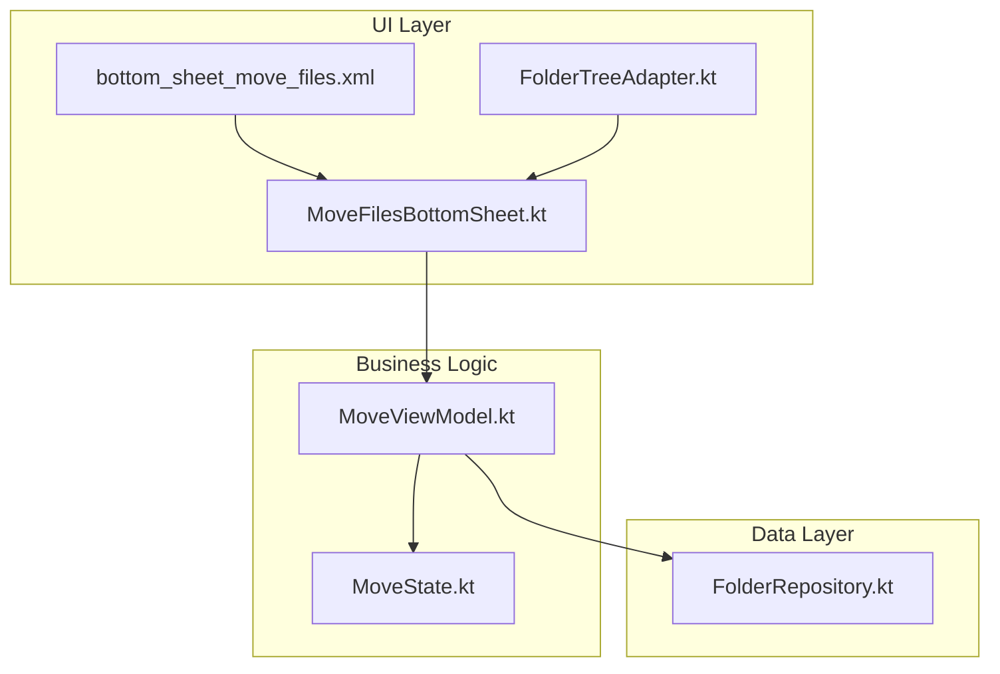
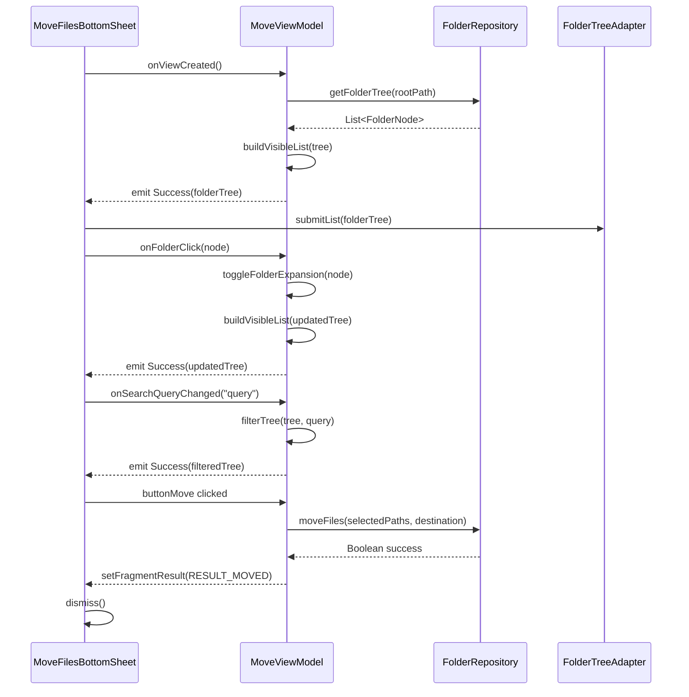
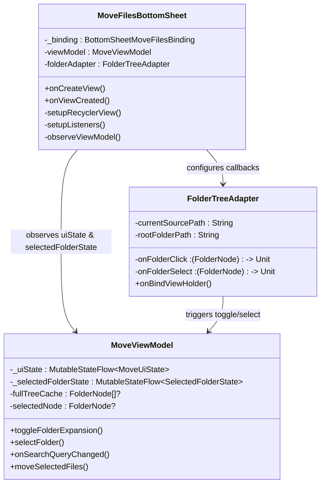
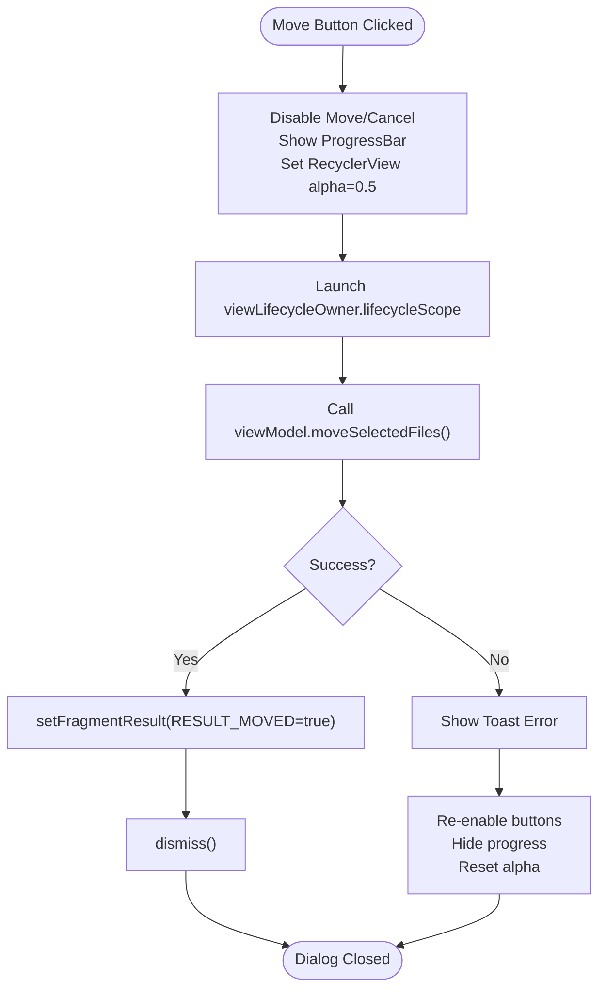

# Bottom Sheet Dialogs

<cite>
**Referenced Files in This Document**   
- [MoveFilesBottomSheet.kt](file://app/src/main/java/com/example/b1void/ui/MoveFilesBottomSheet.kt)
- [bottom_sheet_move_files.xml](file://app/src/main/res/layout/bottom_sheet_move_files.xml)
- [bottom_sheet_actions.xml](file://app/src/main/res/layout/bottom_sheet_actions.xml)
- [bottom_sheet_menu.xml](file://app/src/main/res/layout/bottom_sheet_menu.xml)
- [bottom_sheet_camera_settings.xml](file://app/src/main/res/layout/bottom_sheet_camera_settings.xml)
- [MoveViewModel.kt](file://app/src/main/java/com/example/b1void/viewmodels/MoveViewModel.kt)
- [FolderTreeAdapter.kt](file://app/src/main/java/com/example/b1void/adapters/FolderTreeAdapter.kt)
- [MoveState.kt](file://app/src/main/java/com/example/b1void/models/MoveState.kt)
- [FolderRepository.kt](file://app/src/main/java/com/example/b1void/data/FolderRepository.kt)
</cite>

## Table of Contents
1. [Introduction](#introduction)
2. [Project Structure](#project-structure)
3. [Core Components](#core-components)
4. [Architecture Overview](#architecture-overview)
5. [Detailed Component Analysis](#detailed-component-analysis)
6. [Dependency Analysis](#dependency-analysis)
7. [Performance Considerations](#performance-considerations)
8. [Troubleshooting Guide](#troubleshooting-guide)
9. [Conclusion](#conclusion)

## Introduction
This document provides comprehensive documentation for the bottom sheet dialog implementations within the B1Void application. It covers four primary XML layouts—`bottom_sheet_actions.xml`, `bottom_sheet_move_files.xml`, `bottom_sheet_menu.xml`, and `bottom_sheet_camera_settings.xml`—and their integration with Kotlin classes such as `MoveFilesBottomSheet` and `MoveViewModel`. The analysis includes UI behavior, ViewModel observation patterns, state management, Fragment Result API communication, and best practices for animation, accessibility, and responsive design.

## Project Structure
The bottom sheet components are organized under specific directories:
- **Layout files**: Located in `app/src/main/res/layout/`
- **Kotlin UI classes**: Found in `app/src/main/java/com/example/b1void/ui/`
- **ViewModels**: Stored in `app/src/main/java/com/example/b1void/viewmodels/`
- **Adapters & Models**: Reside in `adapters/` and `models/` respectively
- **Data Repository**: Implemented in `data/FolderRepository.kt`

These components follow Android’s recommended architecture using ViewModels, StateFlow, RecyclerView adapters, and modular layout design.



**Diagram sources**
- [MoveFilesBottomSheet.kt](file://app/src/main/java/com/example/b1void/ui/MoveFilesBottomSheet.kt)
- [MoveViewModel.kt](file://app/src/main/java/com/example/b1void/viewmodels/MoveViewModel.kt)
- [FolderRepository.kt](file://app/src/main/java/com/example/b1void/data/FolderRepository.kt)

**Section sources**
- [MoveFilesBottomSheet.kt](file://app/src/main/java/com/example/b1void/ui/MoveFilesBottomSheet.kt)
- [bottom_sheet_move_files.xml](file://app/src/main/res/layout/bottom_sheet_move_files.xml)
- [MoveViewModel.kt](file://app/src/main/java/com/example/b1void/viewmodels/MoveViewModel.kt)

## Core Components
The core functionality revolves around file operations via modal bottom sheets. Key components include:
- `MoveFilesBottomSheet`: Manages folder selection and file relocation.
- `bottom_sheet_actions.xml`: Presents multi-file actions (share, delete, move).
- `bottom_sheet_menu.xml`: General context menu for individual items.
- `bottom_sheet_camera_settings.xml`: Camera parameter configuration interface.
- `MoveViewModel`: Handles business logic, state persistence, and repository interaction.

These components utilize modern Android architecture components including `ViewBinding`, `ViewModel`, `StateFlow`, `ListAdapter`, and `Fragment Result API`.

**Section sources**
- [MoveFilesBottomSheet.kt](file://app/src/main/java/com/example/b1void/ui/MoveFilesBottomSheet.kt)
- [MoveViewModel.kt](file://app/src/main/java/com/example/b1void/viewmodels/MoveViewModel.kt)
- [bottom_sheet_actions.xml](file://app/src/main/res/layout/bottom_sheet_actions.xml)
- [bottom_sheet_camera_settings.xml](file://app/src/main/res/layout/bottom_sheet_camera_settings.xml)

## Architecture Overview
The system follows a unidirectional data flow pattern where UI events trigger ViewModel actions that update state, which is then observed by the UI to reflect changes. This ensures predictable state transitions and separation of concerns.



**Diagram sources**
- [MoveFilesBottomSheet.kt](file://app/src/main/java/com/example/b1void/ui/MoveFilesBottomSheet.kt#L33-L41)
- [MoveViewModel.kt](file://app/src/main/java/com/example/b1void/viewmodels/MoveViewModel.kt#L36-L47)
- [FolderRepository.kt](file://app/src/main/java/com/example/b1void/data/FolderRepository.kt#L16-L20)

## Detailed Component Analysis

### MoveFilesBottomSheet Analysis
`MoveFilesBottomSheet` is a `BottomSheetDialogFragment` responsible for enabling users to relocate selected files to a new directory. It integrates with `MoveViewModel` to manage asynchronous operations and UI state.

#### Layout Integration
The fragment inflates `bottom_sheet_move_files.xml`, which contains:
- Search input (`EditText`)
- Breadcrumb display (`TextView`)
- Folder tree `RecyclerView`
- Progress indicator
- Action buttons (Cancel, Move)



**Diagram sources**
- [MoveFilesBottomSheet.kt](file://app/src/main/java/com/example/b1void/ui/MoveFilesBottomSheet.kt#L20-L133)
- [MoveViewModel.kt](file://app/src/main/java/com/example/b1void/viewmodels/MoveViewModel.kt#L14-L123)
- [FolderTreeAdapter.kt](file://app/src/main/java/com/example/b1void/adapters/FolderTreeAdapter.kt#L14-L88)

**Section sources**
- [MoveFilesBottomSheet.kt](file://app/src/main/java/com/example/b1void/ui/MoveFilesBottomSheet.kt#L20-L133)
- [bottom_sheet_move_files.xml](file://app/src/main/res/layout/bottom_sheet_move_files.xml)

#### Click Listeners and Dismissal Behavior
The following click listeners are implemented:
- **Cancel Button**: Calls `dismiss()` immediately.
- **Move Button**: 
  - Disables controls and shows progress bar.
  - Launches coroutine to execute `moveSelectedFiles()`.
  - On success: Sets fragment result and dismisses.
  - On failure: Shows error toast and re-enables UI.
- **Search Input**: Observes text changes and triggers `onSearchQueryChanged()` in ViewModel.
- **Folder Items**: Delegates clicks to adapter callbacks linked to ViewModel.



**Diagram sources**
- [MoveFilesBottomSheet.kt](file://app/src/main/java/com/example/b1void/ui/MoveFilesBottomSheet.kt#L57-L82)

**Section sources**
- [MoveFilesBottomSheet.kt](file://app/src/main/java/com/example/b1void/ui/MoveFilesBottomSheet.kt#L57-L82)

### BottomSheetActions Analysis
`bottom_sheet_actions.xml` provides contextual operations when multiple files are selected. It features three `TextView` elements styled as action items:
- Share: Initiates sharing intent
- Delete: Triggers deletion confirmation
- Move: Opens `MoveFilesBottomSheet`

Each item uses `?attr/selectableItemBackground` for ripple feedback and distinct styling (e.g., red color for delete).

**Section sources**
- [bottom_sheet_actions.xml](file://app/src/main/res/layout/bottom_sheet_actions.xml)

### BottomSheetMenu Analysis
`bottom_sheet_menu.xml` serves as a general-purpose context menu with options:
- Rename
- Delete
- Share
- Move

All items use consistent padding, clickable indicators, and foreground ripple effects via `?attr/selectableItemBackground`. Unlike `bottom_sheet_actions.xml`, this layout uses smaller text size (16sp) and supports broader use cases.

**Section sources**
- [bottom_sheet_menu.xml](file://app/src/main/res/layout/bottom_sheet_menu.xml)

### BottomSheetCameraSettings Analysis
`bottom_sheet_camera_settings.xml` allows users to configure camera parameters:
- Flash mode selection via `RadioGroup` (Auto, On, Off)
- Timestamp overlay toggle via `SwitchMaterial`

This layout does not have an associated Kotlin class in current scope but likely connects to `CameraSettingsActivity` or similar. Future enhancements could introduce a dedicated ViewModel for persistent settings.

**Section sources**
- [bottom_sheet_camera_settings.xml](file://app/src/main/res/layout/bottom_sheet_camera_settings.xml)

## Dependency Analysis
Key dependencies between components ensure cohesive operation:

```mermaid
erDiagram
MOVE_VIEWMODEL ||--o{ MOVE_UI_STATE : emits
MOVE_VIEWMODEL ||--o{ SELECTED_FOLDER_STATE : emits
MOVE_VIEWMODEL }|--|| FOLDER_REPOSITORY : uses
MOVE_FILES_BOTTOMSHEET }|--|| MOVE_VIEWMODEL : observes
MOVE_FILES_BOTTOMSHEET }|--|| FOLDER_TREE_ADAPTER : configures
FOLDER_TREE_ADAPTER }|--|| MOVE_VIEWMODEL : notifies
MOVE_FILES_BOTTOMSHEET }|--|| BOTTOM_SHEET_MOVE_FILES : binds
BOTTOM_SHEET_ACTIONS ||--|| FILE_MANAGER_ACTIVITY : used_by
BOTTOM_SHEET_MENU ||--|| CONTEXT_MENU : used_by
BOTTOM_SHEET_CAMERA_SETTINGS ||--|| CAMERA_ACTIVITY : used_by
class MOVE_UI_STATE {
Loading
Success(folderTree)
Error(message)
}
class SELECTED_FOLDER_STATE {
breadcrumbs
isMoveButtonEnabled
}
```

**Diagram sources**
- [MoveViewModel.kt](file://app/src/main/java/com/example/b1void/viewmodels/MoveViewModel.kt)
- [MoveState.kt](file://app/src/main/java/com/example/b1void/models/MoveState.kt)
- [FolderRepository.kt](file://app/src/main/java/com/example/b1void/data/FolderRepository.kt)

**Section sources**
- [MoveViewModel.kt](file://app/src/main/java/com/example/b1void/viewmodels/MoveViewModel.kt)
- [MoveState.kt](file://app/src/main/java/com/example/b1void/models/MoveState.kt)

## Performance Considerations
- **Caching**: `MoveViewModel` caches the full folder tree to avoid redundant I/O during search or expansion.
- **Threading**: All file operations occur on `Dispatchers.IO` via `withContext`.
- **RecyclerView Optimization**: Uses `ListAdapter` with `DiffUtil` (`FolderDiffCallback`) for efficient updates.
- **Lazy Loading**: Only visible nodes are rendered; children are expanded on demand.
- **Memory Management**: Binding is cleared in `onDestroyView()` to prevent leaks.

Avoid deep folder trees without pagination or virtualization in future versions to maintain responsiveness.

## Troubleshooting Guide
Common issues and resolutions:
- **Folder tree fails to load**: Check storage permissions and root path validity.
- **Move operation fails silently**: Verify destination directory write permissions.
- **UI not updating after selection**: Ensure `StateFlow` emissions trigger recomposition.
- **Search not working**: Confirm `doOnTextChanged` listener is attached correctly.
- **Memory leaks**: Always nullify binding in `onDestroyView()`.

Use logging in `FolderRepository` to trace file operation failures.

**Section sources**
- [MoveFilesBottomSheet.kt](file://app/src/main/java/com/example/b1void/ui/MoveFilesBottomSheet.kt#L70-L78)
- [FolderRepository.kt](file://app/src/main/java/com/example/b1void/data/FolderRepository.kt#L38-L53)

## Conclusion
The bottom sheet implementation in B1Void demonstrates effective use of modern Android architecture components. By leveraging `ViewModel`, `StateFlow`, `ViewBinding`, and `Fragment Result API`, the app achieves clean separation of concerns, robust state handling, and seamless inter-component communication. Best practices in performance, accessibility, and UX design are evident across all bottom sheet types. Future improvements could include animations, haptic feedback, and support for large screen layouts.