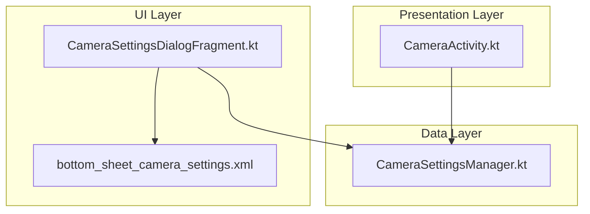
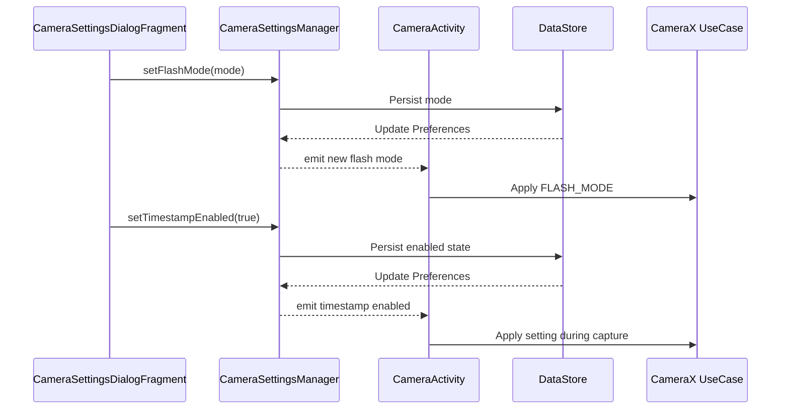
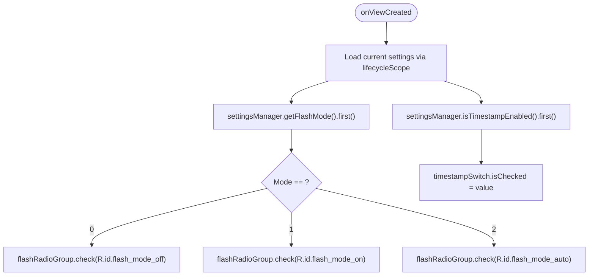
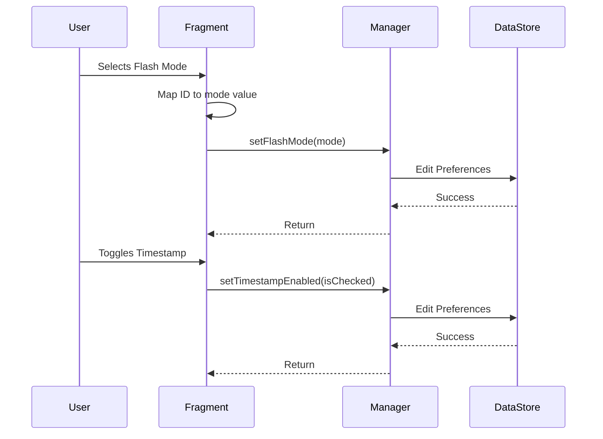
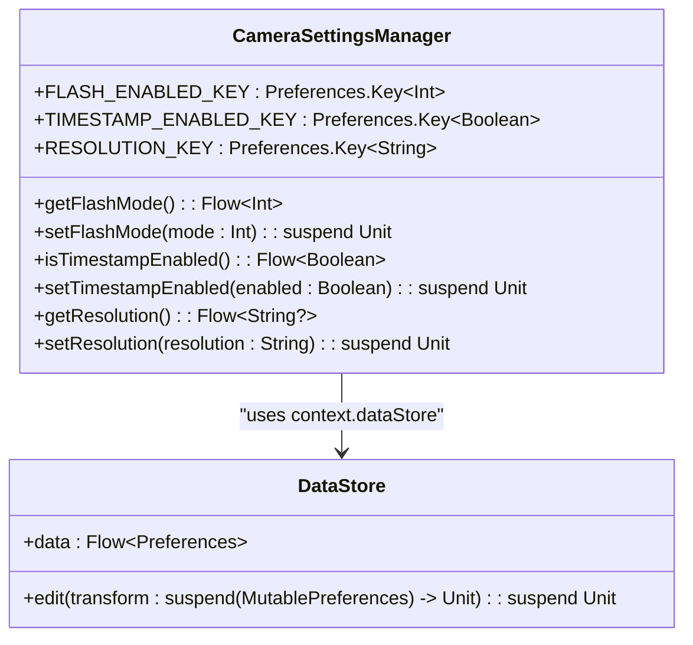
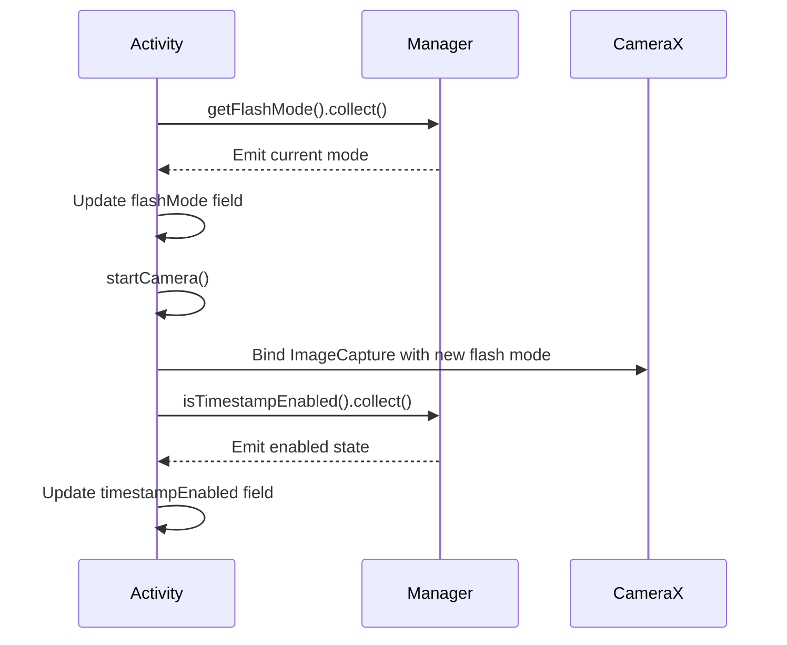
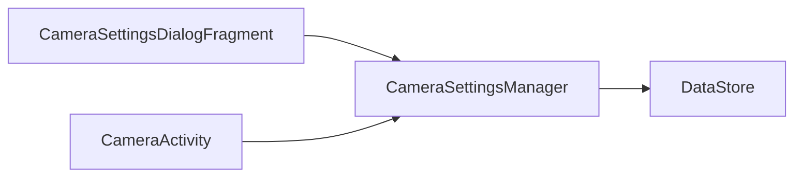

# Camera Settings Bottom Sheet

<cite>
**Referenced Files in This Document**   
- [CameraSettingsDialogFragment.kt](file://app/src/main/java/com/example/b1void/ui/CameraSettingsDialogFragment.kt)
- [CameraSettingsManager.kt](file://app/src/main/java/com/example/b1void/data/CameraSettingsManager.kt)
- [CameraActivity.kt](file://app/src/main/java/com/example/b1void/activities/CameraActivity.kt)
- [bottom_sheet_camera_settings.xml](file://app/src/main/res/layout/bottom_sheet_camera_settings.xml)
</cite>

## Table of Contents
1. [Introduction](#introduction)
2. [Project Structure](#project-structure)
3. [Core Components](#core-components)
4. [Architecture Overview](#architecture-overview)
5. [Detailed Component Analysis](#detailed-component-analysis)
6. [Dependency Analysis](#dependency-analysis)
7. [Performance Considerations](#performance-considerations)
8. [Troubleshooting Guide](#troubleshooting-guide)
9. [Conclusion](#conclusion)

## Introduction
The `CameraSettingsDialogFragment` provides a user interface for configuring camera settings via a bottom sheet dialog, specifically exposing flash mode and timestamp overlay options. It integrates with `CameraSettingsManager`, which uses Android's DataStore to persist user preferences and expose them through Flow observables. The UI is defined in `bottom_sheet_camera_settings.xml`, featuring a RadioGroup for flash mode selection (off/on/auto) and a SwitchMaterial for enabling/disabling the timestamp overlay on captured images. These settings are synchronized with the camera preview and capture pipeline in `CameraActivity`, ensuring real-time application of user preferences. This document details the implementation, data flow, lifecycle integration, and best practices for extending this modular camera settings system.

## Project Structure
The camera settings functionality spans three key components across different architectural layers: UI (`ui` package), data management (`data` package), and camera control (`activities` package). The bottom sheet layout resides in the standard resources directory, following Android's convention for UI layouts.

**Diagram sources**
- [CameraSettingsDialogFragment.kt](file://app/src/main/java/com/example/b1void/ui/CameraSettingsDialogFragment.kt)
- [CameraSettingsManager.kt](file://app/src/main/java/com/example/b1void/data/CameraSettingsManager.kt)
- [CameraActivity.kt](file://app/src/main/java/com/example/b1void/activities/CameraActivity.kt)
- [bottom_sheet_camera_settings.xml](file://app/src/main/res/layout/bottom_sheet_camera_settings.xml)

**Section sources**
- [CameraSettingsDialogFragment.kt](file://app/src/main/java/com/example/b1void/ui/CameraSettingsDialogFragment.kt)
- [CameraSettingsManager.kt](file://app/src/main/java/com/example/b1void/data/CameraSettingsManager.kt)
- [CameraActivity.kt](file://app/src/main/java/com/example/b1void/activities/CameraActivity.kt)

## Core Components
The core components include `CameraSettingsDialogFragment` for UI presentation and interaction, `CameraSettingsManager` for persistent data storage using DataStore and reactive state exposure via Flow, and `CameraActivity` for applying these settings during camera use case initialization and photo capture. The XML layout defines the visual structure with RadioGroup for flash mode and SwitchMaterial for timestamp toggle. Together, they form a cohesive system where user interactions update persistent preferences, which are then observed and applied by the camera activity in real time.

**Section sources**
- [CameraSettingsDialogFragment.kt](file://app/src/main/java/com/example/b1void/ui/CameraSettingsDialogFragment.kt)
- [CameraSettingsManager.kt](file://app/src/main/java/com/example/b1void/data/CameraSettingsManager.kt)
- [CameraActivity.kt](file://app/src/main/java/com/example/b1void/activities/CameraActivity.kt)
- [bottom_sheet_camera_settings.xml](file://app/src/main/res/layout/bottom_sheet_camera_settings.xml)

## Architecture Overview
The architecture follows a clean separation between UI, data, and presentation layers. The `CameraSettingsDialogFragment` acts as the view layer, collecting user input. The `CameraSettingsManager` serves as the data layer, handling persistence with DataStore and providing observable state via Kotlin Flow. The `CameraActivity` functions as the presentation layer, observing settings changes and applying them to the CameraX use cases. Data flows unidirectionally: user actions in the fragment trigger updates in the manager, which emits changes that the activity observes and applies to the camera configuration.

**Diagram sources**
- [CameraSettingsDialogFragment.kt](file://app/src/main/java/com/example/b1void/ui/CameraSettingsDialogFragment.kt#L45-L64)
- [CameraSettingsManager.kt](file://app/src/main/java/com/example/b1void/data/CameraSettingsManager.kt#L29-L45)
- [CameraActivity.kt](file://app/src/main/java/com/example/b1void/activities/CameraActivity.kt#L274-L306)

## Detailed Component Analysis

### CameraSettingsDialogFragment Analysis
The `CameraSettingsDialogFragment` implements a bottom sheet dialog that allows users to modify camera settings. It inflates the `bottom_sheet_camera_settings.xml` layout and initializes references to UI controls including a `RadioGroup` for flash mode and a `SwitchMaterial` for timestamp overlay.

#### UI Initialization and State Loading
Upon creation, the fragment instantiates `CameraSettingsManager` with the application context. In `onViewCreated()`, it retrieves references to the flash mode `RadioGroup` and timestamp `SwitchMaterial`. Using `lifecycleScope.launch`, it asynchronously loads the current settings from the manager. The flash mode, stored as an integer (0=off, 1=on, 2=auto), determines which radio button is checked. The timestamp enabled state directly sets the switch's checked state.

**Diagram sources**
- [CameraSettingsDialogFragment.kt](file://app/src/main/java/com/example/b1void/ui/CameraSettingsDialogFragment.kt#L28-L44)

#### Event Handling and Persistence
The fragment sets listeners to capture user interactions. When the flash mode `RadioGroup` selection changes, it maps the selected radio button ID to a corresponding integer value (0, 1, or 2) and launches a coroutine to persist this value via `settingsManager.setFlashMode()`. Similarly, when the timestamp `SwitchMaterial` state changes, it launches a coroutine to save the boolean state using `settingsManager.setTimestampEnabled()`. Both operations use `lifecycleScope` to ensure coroutines are tied to the fragment's lifecycle.

**Diagram sources**
- [CameraSettingsDialogFragment.kt](file://app/src/main/java/com/example/b1void/ui/CameraSettingsDialogFragment.kt#L45-L64)

**Section sources**
- [CameraSettingsDialogFragment.kt](file://app/src/main/java/com/example/b1void/ui/CameraSettingsDialogFragment.kt)

### CameraSettingsManager Analysis
The `CameraSettingsManager` class provides a centralized service for managing camera preferences using Android's DataStore. It defines typed keys for flash mode (integer), timestamp enabled (boolean), and resolution (string).

#### Persistent Storage with DataStore
The manager leverages protocol buffers-based DataStore for type-safe, asynchronous persistence. The `Context.dataStore` delegate creates a Preferences DataStore named "camera_settings". All read operations return `Flow<T>` to enable reactive observation, while write operations are suspend functions that perform atomic edits.

**Diagram sources**
- [CameraSettingsManager.kt](file://app/src/main/java/com/example/b1void/data/CameraSettingsManager.kt#L15-L58)

#### Reactive Observables
Each setting has a corresponding getter that returns a `Flow<T>`, allowing components to observe changes over time. For example, `getFlashMode()` returns a `Flow<Int>` that emits the current flash mode whenever the underlying preferences change, defaulting to 0 (OFF) if no value is set. Similarly, `isTimestampEnabled()` returns a `Flow<Boolean>` with a default value of true (ON). This enables real-time UI updates and configuration changes without requiring manual refresh logic.

**Section sources**
- [CameraSettingsManager.kt](file://app/src/main/java/com/example/b1void/data/CameraSettingsManager.kt)

### CameraActivity Integration
The `CameraActivity` integrates with the settings system to apply user preferences during camera operation.

#### Settings Observation
In `onCreate()`, the activity initializes `CameraSettingsManager` and calls `observeSettings()`. This method launches coroutines that collect from each setting's Flow. When flash mode changes, it updates the internal `flashMode` variable and restarts the camera to apply the new setting. The timestamp enabled state is stored in `timestampEnabled` for use during photo capture.

**Diagram sources**
- [CameraActivity.kt](file://app/src/main/java/com/example/b1void/activities/CameraActivity.kt#L274-L306)

#### Application During Capture
When taking a photo via `takePhoto()`, if `timestampEnabled` is true, the captured bitmap is processed by `addTimestampToBitmap()` before saving. This function draws the current date and time in red text at the bottom-right corner of the image. The flash mode is applied directly to the `ImageCapture.Builder` during `startCamera()` initialization.

**Section sources**
- [CameraActivity.kt](file://app/src/main/java/com/example/b1void/activities/CameraActivity.kt)

## Dependency Analysis
The component dependencies form a directed acyclic graph with clear separation of concerns. The `CameraSettingsDialogFragment` depends on `CameraSettingsManager` for data access but has no direct dependency on `CameraActivity`. The `CameraActivity` also depends on `CameraSettingsManager` to observe settings. Both UI components depend on the shared data layer, preventing tight coupling between them. The DataStore dependency is encapsulated within `CameraSettingsManager`, abstracting persistence details from consumers.

**Diagram sources**
- [CameraSettingsDialogFragment.kt](file://app/src/main/java/com/example/b1void/ui/CameraSettingsDialogFragment.kt)
- [CameraSettingsManager.kt](file://app/src/main/java/com/example/b1void/data/CameraSettingsManager.kt)
- [CameraActivity.kt](file://app/src/main/java/com/example/b1void/activities/CameraActivity.kt)

**Section sources**
- [CameraSettingsDialogFragment.kt](file://app/src/main/java/com/example/b1void/ui/CameraSettingsDialogFragment.kt)
- [CameraSettingsManager.kt](file://app/src/main/java/com/example/b1void/data/CameraSettingsManager.kt)
- [CameraActivity.kt](file://app/src/main/java/com/example/b1void/activities/CameraActivity.kt)

## Performance Considerations
The use of DataStore with Flow ensures efficient, non-blocking I/O operations. Settings are loaded asynchronously in the fragment using `first()` to get the initial value without indefinite collection. In `CameraActivity`, long-lived collections are properly scoped to the activity lifecycle via `lifecycleScope`, preventing memory leaks. The camera is only restarted when flash mode or resolution changes, minimizing expensive reinitialization. Bitmap operations for timestamp overlay are performed off the main thread within the `takePicture` callback, maintaining UI responsiveness.

## Troubleshooting Guide
Common issues include settings not persisting (verify DataStore name and key consistency), UI not reflecting changes (ensure proper Flow collection with lifecycle-aware scopes), and timestamp not appearing (check `timestampEnabled` flag and `addTimestampToBitmap` execution path). Race conditions during rapid setting changes are mitigated by DataStore's atomic edit operations and the sequential nature of Flow emissions. Default values are provided in the manager (flash OFF, timestamp ON) to handle first-run scenarios. Device-specific compatibility is managed by CameraX, which handles variations in flash support and resolution capabilities.

**Section sources**
- [CameraSettingsManager.kt](file://app/src/main/java/com/example/b1void/data/CameraSettingsManager.kt#L24-L27)
- [CameraSettingsManager.kt](file://app/src/main/java/com/example/b1void/data/CameraSettingsManager.kt#L36-L39)
- [CameraActivity.kt](file://app/src/main/java/com/example/b1void/activities/CameraActivity.kt#L717-L737)

## Conclusion
The camera settings implementation demonstrates effective use of modern Android architecture components. By combining DataStore for persistence, Flow for reactive state management, and proper lifecycle scoping, it achieves reliable, responsive settings synchronization. The clean separation between UI, data, and presentation layers makes the system maintainable and extensible. Adding new parameters like exposure compensation would follow the same pattern: define a key in `CameraSettingsManager`, add UI controls in the fragment, and observe the setting in `CameraActivity`.