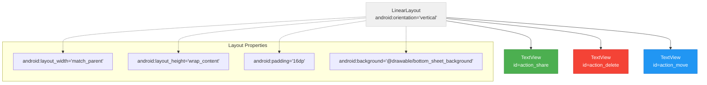
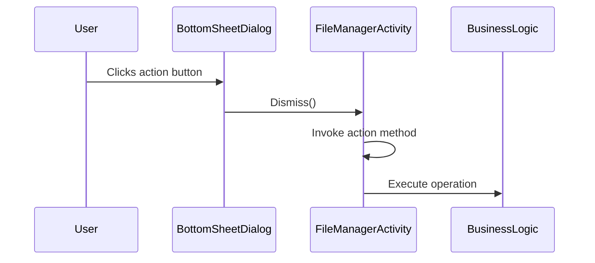
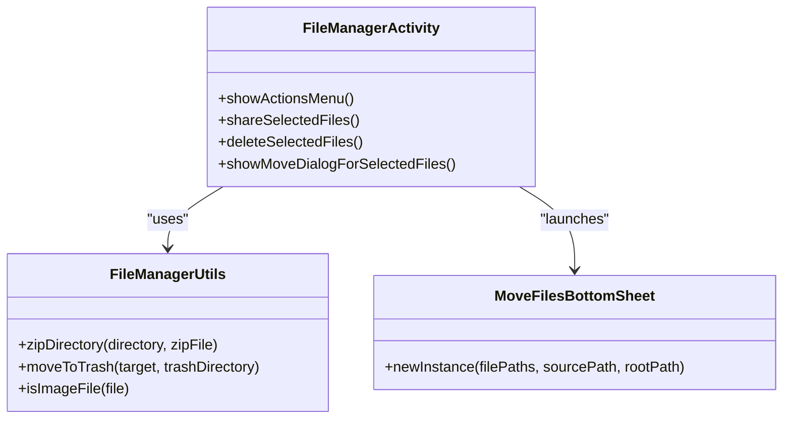

# File Actions Bottom Sheet

<cite>
**Referenced Files in This Document**   
- [FileManagerActivity.kt](file://app/src/main/java/com/example/b1void/activities/FileManagerActivity.kt)
- [bottom_sheet_actions.xml](file://app/src/main/res/layout/bottom_sheet_actions.xml)
- [BottomSheetActionsBinding.java](file://app/build/generated/data_binding_base_class_source_out/debug/out/com/example/b1void/databinding/BottomSheetActionsBinding.java)
- [FileManagerUtils.kt](file://app/src/main/java/com/example/b1void/utils/FileManagerUtils.kt)
- [FileAdapter.kt](file://app/src/main/java/com/example/b1void/adapters/FileAdapter.kt)
- [MoveFilesBottomSheet.kt](file://app/src/main/java/com/example/b1void/ui/MoveFilesBottomSheet.kt)
</cite>

## Table of Contents
1. [Introduction](#introduction)
2. [Layout Structure and UI Components](#layout-structure-and-ui-components)
3. [Action Button Configuration and Accessibility](#action-button-configuration-and-accessibility)
4. [Click Listener Registration and Event Handling](#click-listener-registration-and-event-handling)
5. [Action Execution and Business Logic Integration](#action-execution-and-business-logic-integration)
6. [Dismissal Behavior and State Management](#dismissal-behavior-and-state-management)
7. [Selection Validation and Permission Handling](#selection-validation-and-permission-handling)
8. [Best Practices for Extending Functionality](#best-practices-for-extending-functionality)

## Introduction

The File Actions Bottom Sheet is a contextual menu component that appears when multiple files are selected within the FileManagerActivity, providing users with essential file operations such as sharing, moving, and deleting. This implementation follows Android's Material Design guidelines for bottom sheets, offering a non-modal interface that allows users to easily access bulk operations on selected files. The component is triggered from the FileManagerActivity when the user confirms their selection through the confirmation button in the selection toolbar. The bottom sheet serves as an intermediary layer between the UI and business logic, translating user interactions into appropriate file operations while maintaining proper state management throughout the process.

**Section sources**
- [FileManagerActivity.kt](file://app/src/main/java/com/example/b1void/activities/FileManagerActivity.kt#L42-L838)

## Layout Structure and UI Components

The layout structure of the bottom sheet is defined in `bottom_sheet_actions.xml`, which implements a clean, vertical LinearLayout containing three primary action buttons: share, delete, and move. Each action is represented by a TextView element with consistent styling for visual hierarchy and touch target size. The layout uses a custom background drawable (`@drawable/bottom_sheet_background`) to provide visual distinction from the main content area, following Material Design elevation principles. The padding and spacing are carefully designed to ensure adequate touch targets while maintaining a compact footprint that doesn't obscure too much of the underlying content. The text elements use white color for standard actions and a distinct red color (`@color/delete_red`) for the delete action, providing immediate visual feedback about the destructive nature of this operation.

**Diagram sources**
- [bottom_sheet_actions.xml](file://app/src/main/res/layout/bottom_sheet_actions.xml#L1-L40)

**Section sources**
- [bottom_sheet_actions.xml](file://app/src/main/res/layout/bottom_sheet_actions.xml#L1-L40)

## Action Button Configuration and Accessibility

Each action button in the bottom sheet is configured with accessibility considerations in mind, ensuring the interface is usable for all users. The TextView elements serving as buttons have appropriate padding (12dp) and text size (18sp) to meet minimum touch target requirements. They utilize the `?attr/selectableItemBackground` attribute to provide visual feedback during interaction, displaying a ripple effect when pressed. The text labels are presented in Russian ("Поделиться", "Удалить", "Переместить") to match the application's localization strategy. The delete action uses a distinctive red text color (`@color/delete_red`) to visually communicate its destructive nature, following established UX patterns for warning states. All interactive elements inherit focusability and clickability from the selectable item background, eliminating the need for explicit configuration while maintaining consistent behavior across different Android versions.

**Section sources**
- [bottom_sheet_actions.xml](file://app/src/main/res/layout/bottom_sheet_actions.xml#L1-L40)

## Click Listener Registration and Event Handling

The registration of click listeners for the file actions bottom sheet occurs within the `showActionsMenu()` method of the FileManagerActivity. When triggered, this method inflates the bottom sheet layout and programmatically attaches click listeners to each action button using findViewById() calls. The listeners are implemented as lambda expressions that immediately dismiss the bottom sheet dialog before invoking the corresponding action method. This two-step process ensures a responsive UI by providing immediate visual feedback (dismissal) before potentially longer-running operations begin. The click handling follows a clear separation of concerns: the bottom sheet itself only handles UI dismissal and delegation, while the actual business logic is encapsulated in dedicated methods within the FileManagerActivity. This approach promotes code maintainability and enables easy modification of action behaviors without affecting the presentation layer.

**Diagram sources**
- [FileManagerActivity.kt](file://app/src/main/java/com/example/b1void/activities/FileManagerActivity.kt#L42-L838)

**Section sources**
- [FileManagerActivity.kt](file://app/src/main/java/com/example/b1void/activities/FileManagerActivity.kt#L42-L838)

## Action Execution and Business Logic Integration

The execution of file actions integrates closely with the FileManagerUtils utility class, which contains the core business logic for file operations. When the user selects "share" from the bottom sheet, the `shareSelectedFiles()` method is invoked, which first determines whether to share as individual images or as a ZIP archive based on the file types selected. For image sharing, it generates content URIs using FileProvider and creates an ACTION_SEND_MULTIPLE intent. For mixed content, it creates a temporary ZIP archive using the `zipDirectory()` method from FileManagerUtils before sharing. The "delete" action triggers `deleteSelectedFiles()`, which moves files to a designated trash directory using `moveToTrash()` from FileManagerUtils, preserving the ability to recover files if needed. The "move" action launches the MoveFilesBottomSheet fragment, passing the selected file paths and directory context to facilitate the move operation through a dedicated UI.

**Diagram sources**
- [FileManagerActivity.kt](file://app/src/main/java/com/example/b1void/activities/FileManagerActivity.kt#L42-L838)
- [FileManagerUtils.kt](file://app/src/main/java/com/example/b1void/utils/FileManagerUtils.kt#L15-L248)
- [MoveFilesBottomSheet.kt](file://app/src/main/java/com/example/b1void/ui/MoveFilesBottomSheet.kt#L20-L133)

**Section sources**
- [FileManagerActivity.kt](file://app/src/main/java/com/example/b1void/activities/FileManagerActivity.kt#L42-L838)
- [FileManagerUtils.kt](file://app/src/main/java/com/example/b1void/utils/FileManagerUtils.kt#L15-L248)

## Dismissal Behavior and State Management

The dismissal behavior of the file actions bottom sheet is tightly coupled with state management in the FileManagerActivity. When any action button is clicked, the bottom sheet is immediately dismissed through the `dialog.dismiss()` call before the corresponding operation begins. This creates a responsive user experience by providing instant visual feedback. After action execution completes, the activity resets its selection state by calling `exitSelectionMode()`, which clears the selected files collection, updates the RecyclerView adapter, and hides the selection toolbar with an animation. The state reset also re-enables the SwipeRefreshLayout, restoring normal scrolling behavior. This comprehensive state management ensures that the UI returns to a consistent state regardless of the outcome of the file operation. The integration with the MoveFilesBottomSheet includes a FragmentResultListener that listens for successful move operations and triggers the same state reset sequence, maintaining consistency across different file manipulation workflows.

**Section sources**
- [FileManagerActivity.kt](file://app/src/main/java/com/example/b1void/activities/FileManagerActivity.kt#L42-L838)

## Selection Validation and Permission Handling

The implementation includes robust validation for action availability based on selection count and handles permissions appropriately during file operations. Before showing the actions menu, the `confirmSelectionButton` is enabled only when at least one file is selected, as controlled by the `updateSelectionState()` method. This prevents the user from accessing the bottom sheet with an empty selection. During delete operations, the `moveToTrash()` method in FileManagerUtils handles potential SecurityException cases that may arise from permission issues, logging errors and providing user feedback through Toast messages. The sharing functionality leverages FileProvider to grant temporary read permissions to external applications, adhering to Android's scoped storage principles. For ZIP creation during sharing, the operation runs in a background thread to prevent ANR (Application Not Responding) conditions, with appropriate error handling for IOExceptions that might occur during file compression. The trash system itself acts as a safety mechanism, preventing permanent deletion and allowing recovery of mistakenly removed files.

**Section sources**
- [FileManagerActivity.kt](file://app/src/main/java/com/example/b1void/activities/FileManagerActivity.kt#L42-L838)
- [FileManagerUtils.kt](file://app/src/main/java/com/example/b1void/utils/FileManagerUtils.kt#L15-L248)

## Best Practices for Extending Functionality

Extending the file actions bottom sheet with additional operations should follow several best practices observed in the current implementation. New actions should be added to the bottom_sheet_actions.xml layout in order of importance, with destructive actions like delete placed separately from others. Each new action should have corresponding methods in FileManagerActivity that delegate to utility classes for business logic, maintaining separation of concerns. Permission requirements for new operations should be handled gracefully with appropriate runtime permission requests and fallback behaviors. Long-running operations should execute in background threads using Kotlin coroutines or similar concurrency mechanisms to maintain UI responsiveness. Accessibility should be considered for all new elements, including content descriptions for screen readers and sufficient contrast ratios. Finally, new features should integrate with the existing state management system, ensuring proper cleanup and UI updates after completion, similar to how the current implementation calls exitSelectionMode() after action execution.

**Section sources**
- [FileManagerActivity.kt](file://app/src/main/java/com/example/b1void/activities/FileManagerActivity.kt#L42-L838)
- [FileManagerUtils.kt](file://app/src/main/java/com/example/b1void/utils/FileManagerUtils.kt#L15-L248)