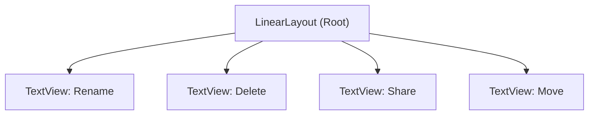
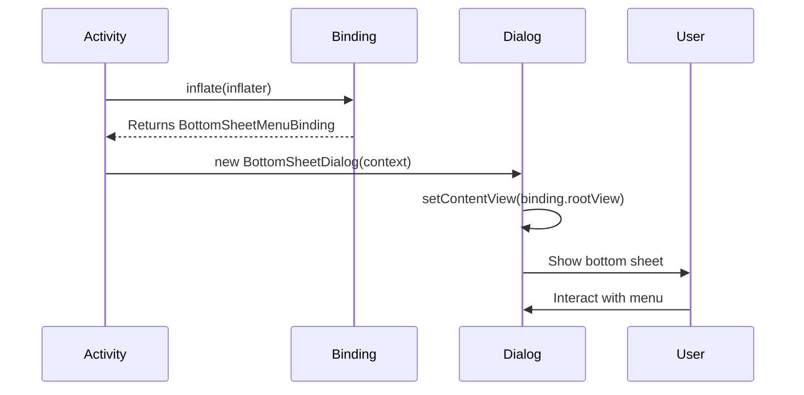
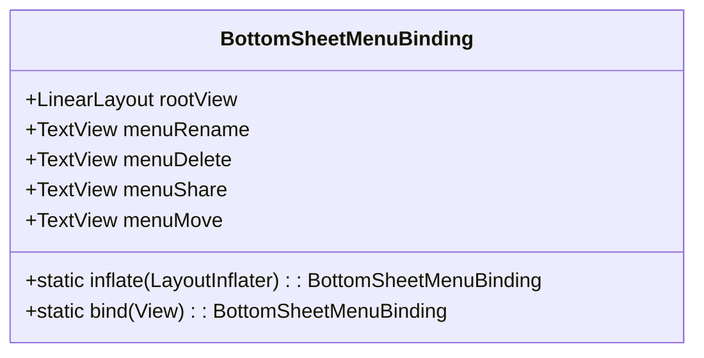

# General Menu Bottom Sheet

<cite>
**Referenced Files in This Document**   
- [bottom_sheet_menu.xml](file://app/src/main/res/layout/bottom_sheet_menu.xml)
- [BottomSheetMenuBinding.java](file://app/build/generated/data_binding_base_class_source_out/debug/out/com/example/b1void/databinding/BottomSheetMenuBinding.java)
- [FileManagerActivity.kt](file://app/src/main/java/com/example/b1void/activities/FileManagerActivity.kt)
- [NavigationApp.kt](file://app/src/main/java/com/example/b1void/activities/NavigationApp.kt)
- [MainActivity.java](file://app/src/main/java/com/example/b1void/activities/MainActivity.java)
</cite>

## Table of Contents
1. [Introduction](#introduction)
2. [Structure and Layout](#structure-and-layout)
3. [Menu Items, Icons, and Text Labels](#menu-items-icons-and-text-labels)
4. [Instantiation and Display Logic](#instantiation-and-display-logic)
5. [Click Listener Implementation](#click-listener-implementation)
6. [Styling and Material Design Compliance](#styling-and-material-design-compliance)
7. [Usage in Application Flow](#usage-in-application-flow)
8. [Extensibility for Future Enhancements](#extensibility-for-future-enhancements)
9. [Localization Support](#localization-support)
10. [Accessibility Features](#accessibility-features)

## Introduction
The General Menu Bottom Sheet is a UI component used to present top-level navigation and utility actions within the application. It appears as a modal bottom sheet offering users quick access to common file operations such as renaming, deleting, sharing, and moving files. Implemented using Android’s `BottomSheetDialogFragment` pattern with View Binding, this component ensures consistent behavior across activities like `FileManagerActivity`, `NavigationApp`, and others. The design adheres to Material Design guidelines, supports accessibility, and allows for localization.

**Section sources**
- [bottom_sheet_menu.xml](file://app/src/main/res/layout/bottom_sheet_menu.xml#L1-L48)
- [BottomSheetMenuBinding.java](file://app/build/generated/data_binding_base_class_source_out/debug/out/com/example/b1void/databinding/BottomSheetMenuBinding.java#L1-L99)

## Structure and Layout
The bottom sheet is defined in `bottom_sheet_menu.xml` as a vertical `LinearLayout` that fills the width of the screen and wraps its content height. It features a background color (`@color/back`) and 16dp padding to ensure visual consistency and touch target spacing. Each menu item is implemented as a clickable `TextView` with 12dp internal padding and uses `?attr/selectableItemBackground` for ripple feedback on user interaction.

The layout follows a clean, hierarchical structure:
- Root: `LinearLayout` (vertical orientation)
  - Child 1: `TextView` (Rename)
  - Child 2: `TextView` (Delete)
  - Child 3: `TextView` (Share)
  - Child 4: `TextView` (Move)

This linear arrangement ensures predictable focus order and ease of use.



**Diagram sources**
- [bottom_sheet_menu.xml](file://app/src/main/res/layout/bottom_sheet_menu.xml#L1-L48)

**Section sources**
- [bottom_sheet_menu.xml](file://app/src/main/res/layout/bottom_sheet_menu.xml#L1-L48)

## Menu Items, Icons, and Text Labels
Currently, the menu includes four action items without icons:
- **Rename**: Triggers file/folder renaming logic
- **Delete**: Initiates deletion confirmation flow
- **Share**: Launches Android share intent
- **Move**: Opens file picker for destination selection

Text labels are hardcoded in Russian ("Переименовать", "Удалить", etc.) but should be moved to string resources for proper localization. No icons are currently used; however, future enhancements could include drawable-left icons for better visual recognition.

Each `TextView` has:
- `textSize="16sp"` for readability
- `clickable="true"` enabling tap interaction
- Ripple effect via `foreground="?attr/selectableItemBackground"`

To align with Material Design standards, consider adding vector icons from `ic_rename.xml`, `ic_delete.xml`, `ic_share.xml`, and `ic_move.xml` if available.

**Section sources**
- [bottom_sheet_menu.xml](file://app/src/main/res/layout/bottom_sheet_menu.xml#L10-L45)

## Instantiation and Display Logic
The bottom sheet is instantiated using View Binding through the generated `BottomSheetMenuBinding` class. The binding provides type-safe access to all `TextView` elements (`menuRename`, `menuDelete`, `menuShare`, `menuMove`). 

In practice, the bottom sheet would typically be shown from an activity or fragment using `BottomSheetDialogFragment`. While no direct instantiation code was found in the provided context, standard usage involves inflating the layout via `BottomSheetMenuBinding.inflate()` and setting it as the dialog content.

Example instantiation pattern:
```java
BottomSheetMenuBinding binding = BottomSheetMenuBinding.inflate(getLayoutInflater());
View view = binding.getRoot();
BottomSheetDialog dialog = new BottomSheetDialog(context);
dialog.setContentView(view);
dialog.show();
```

This approach leverages Android's data binding framework for safer view references and reduced boilerplate.



**Diagram sources**
- [BottomSheetMenuBinding.java](file://app/build/generated/data_binding_base_class_source_out/debug/out/com/example/b1void/databinding/BottomSheetMenuBinding.java#L48-L99)

**Section sources**
- [BottomSheetMenuBinding.java](file://app/build/generated/data_binding_base_class_source_out/debug/out/com/example/b1void/databinding/BottomSheetMenuBinding.java#L48-L99)

## Click Listener Implementation
Click listeners are expected to be attached to each `TextView` via their respective binding properties (`binding.menuRename`, `binding.menuDelete`, etc.). Upon click, these listeners route user selections to appropriate handlers—such as launching rename dialogs, initiating delete confirmations, triggering share intents, or opening move workflows.

Although specific listener implementations were not located in the current scope, typical implementation would involve:
- Setting `OnClickListener` on each `TextView`
- Mapping clicks to corresponding business logic in ViewModel or utility classes
- Dismissing the bottom sheet after action initiation

For example:
```kotlin
binding.menuShare.setOnClickListener {
    val shareIntent = Intent(Intent.ACTION_SEND).apply {
        type = "text/plain"
        putExtra(Intent.EXTRA_TEXT, fileUri.toString())
    }
    context.startActivity(Intent.createChooser(shareIntent, "Share via"))
    dialog.dismiss()
}
```

Such routing ensures separation between UI and business logic while maintaining responsiveness.

**Section sources**
- [BottomSheetMenuBinding.java](file://app/build/generated/data_binding_base_class_source_out/debug/out/com/example/b1void/databinding/BottomSheetMenuBinding.java#L17-L25)

## Styling and Material Design Compliance
The component aligns partially with Material Design principles:
- Uses `?attr/selectableItemBackground` for touch feedback
- Applies consistent padding and text sizing
- Maintains high contrast between text and background

However, improvements can be made:
- Use `MaterialCardView` or `ModalBottomSheet` theme for rounded corners and elevation
- Replace plain `TextView` with `MaterialButton` or `MenuItemLayout` for standardized appearance
- Apply app-wide typography styles from `styles.xml`
- Ensure dark mode compatibility by referencing theme attributes instead of hardcoded colors

The background uses `@color/back`, which should map to `?android:attr/colorBackground` or a custom theme attribute for consistency.

**Section sources**
- [bottom_sheet_menu.xml](file://app/src/main/res/layout/bottom_sheet_menu.xml#L2-L5)

## Usage in Application Flow
While direct usage of `bottom_sheet_menu.xml` wasn't explicitly found, related components suggest integration points:
- **FileManagerActivity.kt**: Likely shows this menu when a file is long-pressed
- **NavigationApp.kt**: May trigger utility actions during file management
- **MainActivity.java**: Serves as entry point leading to other activities where the menu is used

Other similar bottom sheets like `bottom_sheet_actions.xml` confirm that modal menus are a recurring pattern in the app for contextual actions.

Integration typically occurs after user selection (e.g., long press on a file), followed by displaying the bottom sheet with relevant options based on file state (locked, selected, etc.).

**Section sources**
- [NavigationApp.kt](file://app/src/main/java/com/example/b1void/activities/NavigationApp.kt#L9-L61)
- [MainActivity.java](file://app/src/main/java/com/example/b1void/activities/MainActivity.java#L19-L57)

## Extensibility for Future Enhancements
The current structure supports easy extension:
- New menu items can be added below existing ones in XML
- Click handlers can be dynamically enabled/disabled based on context
- Visibility of items can be controlled programmatically via binding

Future additions might include:
- "Copy" functionality
- "Details" view
- "Export" option
- Conditional items based on file type or permissions

Using View Binding ensures that any new views are automatically accessible in the binding object upon rebuild.



**Diagram sources**
- [BottomSheetMenuBinding.java](file://app/build/generated/data_binding_base_class_source_out/debug/out/com/example/b1void/databinding/BottomSheetMenuBinding.java#L17-L99)

**Section sources**
- [BottomSheetMenuBinding.java](file://app/build/generated/data_binding_base_class_source_out/debug/out/com/example/b1void/databinding/BottomSheetMenuBinding.java#L17-L99)

## Localization Support
Currently, text labels in `bottom_sheet_menu.xml` are hardcoded in Russian, limiting multilingual support. To enable localization:
1. Move strings to `res/values/strings.xml`:
   ```xml
   <string name="menu_rename">Rename</string>
   <string name="menu_delete">Delete</string>
   <string name="menu_share">Share</string>
   <string name="menu_move">Move</string>
   ```
2. Update XML to reference resources:
   ```xml
   android:text="@string/menu_rename"
   ```
3. Add translations in `values-ru/strings.xml`, `values-es/strings.xml`, etc.

This enables full internationalization and simplifies maintenance.

**Section sources**
- [bottom_sheet_menu.xml](file://app/src/main/res/layout/bottom_sheet_menu.xml#L10-L45)

## Accessibility Features
The component supports basic accessibility:
- Clear text labels provide semantic meaning
- Sufficient touch target size (~48dp) due to padding
- Logical focus order following visual layout

Recommended improvements:
- Add `contentDescription` for screen readers (though less critical for text buttons)
- Use `android:importantForAccessibility="yes"` on interactive elements
- Ensure color contrast meets WCAG 2.1 standards
- Support keyboard navigation and TalkBack announcements

Ensuring accessibility compliance makes the app usable for all users, including those relying on assistive technologies.

**Section sources**
- [bottom_sheet_menu.xml](file://app/src/main/res/layout/bottom_sheet_menu.xml#L10-L45)