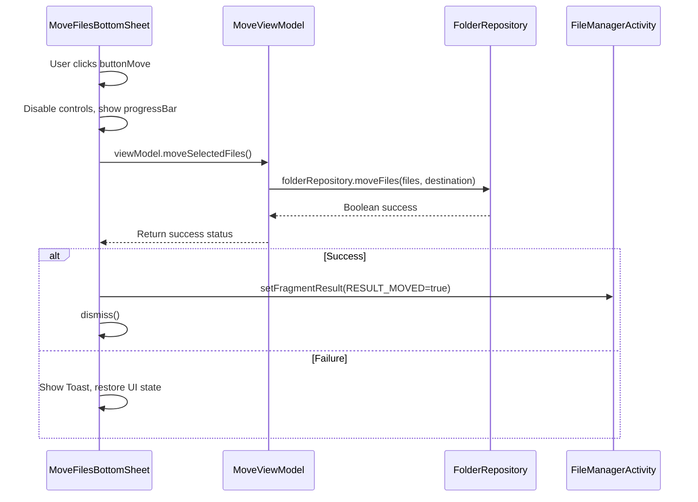
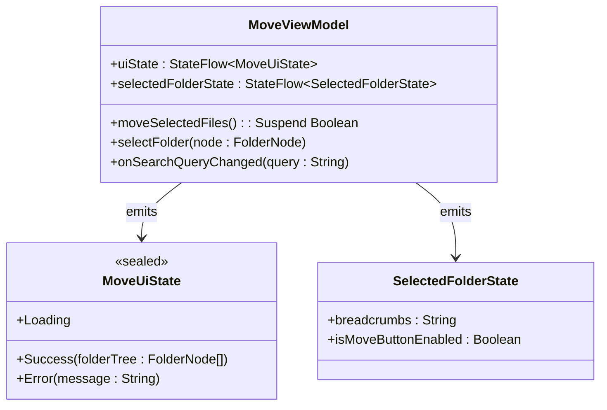
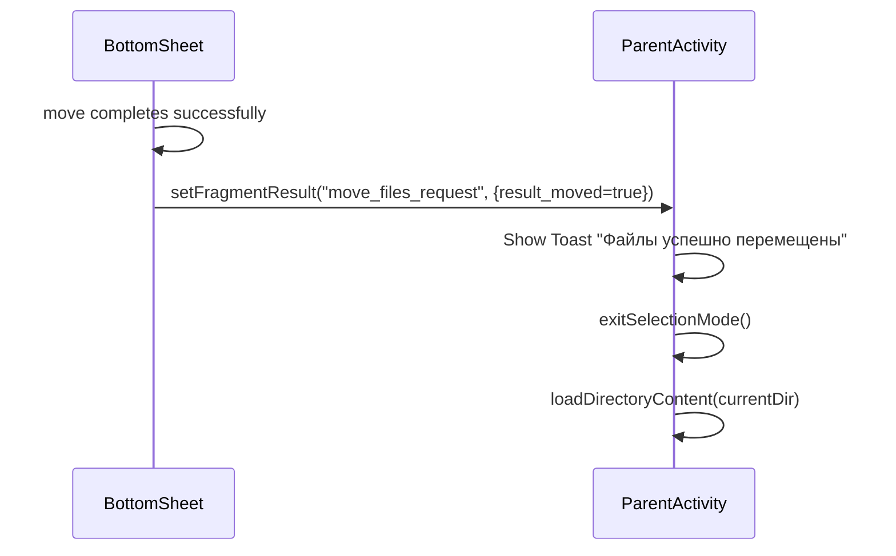

# File Moving Logic

<cite>
**Referenced Files in This Document**
- [MoveFilesBottomSheet.kt](file://app/src/main/java/com/example/b1void/ui/MoveFilesBottomSheet.kt)
- [MoveViewModel.kt](file://app/src/main/java/com/example/b1void/viewmodels/MoveViewModel.kt)
- [FolderRepository.kt](file://app/src/main/java/com/example/b1void/data/FolderRepository.kt)
- [MoveState.kt](file://app/src/main/java/com/example/b1void/models/MoveState.kt)
- [FileManagerActivity.kt](file://app/src/main/java/com/example/b1void/activities/FileManagerActivity.kt)
</cite>

## Table of Contents
1. [Introduction](#introduction)
2. [Core Components and Flow Overview](#core-components-and-flow-overview)
3. [UI Interaction: Move Button Click Handling](#ui-interaction-move-button-click-handling)
4. [ViewModel Layer: Move Operation Coordination](#viewmodel-layer-move-operation-coordination)
5. [Repository Layer: File System Operations](#repository-layer-file-system-operations)
6. [Result Communication with Fragment Result API](#result-communication-with-fragment-result-api)
7. [Error Handling and UI Feedback](#error-handling-and-ui-feedback)
8. [Transactional Behavior and Atomicity Considerations](#transactional-behavior-and-atomicity-considerations)
9. [Common Issues and Edge Cases](#common-issues-and-edge-cases)
10. [Extension Opportunities](#extension-opportunities)

## Introduction
This document details the implementation of the file moving logic within the Move Files Bottom Sheet component of the Inspector_appVX application. The process begins with a user interaction on the UI, progresses through ViewModel coordination, executes file operations via repository abstraction, and concludes with result communication back to the parent fragment. The design emphasizes responsive UI feedback, proper state management using Kotlin Flows, and robust error handling for various file system edge cases.

## Core Components and Flow Overview
The file moving functionality spans multiple architectural layers:
- **UI Layer**: `MoveFilesBottomSheet` handles user interactions and displays progress
- **ViewModel Layer**: `MoveViewModel` manages UI state and orchestrates business logic
- **Data Layer**: `FolderRepository` performs actual file system operations
- **Model Layer**: Data classes define state structures used across components

The flow follows a unidirectional data pattern where UI events trigger ViewModel actions that update observable states, which are then reflected in the UI.

**Diagram sources**
- [MoveFilesBottomSheet.kt](file://app/src/main/java/com/example/b1void/ui/MoveFilesBottomSheet.kt#L84-L108)
- [MoveViewModel.kt](file://app/src/main/java/com/example/b1void/viewmodels/MoveViewModel.kt#L83-L87)
- [FolderRepository.kt](file://app/src/main/java/com/example/b1void/data/FolderRepository.kt#L38-L53)

**Section sources**
- [MoveFilesBottomSheet.kt](file://app/src/main/java/com/example/b1void/ui/MoveFilesBottomSheet.kt#L1-L134)
- [MoveViewModel.kt](file://app/src/main/java/com/example/b1void/viewmodels/MoveViewModel.kt#L1-L124)
- [FolderRepository.kt](file://app/src/main/java/com/example/b1void/data/FolderRepository.kt#L1-L55)

## UI Interaction: Move Button Click Handling
When the user clicks the move button, the `MoveFilesBottomSheet` initiates a sequence of UI updates before launching the asynchronous move operation:

1. Disables both move and cancel buttons to prevent concurrent operations
2. Shows a progress bar to indicate ongoing processing
3. Applies visual dimming to the folder list to signal non-interactivity
4. Launches the move operation within `viewModelScope` using `lifecycleScope`

The click listener ensures thread safety by confining all UI modifications to the main thread while delegating the blocking file operation to a background dispatcher via the ViewModel.

**Section sources**
- [MoveFilesBottomSheet.kt](file://app/src/main/java/com/example/b1void/ui/MoveFilesBottomSheet.kt#L84-L108)

## ViewModel Layer: Move Operation Coordination
The `MoveViewModel` serves as the central coordinator for the file moving process. Its `moveSelectedFiles()` suspend function performs several critical responsibilities:

- Validates that a destination folder has been selected (`selectedNode?.file`)
- Maps file paths from arguments to `File` objects using `filesToMovePaths.map { File(it) }`
- Delegates the actual move operation to `FolderRepository.moveFiles()`
- Returns a boolean indicating overall success or failure

The ViewModel also exposes two state flows:
- `uiState`: Communicates loading, success, or error states to the UI
- `selectedFolderState`: Provides breadcrumbs text and move button enablement status

These flows are observed in the bottom sheet to automatically update the UI based on selection changes.

**Diagram sources**
- [MoveViewModel.kt](file://app/src/main/java/com/example/b1void/viewmodels/MoveViewModel.kt#L83-L87)
- [MoveState.kt](file://app/src/main/java/com/example/b1void/models/MoveState.kt#L1-L36)

**Section sources**
- [MoveViewModel.kt](file://app/src/main/java/com/example/b1void/viewmodels/MoveViewModel.kt#L56-L71)
- [MoveViewModel.kt](file://app/src/main/java/com/example/b1void/viewmodels/MoveViewModel.kt#L20-L23)

## Repository Layer: File System Operations
The `FolderRepository` implements the actual file moving logic in its `moveFiles()` method. Key characteristics include:

- Execution on `Dispatchers.IO` for safe file system access
- Iterative processing of each file in the input list
- Use of `File.renameTo()` for atomic file moves when possible
- Individual try-catch blocks per file to isolate failures
- Aggregation of results to return overall success status

The repository treats the entire operation as a "best effort" batch process rather than an atomic transaction—success is reported only if all files move successfully, but partial moves may occur if some succeed and others fail.

**Section sources**
- [FolderRepository.kt](file://app/src/main/java/com/example/b1void/data/FolderRepository.kt#L38-L53)

## Result Communication with Fragment Result API
Upon successful completion, the move operation communicates results back to the parent `FileManagerActivity` using Android's Fragment Result API:

1. The bottom sheet calls `setFragmentResult()` with key `REQUEST_KEY` and value `RESULT_MOVED=true`
2. The parent activity has registered a listener via `setFragmentResultListener()`
3. When the result is received, the parent shows a confirmation toast
4. Selection mode is exited via `exitSelectionMode()`
5. The current directory content is reloaded to reflect changes

This decoupled communication pattern allows the bottom sheet to remain independent while enabling the parent to respond appropriately to the outcome.

**Diagram sources**
- [MoveFilesBottomSheet.kt](file://app/src/main/java/com/example/b1void/ui/MoveFilesBottomSheet.kt#L98-L99)
- [FileManagerActivity.kt](file://app/src/main/java/com/example/b1void/activities/FileManagerActivity.kt#L820-L830)

**Section sources**
- [FileManagerActivity.kt](file://app/src/main/java/com/example/b1void/activities/FileManagerActivity.kt#L820-L839)

## Error Handling and UI Feedback
The system implements comprehensive error handling at multiple levels:

- **Repository Level**: Catches exceptions during individual file moves, logs errors, and continues processing other files
- **ViewModel Level**: Returns false on any failure, allowing the caller to handle the outcome
- **UI Level**: 
  - Shows Toast notification with localized error message
  - Restores original UI state (re-enables buttons, hides progress bar)
  - Removes dimming effect from folder list

Additionally, the ViewModel can emit `MoveUiState.Error` states during folder tree loading, which are automatically converted to Toast messages by the observing bottom sheet.

**Section sources**
- [MoveFilesBottomSheet.kt](file://app/src/main/java/com/example/b1void/ui/MoveFilesBottomSheet.kt#L100-L107)
- [FolderRepository.kt](file://app/src/main/java/com/example/b1void/data/FolderRepository.kt#L45-L49)

## Transactional Behavior and Atomicity Considerations
While the move operation aims for consistency, it does not provide strong transactional guarantees:

- **No Rollback Mechanism**: If some files move successfully but others fail, there is no automatic rollback of the successful moves
- **Best-Effort Processing**: Each file is processed independently; one failure doesn't stop others
- **Final State Determination**: Success is determined by whether ALL files moved successfully

For true atomicity, enhancements would be needed such as:
- Pre-validation of all destinations
- Two-phase commit pattern (prepare then execute)
- Journaling/move logging for recovery
- Batch operation with explicit rollback capability

Currently, the system prioritizes simplicity and responsiveness over strict transactional integrity.

## Common Issues and Edge Cases
The implementation addresses several common file system challenges:

- **Insufficient Storage Space**: Handled implicitly by `renameTo()` failure, reported as general move failure
- **Permission Denied Errors**: Caught as exceptions, logged, and reported as operation failure
- **Network Timeouts (Cloud Sync)**: Dropbox sync issues manifest as file lock conflicts or I/O exceptions
- **File Conflicts**: Existing files with same name will be overwritten without warning
- **Source-Destination Identity**: Prevented by validation in `selectFolder()` which rejects selection of source folder as destination

Additional edge cases include:
- Moving very large files (potential ANR without proper threading)
- Moving files being actively written by other processes
- Cross-filesystem moves that require copy+delete instead of rename
- Special characters in filenames affecting path resolution

## Extension Opportunities
Several improvements could enhance this functionality:

### Undo Operations
Implement command pattern with:
- History stack storing move operations
- Undo button appearance after successful move
- Reverse move operation with conflict detection

### Batch Processing Indicators
Enhance user feedback with:
- Progress percentage showing files processed/total
- Detailed status messages ("Moving file 3 of 15...")
- Pause/resume capability for large batches

### Conflict Resolution Dialogs
Add intelligent handling for name collisions:
- Prompt user when destination file exists
- Options: Replace, Skip, Rename (with auto-suggestion)
- Bulk decision options for multiple conflicts

### Additional Features
- **Copy Instead of Move**: Add mode selector in bottom sheet
- **Background Processing**: Allow app to navigate away during long operations
- **Notification Integration**: Show progress in system tray for lengthy operations
- **Storage Analysis**: Pre-check available space and warn if insufficient
- **Filtering**: Option to move only specific file types from selection

These extensions would improve usability while maintaining the clean separation of concerns established in the current architecture.