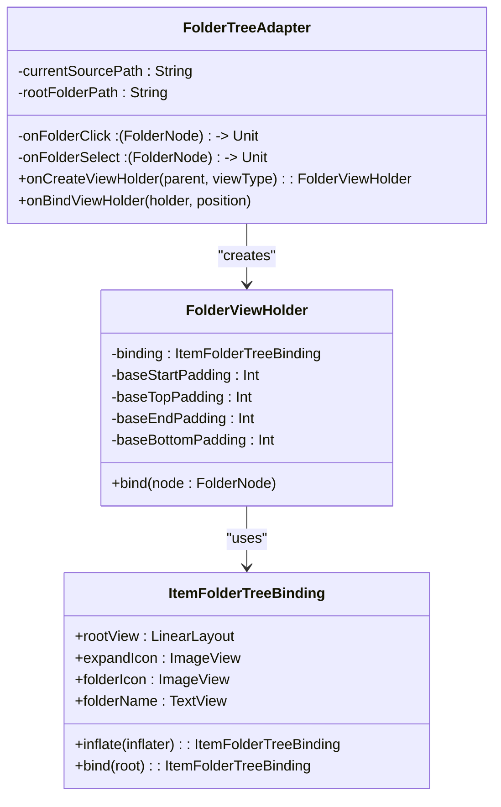
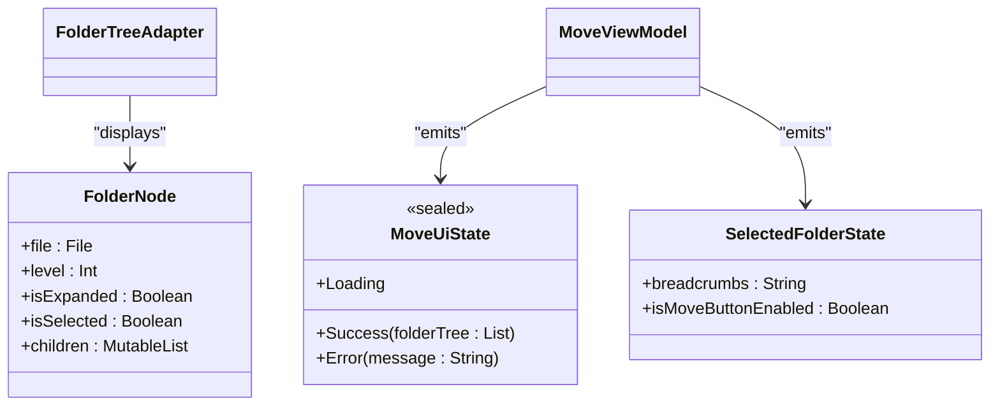
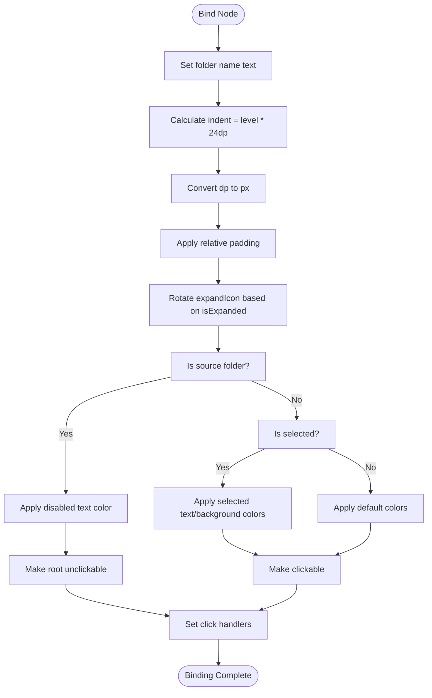
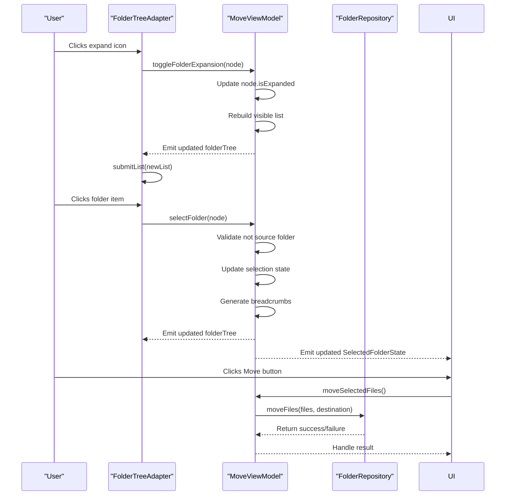
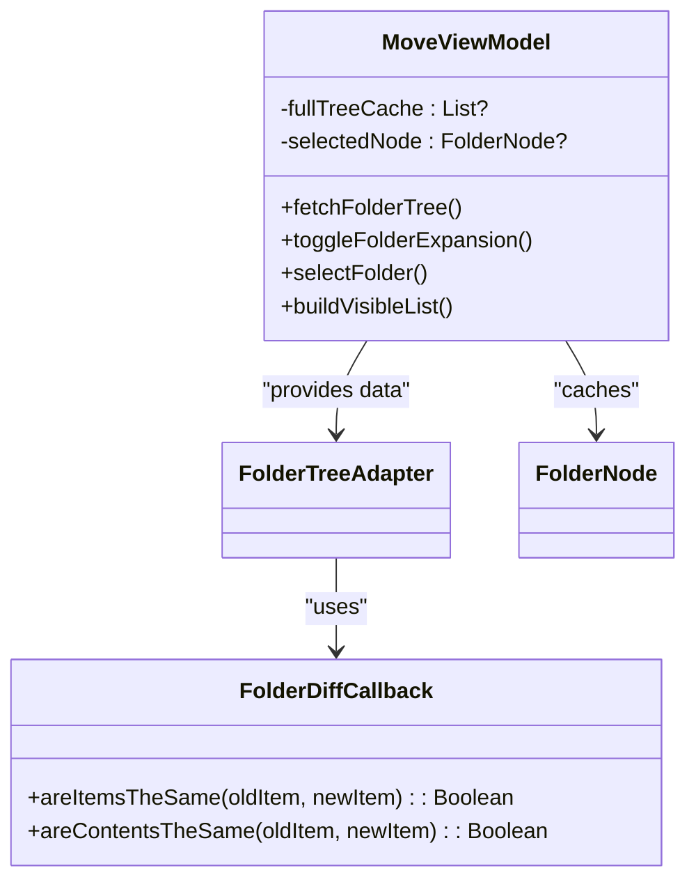
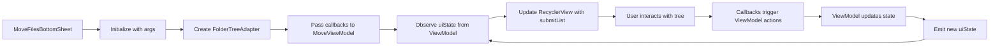

# Folder Tree Rendering

<cite>
**Referenced Files in This Document**   
- [FolderTreeAdapter.kt](file://app/src/main/java/com/example/b1void/adapters/FolderTreeAdapter.kt)
- [ItemFolderTreeBinding.java](file://app/build/generated/data_binding_base_class_source_out/debug/out/com/example/b1void/databinding/ItemFolderTreeBinding.java)
- [MoveFilesBottomSheet.kt](file://app/src/main/java/com/example/b1void/ui/MoveFilesBottomSheet.kt)
- [MoveViewModel.kt](file://app/src/main/java/com/example/b1void/viewmodels/MoveViewModel.kt)
- [FolderDiffCallback.kt](file://app/src/main/java/com/example/b1void/adapters/FolderDiffCallback.kt)
- [item_folder_tree.xml](file://app/src/main/res/layout/item_folder_tree.xml)
- [colors.xml](file://app/src/main/res/values/colors.xml)
- [MoveState.kt](file://app/src/main/java/com/example/b1void/models/MoveState.kt)
</cite>

## Table of Contents
1. [Introduction](#introduction)
2. [Core Components](#core-components)
3. [Data Structure and Model](#data-structure-and-model)
4. [Visual Hierarchy Implementation](#visual-hierarchy-implementation)
5. [State Management and User Interaction](#state-management-and-user-interaction)
6. [Performance Optimization](#performance-optimization)
7. [Accessibility Considerations](#accessibility-considerations)
8. [Integration Flow](#integration-flow)
9. [Conclusion](#conclusion)

## Introduction

The folder tree rendering system in the Move Files Bottom Sheet provides a hierarchical navigation interface for selecting destination folders during file operations. This implementation leverages Android's RecyclerView with a custom adapter to display nested folder structures, supporting expandable nodes, visual indentation based on depth level, and state-based styling for selection and disabled states. The system is designed to handle large directory trees efficiently while maintaining smooth scrolling performance and providing clear visual feedback to users.

**Section sources**
- [FolderTreeAdapter.kt](file://app/src/main/java/com/example/b1void/adapters/FolderTreeAdapter.kt#L14-L88)
- [MoveFilesBottomSheet.kt](file://app/src/main/java/com/example/b1void/ui/MoveFilesBottomSheet.kt#L20-L133)

## Core Components

The folder tree rendering functionality is implemented through several interconnected components that work together to provide a responsive and efficient hierarchical display. The core of this system is the `FolderTreeAdapter` class, which extends `ListAdapter` to leverage DiffUtil for efficient updates when the folder structure changes. This adapter works in conjunction with data binding through `ItemFolderTreeBinding` to connect the UI elements defined in `item_folder_tree.xml` with the underlying data model.

The adapter utilizes the ViewHolder pattern via the inner `FolderViewHolder` class, which holds references to all UI components (folder name text, expand icon, folder icon) and handles their configuration based on the current node state. Each view holder manages its own binding instance, ensuring type-safe access to UI elements without the need for findViewById calls, which improves both performance and code maintainability.

**Diagram sources**
- [FolderTreeAdapter.kt](file://app/src/main/java/com/example/b1void/adapters/FolderTreeAdapter.kt#L14-L88)
- [ItemFolderTreeBinding.java](file://app/build/generated/data_binding_base_class_source_out/debug/out/com/example/b1void/databinding/ItemFolderTreeBinding.java#L18-L89)

**Section sources**
- [FolderTreeAdapter.kt](file://app/src/main/java/com/example/b1void/adapters/FolderTreeAdapter.kt#L14-L88)
- [ItemFolderTreeBinding.java](file://app/build/generated/data_binding_base_class_source_out/debug/out/com/example/b1void/databinding/ItemFolderTreeBinding.java#L18-L89)

## Data Structure and Model

The hierarchical folder structure is represented by the `FolderNode` data class, which encapsulates both the file system information and UI state properties. Each node contains a reference to its corresponding `File` object, its depth level within the hierarchy, expansion state, selection status, and a mutable list of child nodes. This recursive structure enables the representation of arbitrarily deep folder trees while maintaining parent-child relationships.

The adapter receives initialization parameters including the current source path (which cannot be selected), the root folder path (displayed as "Основная директория"), and callback functions for handling folder clicks and selections. These callbacks facilitate communication between the UI layer and the ViewModel, enabling separation of concerns where the adapter focuses solely on presentation logic while delegating business logic to higher-level components.

**Diagram sources**
- [MoveState.kt](file://app/src/main/java/com/example/b1void/models/MoveState.kt#L12-L35)
- [FolderTreeAdapter.kt](file://app/src/main/java/com/example/b1void/adapters/FolderTreeAdapter.kt#L14-L19)

**Section sources**
- [MoveState.kt](file://app/src/main/java/com/example/b1void/models/MoveState.kt#L12-L35)
- [FolderTreeAdapter.kt](file://app/src/main/java/com/example/b1void/adapters/FolderTreeAdapter.kt#L14-L19)

## Visual Hierarchy Implementation

The visual representation of the folder hierarchy is achieved through dynamic padding manipulation based on each node's level property. The `FolderViewHolder` calculates an indentation value by multiplying the node's level by 24dp, then converts this dimension to pixels using a context-aware extension function (`dpToPx`). This calculated indent is added to the base start padding of the item view using `ViewCompat.setPaddingRelative`, ensuring proper RTL layout support.

The expandable nature of nodes is visually indicated by the `expandIcon` ImageView, which rotates between 0° (collapsed) and 90° (expanded) based on the node's `isExpanded` state. This rotation provides immediate visual feedback about the node's state without requiring additional icons or complex animations. The folder name text is conditionally displayed as "Основная директория" when the node represents the root folder, providing a user-friendly label instead of the raw file path.

Color states are managed through programmatic application of color resources based on three conditions: whether the node represents the source folder (disabled state), whether it is currently selected, or neither (default state). The colors are retrieved from the application's theme using `ContextCompat.getColor`, ensuring consistency with the overall application design language.

**Diagram sources**
- [FolderTreeAdapter.kt](file://app/src/main/java/com/example/b1void/adapters/FolderTreeAdapter.kt#L30-L87)
- [item_folder_tree.xml](file://app/src/main/res/layout/item_folder_tree.xml#L1-L35)

**Section sources**
- [FolderTreeAdapter.kt](file://app/src/main/java/com/example/b1void/adapters/FolderTreeAdapter.kt#L30-L87)
- [item_folder_tree.xml](file://app/src/main/res/layout/item_folder_tree.xml#L1-L35)

## State Management and User Interaction

User interactions with the folder tree are handled through two distinct callback mechanisms that separate expansion behavior from selection behavior. Clicking the expand icon triggers the `onFolderClick` callback, which toggles the node's expansion state in the `MoveViewModel`. Clicking anywhere else on the item (except the source folder) triggers the `onFolderSelect` callback, which updates the selection state and enables the move button if a valid destination is chosen.

The source folder is prevented from being selected through both visual and functional means: it appears with a grayed-out text color (`disabledTextColor`) and its click handler is disabled by setting `isClickable = false`. This prevents accidental self-referential moves that would have no effect. Selection state changes are propagated through the ViewModel's state flow, which recomputes the visible folder list and updates the breadcrumbs display accordingly.

**Diagram sources**
- [FolderTreeAdapter.kt](file://app/src/main/java/com/example/b1void/adapters/FolderTreeAdapter.kt#L30-L87)
- [MoveViewModel.kt](file://app/src/main/java/com/example/b1void/viewmodels/MoveViewModel.kt#L14-L123)
- [MoveFilesBottomSheet.kt](file://app/src/main/java/com/example/b1void/ui/MoveFilesBottomSheet.kt#L20-L133)

**Section sources**
- [FolderTreeAdapter.kt](file://app/src/main/java/com/example/b1void/adapters/FolderTreeAdapter.kt#L30-L87)
- [MoveViewModel.kt](file://app/src/main/java/com/example/b1void/viewmodels/MoveViewModel.kt#L14-L123)

## Performance Optimization

The folder tree implementation incorporates several performance optimizations to ensure smooth operation even with large directory structures. The primary optimization is the use of `ListAdapter` with a custom `FolderDiffCallback`, which minimizes unnecessary view updates by comparing items based on their absolute file paths (`areItemsTheSame`) and structural equality (`areContentsTheSame`). This diffing algorithm ensures that only changed items are re-bound, preserving existing view holders for unchanged nodes.

Additional performance considerations include:
- Caching of the complete folder tree in `MoveViewModel` to avoid repeated filesystem traversal
- Lazy expansion of child nodes, where children are only included in the displayed list when their parent is expanded
- Nulling of the item animator on the RecyclerView to eliminate animation overhead during rapid updates
- Use of data binding to eliminate findViewById calls and reduce inflation time

For very large trees, further optimizations could include pagination, virtualization of off-screen items, or background pre-fetching of likely-to-be-expanded subtrees based on user navigation patterns.

**Diagram sources**
- [FolderDiffCallback.kt](file://app/src/main/java/com/example/b1void/adapters/FolderDiffCallback.kt#L90-L98)
- [MoveViewModel.kt](file://app/src/main/java/com/example/b1void/viewmodels/MoveViewModel.kt#L14-L123)

**Section sources**
- [FolderDiffCallback.kt](file://app/src/main/java/com/example/b1void/adapters/FolderDiffCallback.kt#L90-L98)
- [MoveViewModel.kt](file://app/src/main/java/com/example/b1void/viewmodels/MoveViewModel.kt#L14-L123)

## Accessibility Considerations

The visual hierarchy implementation has several implications for accessibility. The indentation-based nesting provides strong visual cues for screen reader users to understand the hierarchical relationship between folders. However, additional accessibility enhancements could improve the experience:

- The expand/collapse state should be announced by screen readers using appropriate accessibility actions and states
- Breadcrumbs navigation could provide alternative pathways for users who prefer linear navigation over hierarchical exploration
- Sufficient color contrast between text and background colors ensures readability for users with low vision
- Touch targets meet minimum size requirements (48dp) for users with motor impairments

The current implementation uses standard Android accessibility features like `selectableItemBackground` for visual feedback and proper focus handling through RecyclerView's built-in mechanisms. Future improvements could include content descriptions for the expand icon that dynamically reflect its state ("Expand folder" vs "Collapse folder").

**Section sources**
- [item_folder_tree.xml](file://app/src/main/res/layout/item_folder_tree.xml#L1-L35)
- [colors.xml](file://app/src/main/res/values/colors.xml#L1-L33)

## Integration Flow

The folder tree rendering system is integrated into the application through the `MoveFilesBottomSheet` fragment, which serves as the entry point for the move operation. This bottom sheet initializes the `FolderTreeAdapter` with the necessary parameters and establishes the connection between UI events and ViewModel actions. The integration follows a unidirectional data flow pattern where user actions trigger state changes in the ViewModel, which then pushes updated state back to the UI for rendering.

Initialization occurs when the bottom sheet is created, with arguments specifying the files to move, the source folder path, and the root folder path. The ViewModel observes these parameters and fetches the initial folder tree structure from the `FolderRepository`. As the user interacts with the tree, the ViewModel updates its internal state and emits new UI states that are collected by the bottom sheet's lifecycle scope.

**Diagram sources**
- [MoveFilesBottomSheet.kt](file://app/src/main/java/com/example/b1void/ui/MoveFilesBottomSheet.kt#L20-L133)
- [FolderTreeAdapter.kt](file://app/src/main/java/com/example/b1void/adapters/FolderTreeAdapter.kt#L14-L88)

**Section sources**
- [MoveFilesBottomSheet.kt](file://app/src/main/java/com/example/b1void/ui/MoveFilesBottomSheet.kt#L20-L133)

## Conclusion

The folder tree rendering implementation in the Move Files Bottom Sheet demonstrates a well-architected approach to displaying hierarchical data in Android applications. By combining RecyclerView with data binding, custom adapters, and ViewModel-based state management, the system achieves a balance between performance, maintainability, and user experience. The use of DiffUtil for efficient updates, thoughtful color state management, and clear separation of concerns between presentation and business logic make this implementation scalable and robust.

Key strengths include the dynamic indentation based on node level, intuitive expand/collapse mechanics with visual rotation feedback, and effective prevention of invalid operations (selecting the source folder). For future improvements, consideration could be given to adding search functionality integration, breadcrumb navigation, and enhanced accessibility features to further improve usability across different user needs and device configurations.