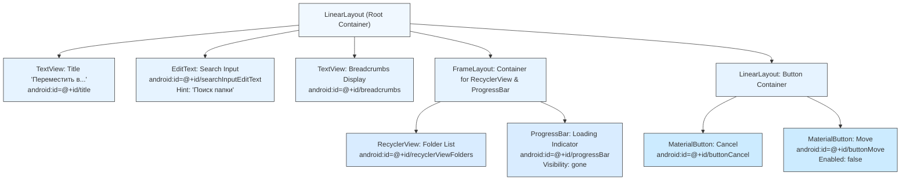
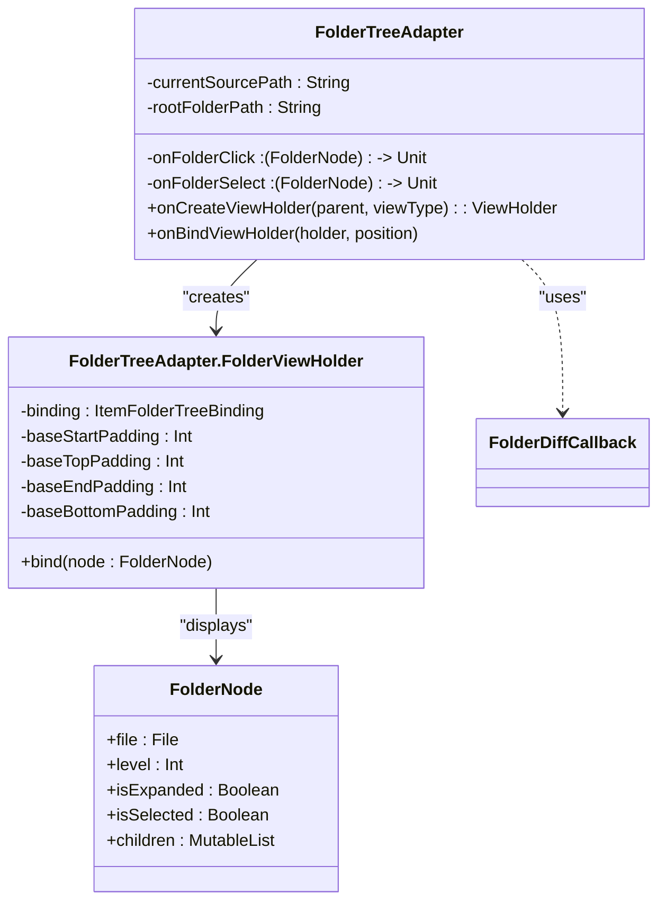
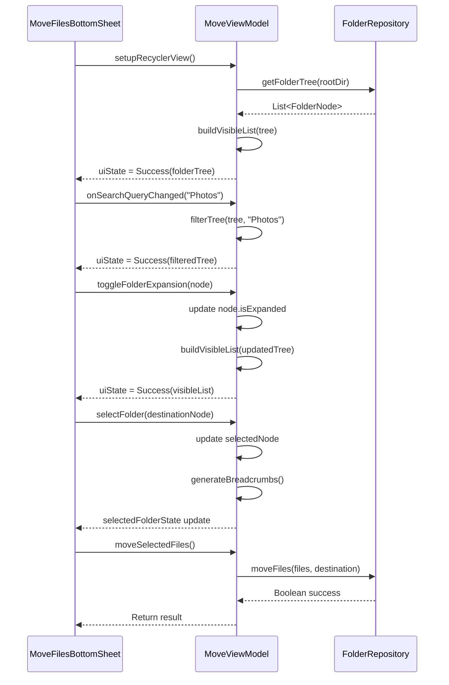

# Move Files Bottom Sheet

<cite>
**Referenced Files in This Document**   
- [MoveFilesBottomSheet.kt](file://app/src/main/java/com/example/b1void/ui/MoveFilesBottomSheet.kt)
- [bottom_sheet_move_files.xml](file://app/src/main/res/layout/bottom_sheet_move_files.xml)
- [FolderTreeAdapter.kt](file://app/src/main/java/com/example/b1void/adapters/FolderTreeAdapter.kt)
- [item_folder_tree.xml](file://app/src/main/res/layout/item_folder_tree.xml)
- [MoveViewModel.kt](file://app/src/main/java/com/example/b1void/viewmodels/MoveViewModel.kt)
- [MoveState.kt](file://app/src/main/java/com/example/b1void/models/MoveState.kt)
- [FolderRepository.kt](file://app/src/main/java/com/example/b1void/data/FolderRepository.kt)
- [FileManagerActivity.kt](file://app/src/main/java/com/example/b1void/activities/FileManagerActivity.kt)
</cite>

## Table of Contents
1. [Introduction](#introduction)
2. [Layout Implementation: bottom_sheet_move_files.xml](#layout-implementation-bottom_sheet_move_filesxml)
3. [Core Component: MoveFilesBottomSheet](#core-component-movefilesbottomsheet)
4. [Folder Navigation with FolderTreeAdapter](#folder-navigation-with-foldertreeadapter)
5. [State Management with MoveViewModel](#state-management-with-moveviewmodel)
6. [Communication with Parent Fragment](#communication-with-parent-fragment)
7. [Performance and Accessibility Considerations](#performance-and-accessibility-considerations)

## Introduction
The MoveFilesBottomSheet component provides a user interface for relocating files between folders within the application. It implements a modal bottom sheet that displays a hierarchical folder structure, enabling users to navigate, search, and select destination folders. The component integrates RecyclerView for efficient rendering of potentially large directory trees, incorporates real-time search functionality, and manages asynchronous file operations through ViewModel-based state management. This documentation details the implementation of all UI elements, data flow patterns, and integration points that enable seamless file relocation.

## Layout Implementation: bottom_sheet_move_files.xml

**Diagram sources**
- [bottom_sheet_move_files.xml](file://app/src/main/res/layout/bottom_sheet_move_files.xml)

**Section sources**
- [bottom_sheet_move_files.xml](file://app/src/main/res/layout/bottom_sheet_move_files.xml)

## Core Component: MoveFilesBottomSheet

The MoveFilesBottomSheet class extends BottomSheetDialogFragment to create a modal interface for file relocation. It uses ViewBinding (BottomSheetMoveFilesBinding) for type-safe access to UI components defined in the layout. The fragment receives three critical parameters through its arguments: the list of file paths to move ([SPEC ARG_FILE_IDS](file://app/src/main/java/com/example/b1void/ui/MoveFilesBottomSheet.kt#L130)), the source folder path ([SPEC ARG_SOURCE_FOLDER_PATH](file://app/src/main/java/com/example/b1void/ui/MoveFilesBottomSheet.kt#L131)), and the root folder path ([SPEC ARG_ROOT_FOLDER_PATH](file://app/src/main/java/com/example/b1void/ui/MoveFilesBottomSheet.kt#L132)). These parameters are used to initialize the folder tree adapter and prevent selection of the source folder as a destination. The setupListeners() method configures click listeners for the Cancel and Move buttons, with the Move button initiating the file transfer operation via the ViewModel. During the operation, the UI is updated to show a progress bar and disable interaction with the folder list by reducing its alpha value. The observeViewModel() method establishes lifecycle-aware coroutines to collect state updates from the MoveViewModel, updating the UI accordingly based on loading, success, or error states.

**Section sources**
- [MoveFilesBottomSheet.kt](file://app/src/main/java/com/example/b1void/ui/MoveFilesBottomSheet.kt#L20-L133)

## Folder Navigation with FolderTreeAdapter

**Diagram sources**
- [FolderTreeAdapter.kt](file://app/src/main/java/com/example/b1void/adapters/FolderTreeAdapter.kt#L14-L88)
- [item_folder_tree.xml](file://app/src/main/res/layout/item_folder_tree.xml)

**Section sources**
- [FolderTreeAdapter.kt](file://app/src/main/java/com/example/b1void/adapters/FolderTreeAdapter.kt#L14-L88)
- [item_folder_tree.xml](file://app/src/main/res/layout/item_folder_tree.xml)

The FolderTreeAdapter renders the hierarchical folder structure using a RecyclerView. It extends ListAdapter with FolderDiffCallback to efficiently handle list updates by comparing item identity and content. Each item is represented by an instance of FolderNode, which contains metadata about the folder including its level in the hierarchy. The adapter calculates dynamic indentation based on the node's level, creating a visual tree structure where child folders are indented relative to their parents. Visual feedback is provided through color changes: selected folders use a red text color ([SPEC delete_red](file://app/src/main/java/com/example/b1void/adapters/FolderTreeAdapter.kt#L68)), while the source folder is disabled with gray text ([SPEC gray](file://app/src/main/java/com/example/b1void/adapters/FolderTreeAdapter.kt#L67)) to prevent invalid selections. Clicking on a folder selects it as the destination (triggering onFolderSelect), while clicking the expand icon toggles the node's expansion state (triggering onFolderClick). The adapter is initialized with callbacks that connect to the MoveViewModel, ensuring that UI interactions directly influence the application state.

## State Management with MoveViewModel

**Diagram sources**
- [MoveViewModel.kt](file://app/src/main/java/com/example/b1void/viewmodels/MoveViewModel.kt#L14-L123)
- [MoveFilesBottomSheet.kt](file://app/src/main/java/com/example/b1void/ui/MoveFilesBottomSheet.kt#L20-L133)

**Section sources**
- [MoveViewModel.kt](file://app/src/main/java/com/example/b1void/viewmodels/MoveViewModel.kt#L14-L123)
- [MoveState.kt](file://app/src/main/java/com/example/b1void/models/MoveState.kt#L23-L35)
- [FolderRepository.kt](file://app/src/main/java/com/example/b1void/data/FolderRepository.kt)

The MoveViewModel orchestrates the business logic for the file move operation using a unidirectional data flow pattern. It exposes two StateFlow properties: uiState ([SPEC uiState](file://app/src/main/java/com/example/b1void/viewmodels/MoveViewModel.kt#L18)) and selectedFolderState ([SPEC selectedFolderState](file://app/src/main/java/com/example/b1void/viewmodels/MoveViewModel.kt#L20)), which emit values whenever the internal state changes. The uiState can be Loading, Success (with folderTree data), or Error (with message), driving the visibility of the progress bar and folder list. The selectedFolderState controls the Move button's enabled state and populates the breadcrumbs text. The ViewModel caches the full folder tree to avoid redundant disk operations during filtering and expansion. When a search query is entered, the filterTree function recursively traverses the cached tree, preserving nodes that match the query or have matching children, and returns a flattened visible list. The moveSelectedFiles() method is a suspending function that delegates the actual file system operation to FolderRepository, returning a boolean success indicator. All state mutations occur within viewModelScope to ensure they are executed on the appropriate dispatcher and automatically canceled if the ViewModel is cleared.

## Communication with Parent Fragment

The MoveFilesBottomSheet communicates completion results to its parent fragment using the Fragment Result API. It defines two constants: REQUEST_KEY ([SPEC REQUEST_KEY](file://app/src/main/java/com/example/b1void/ui/MoveFilesBottomSheet.kt#L127)) and RESULT_MOVED ([SPEC RESULT_MOVED](file://app/src/main/java/com/example/b1void/ui/MoveFilesBottomSheet.kt#L128)). When the file move operation succeeds, the bottom sheet sets a fragment result with these keys before dismissing itself ([SPEC setFragmentResult](file://app/src/main/java/com/example/b1void/ui/MoveFilesBottomSheet.kt#L75)). The parent FileManagerActivity listens for this result using setFragmentResultListener ([SPEC setFragmentResultListener](file://app/src/main/java/com/example/b1void/activities/FileManagerActivity.kt#L818-L822)). Upon receiving a positive result, the activity displays a success toast, exits selection mode, and reloads the current directory content to reflect the changes. This decoupled communication pattern ensures that the bottom sheet remains independent of its host fragment while still being able to trigger necessary UI updates in the parent context. The newInstance factory method ([SPEC newInstance](file://app/src/main/java/com/example/b1void/ui/MoveFilesBottomSheet.kt#L134-L142)) encapsulates the argument creation logic, providing a clean API for launching the bottom sheet with the required parameters.

**Section sources**
- [MoveFilesBottomSheet.kt](file://app/src/main/java/com/example/b1void/ui/MoveFilesBottomSheet.kt#L127-L142)
- [FileManagerActivity.kt](file://app/src/main/java/com/example/b1void/activities/FileManagerActivity.kt#L818-L822)

## Performance and Accessibility Considerations

The implementation includes several optimizations for handling large directory structures and ensuring accessibility. The FolderTreeAdapter uses ListAdapter with a custom DiffUtil callback ([SPEC FolderDiffCallback](file://app/src/main/java/com/example/b1void/adapters/FolderTreeAdapter.kt#L90-L98)) to minimize UI updates by only notifying RecyclerView of actual changes. The folder tree is built asynchronously in the IO dispatcher ([SPEC Dispatchers.IO](file://app/src/main/java/com/example/b1void/data/FolderRepository.kt#L10)) to prevent blocking the main thread during disk operations. For very large directories, additional optimizations could include pagination, lazy loading of child nodes, or indexing. The UI maintains responsiveness during long-running tasks by showing a progress indicator and disabling interactive elements. For accessibility, the implementation should ensure proper content descriptions for icons (expand/collapse, folder), announce state changes (selection, loading) to screen readers, and maintain sufficient color contrast. The breadcrumbs provide important navigation context for all users, especially those relying on assistive technologies. To handle concurrent moves or network timeouts during cloud sync (if extended), the FolderRepository would need to implement retry logic, cancellation tokens, and proper exception handling to maintain data consistency and provide meaningful error messages to the user.

**Section sources**
- [FolderTreeAdapter.kt](file://app/src/main/java/com/example/b1void/adapters/FolderTreeAdapter.kt#L90-L98)
- [FolderRepository.kt](file://app/src/main/java/com/example/b1void/data/FolderRepository.kt)
- [MoveViewModel.kt](file://app/src/main/java/com/example/b1void/viewmodels/MoveViewModel.kt#L14-L123)