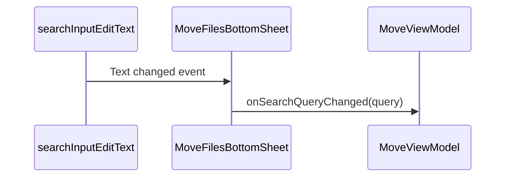
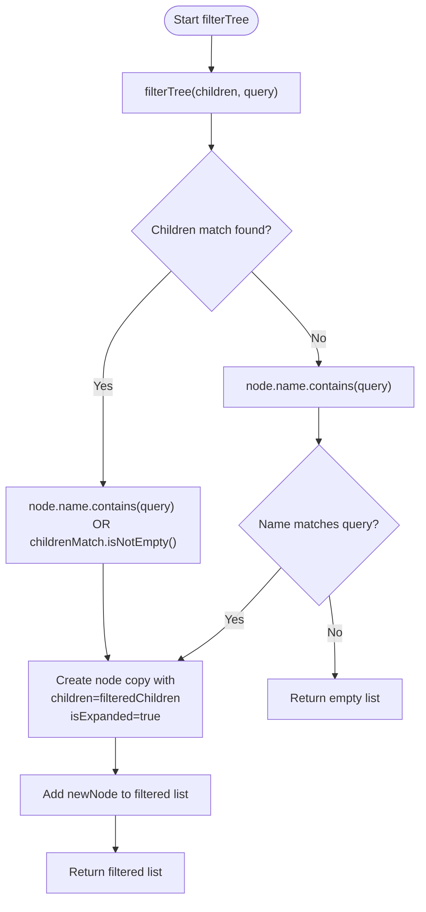
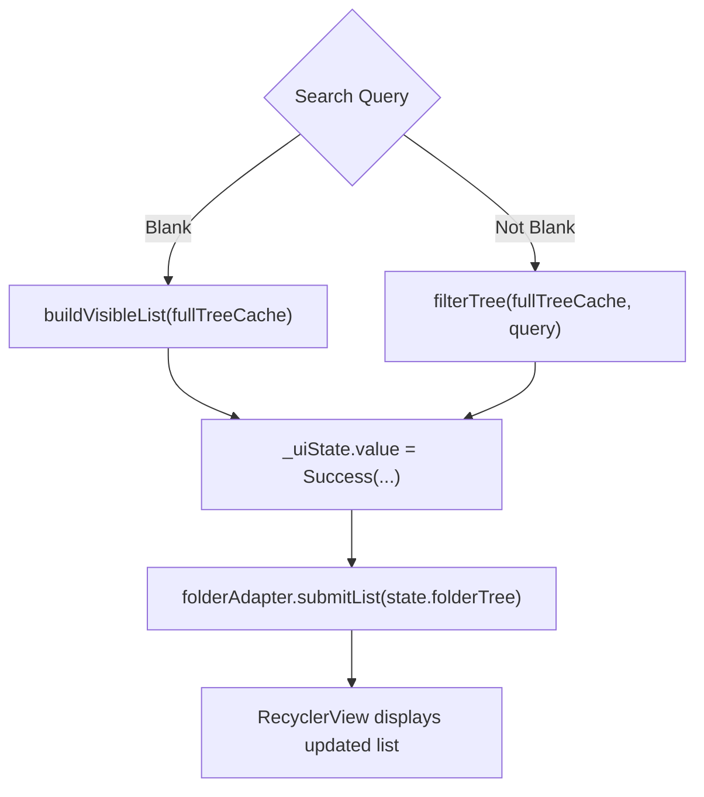

# Search Functionality

<cite>
**Referenced Files in This Document**   
- [MoveFilesBottomSheet.kt](file://app/src/main/java/com/example/b1void/ui/MoveFilesBottomSheet.kt)
- [MoveViewModel.kt](file://app/src/main/java/com/example/b1void/viewmodels/MoveViewModel.kt)
- [FolderTreeAdapter.kt](file://app/src/main/java/com/example/b1void/adapters/FolderTreeAdapter.kt)
- [MoveState.kt](file://app/src/main/java/com/example/b1void/models/MoveState.kt)
- [FolderRepository.kt](file://app/src/main/java/com/example/b1void/data/FolderRepository.kt)
</cite>

## Table of Contents
1. [Introduction](#introduction)
2. [Search Input Handling](#search-input-handling)
3. [Recursive Filtering Algorithm](#recursive-filtering-algorithm)
4. [UI State Management](#ui-state-management)
5. [Filtering Behavior Examples](#filtering-behavior-examples)
6. [Common Issues and Considerations](#common-issues-and-considerations)
7. [Optimization Suggestions](#optimization-suggestions)

## Introduction
The Move Files Bottom Sheet implements a real-time search functionality that allows users to filter folder trees based on name queries. This document details the implementation of the search feature, focusing on the interaction between UI components and ViewModel, the recursive filtering algorithm, state preservation, and performance considerations. The system enables users to quickly locate folders within potentially large directory structures while maintaining context through ancestor preservation.

## Search Input Handling

The search functionality begins with the `doOnTextChanged` listener attached to the `searchInputEditText` in the `MoveFilesBottomSheet`. This listener captures every keystroke and immediately delegates the query processing to the `MoveViewModel`.



**Section sources**
- [MoveFilesBottomSheet.kt](file://app/src/main/java/com/example/b1void/ui/MoveFilesBottomSheet.kt#L89-L91)

When text changes occur, the `onSearchQueryChanged` method in `MoveViewModel` is invoked with the current query string. This triggers immediate filtering logic that processes the cached folder tree structure without blocking the UI thread, ensuring responsive user interaction during typing.

## Recursive Filtering Algorithm

The core of the search functionality lies in the `filterTree` method within `MoveViewModel`, which implements a recursive depth-first traversal algorithm to identify matching nodes.



**Diagram sources**
- [MoveViewModel.kt](file://app/src/main/java/com/example/b1void/viewmodels/MoveViewModel.kt#L105-L115)

The algorithm works as follows:
1. For each node, recursively process its children first
2. A node is included in results if either:
   - Its name contains the query (case-insensitive)
   - Any of its descendants match the query
3. When a match occurs, a copy of the node is created with:
   - Filtered children list
   - `isExpanded = true` to ensure visibility
   - Original expansion state preserved in cache

This approach ensures that parent folders are preserved in search results when their children match, maintaining navigational context for the user.

**Section sources**
- [MoveViewModel.kt](file://app/src/main/java/com/example/b1void/viewmodels/MoveViewModel.kt#L105-L115)

## UI State Management

The search functionality integrates with the application's state management system through the `_uiState.value` updates in `MoveViewModel`. The system handles both blank queries and active searches differently:



**Diagram sources**
- [MoveViewModel.kt](file://app/src/main/java/com/example/b1void/viewmodels/MoveViewModel.kt#L98-L108)
- [MoveFilesBottomSheet.kt](file://app/src/main/java/com/example/b1void/ui/MoveFilesBottomSheet.kt#L70-L75)

For blank queries, the system returns the full visible list using `buildVisibleList`, which respects the current expansion state of all nodes. For non-blank queries, the filtered results show only matching nodes and their ancestors, with all relevant nodes forced to expanded state (`isExpanded = true`) to ensure complete visibility of the matching path.

The implementation creates copies of `FolderNode` objects during filtering to avoid modifying the cached tree, preserving the original state for subsequent operations.

**Section sources**
- [MoveViewModel.kt](file://app/src/main/java/com/example/b1void/viewmodels/MoveViewModel.kt#L98-L115)
- [MoveState.kt](file://app/src/main/java/com/example/b1void/models/MoveState.kt#L12-L18)

## Filtering Behavior Examples

The search functionality demonstrates specific behaviors in different scenarios:

### Case-Insensitive Matching
The algorithm uses `contains(query, ignoreCase = true)` to match folder names regardless of case, allowing users to find "Documents", "documents", or "DOCUMENTS" with the same query.

### Partial Match Preservation
When searching for "proj":
- Matches: "Project Alpha", "My Projects", "Recent_Projects"
- Preserves parents: Even if parents don't match, they appear to maintain hierarchy
- Expands path: All nodes from root to matching nodes are shown as expanded

### Multiple Match Handling
The algorithm collects all nodes that match the criteria, allowing multiple branches of the folder tree to appear simultaneously in results when they contain matches.

**Section sources**
- [MoveViewModel.kt](file://app/src/main/java/com/example/b1void/viewmodels/MoveViewModel.kt#L105-L115)
- [FolderTreeAdapter.kt](file://app/src/main/java/com/example/b1void/adapters/FolderTreeAdapter.kt#L45-L60)

## Common Issues and Considerations

### Special Characters in Queries
The current implementation uses basic string containment checking, which may produce unexpected results with special characters. For example, regex control characters or Unicode symbols might not behave as users expect in partial matching.

### Performance with Large Structures
The recursive filtering algorithm has O(n) complexity where n is the total number of nodes in the tree. With very large directory structures:
- Deep recursion could lead to stack overflow risks
- Complete tree traversal on every keystroke may cause lag
- Memory usage increases with large result sets

### UX Considerations for Partial Matches
The implementation favors recall over precision by showing ancestors of matching nodes. While this preserves context, it may overwhelm users with irrelevant intermediate folders in deep hierarchies.

**Section sources**
- [MoveViewModel.kt](file://app/src/main/java/com/example/b1void/viewmodels/MoveViewModel.kt#L105-L115)
- [FolderRepository.kt](file://app/src/main/java/com/example/b1void/data/FolderRepository.kt#L14-L30)

## Optimization Suggestions

### Input Debouncing
Implement debouncing to reduce processing frequency during rapid typing:

```kotlin
// Pseudocode for debounced search
val searchDebouncer = MutableSharedFlow<String>()
lifecycleScope.launch {
    searchDebouncer
        .debounce(300) // 300ms delay
        .collect { query -> 
            viewModel.onSearchQueryChanged(query)
        }
}
```

This would prevent excessive filtering operations during fast typing, improving responsiveness.

### Search Scope Limitation
Consider implementing scope limitations such as:
- Maximum search depth
- Result count limits
- Asynchronous incremental loading for large result sets

### Caching Optimizations
Enhance the caching strategy by:
- Maintaining a flattened index of folder names for faster lookup
- Implementing lazy filtering for very large trees
- Using efficient data structures for common search terms

### Enhanced Matching Algorithm
Improve search quality by implementing:
- Word boundary matching
- Fuzzy matching for typo tolerance
- Prioritization of exact matches at the beginning of folder names

These optimizations would maintain the core functionality while significantly improving performance and user experience, especially with large directory structures.

**Section sources**
- [MoveViewModel.kt](file://app/src/main/java/com/example/b1void/viewmodels/MoveViewModel.kt#L98-L115)
- [FolderRepository.kt](file://app/src/main/java/com/example/b1void/data/FolderRepository.kt#L14-L30)