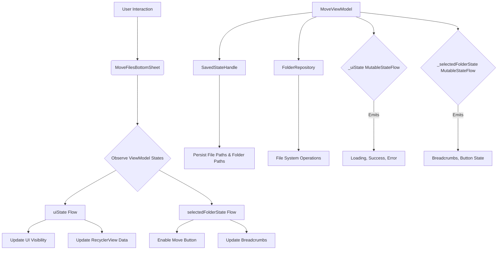
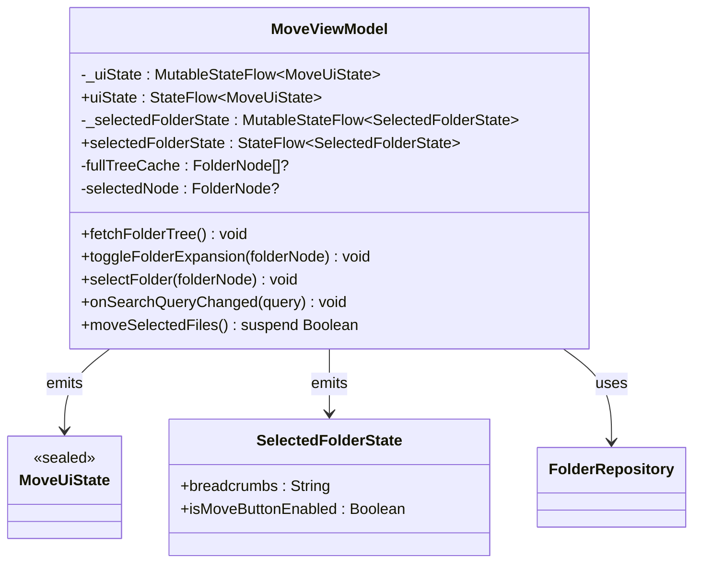
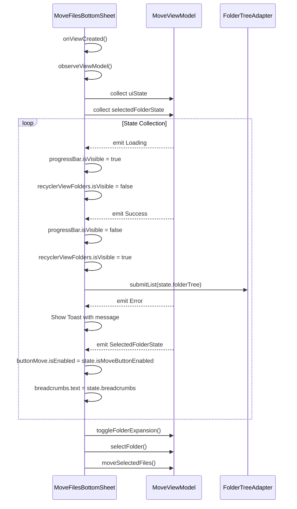
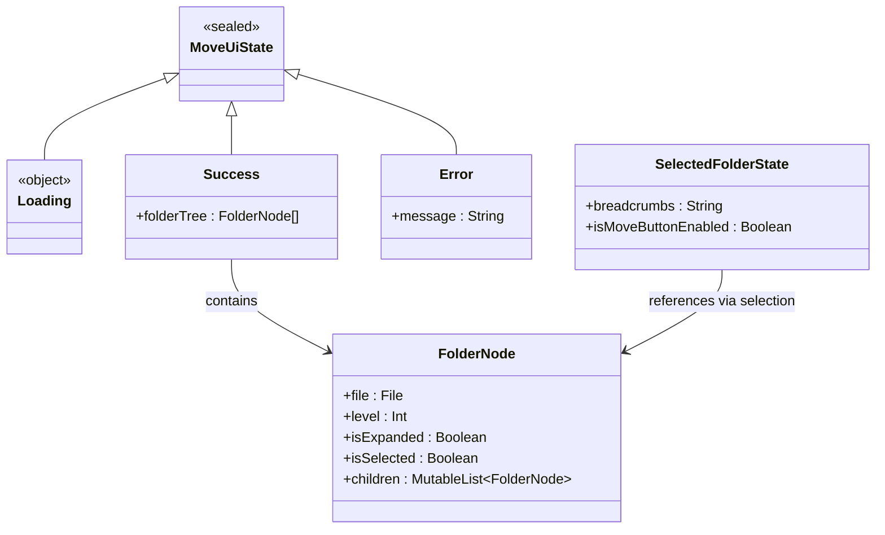
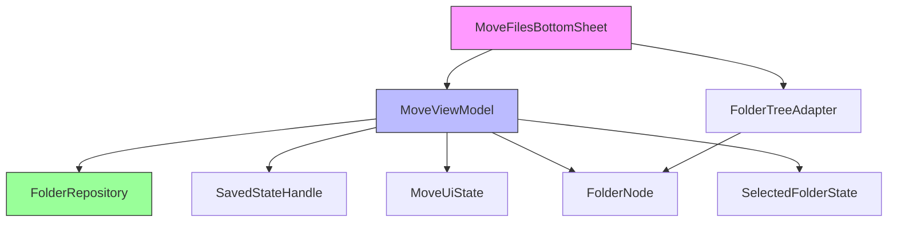

# State Management

<cite>
**Referenced Files in This Document **   
- [MoveViewModel.kt](file://app/src/main/java/com/example/b1void/viewmodels/MoveViewModel.kt)
- [MoveFilesBottomSheet.kt](file://app/src/main/java/com/example/b1void/ui/MoveFilesBottomSheet.kt)
- [MoveState.kt](file://app/src/main/java/com/example/b1void/models/MoveState.kt)
- [FolderRepository.kt](file://app/src/main/java/com/example/b1void/data/FolderRepository.kt)
- [FolderTreeAdapter.kt](file://app/src/main/java/com/example/b1void/adapters/FolderTreeAdapter.kt)
</cite>

## Table of Contents
1. [Introduction](#introduction)
2. [Core Components](#core-components)
3. [Architecture Overview](#architecture-overview)
4. [Detailed Component Analysis](#detailed-component-analysis)
5. [Dependency Analysis](#dependency-analysis)
6. [Performance Considerations](#performance-considerations)
7. [Troubleshooting Guide](#troubleshooting-guide)
8. [Conclusion](#conclusion)

## Introduction
This document provides a comprehensive analysis of the state management system powering the Move Files Bottom Sheet feature in the B1Void application. The system leverages Kotlin's StateFlow to manage UI states and folder selection states in a lifecycle-aware manner, ensuring consistent user experience during file operations. The architecture follows modern Android development patterns with clear separation of concerns between UI components, view models, and data repositories. This documentation details how state changes are propagated from the ViewModel through to the UI layer, handling loading, success, and error states while maintaining performance and responsiveness.

## Core Components
The state management system for the Move Files Bottom Sheet is built around several key components that work together to provide a seamless user experience. At its core, the `MoveViewModel` manages two primary state flows: `_uiState` for overall UI presentation and `_selectedFolderState` for folder selection context. These states are exposed as immutable StateFlows to prevent external modification. The `MoveFilesBottomSheet` fragment observes these states using lifecycle-aware coroutines, ensuring subscriptions are properly managed across configuration changes. Supporting data classes like `MoveUiState` and `SelectedFolderState` define the possible states and their associated data, while the `FolderRepository` handles the actual file system operations. The `FolderTreeAdapter` bridges the gap between the domain model and UI presentation, efficiently displaying the hierarchical folder structure.

**Section sources**
- [MoveViewModel.kt](file://app/src/main/java/com/example/b1void/viewmodels/MoveViewModel.kt#L14-L123)
- [MoveFilesBottomSheet.kt](file://app/src/main/java/com/example/b1void/ui/MoveFilesBottomSheet.kt#L20-L133)
- [MoveState.kt](file://app/src/main/java/com/example/b1void/models/MoveState.kt#L12-L35)

## Architecture Overview
The state management architecture follows a unidirectional data flow pattern where user actions trigger state changes in the ViewModel, which are then observed by the UI layer. This creates a predictable and testable system where all state mutations occur in a single location. The architecture is designed to be resilient to configuration changes through the use of SavedStateHandle, which automatically persists critical parameters across activity recreations. The system also implements proper error handling and graceful degradation when file operations fail, providing meaningful feedback to users without crashing the application.

**Diagram sources **
- [MoveViewModel.kt](file://app/src/main/java/com/example/b1void/viewmodels/MoveViewModel.kt#L14-L123)
- [MoveFilesBottomSheet.kt](file://app/src/main/java/com/example/b1void/ui/MoveFilesBottomSheet.kt#L20-L133)

## Detailed Component Analysis

### MoveViewModel Analysis
The `MoveViewModel` serves as the central state management component for the Move Files Bottom Sheet, orchestrating data retrieval, state transitions, and business logic execution. It utilizes two distinct StateFlow instances to separate different aspects of the UI state, following the principle of single responsibility for state objects.

#### State Management Implementation

**Diagram sources **
- [MoveViewModel.kt](file://app/src/main/java/com/example/b1void/viewmodels/MoveViewModel.kt#L14-L123)
- [MoveState.kt](file://app/src/main/java/com/example/b1void/models/MoveState.kt#L23-L35)

**Section sources**
- [MoveViewModel.kt](file://app/src/main/java/com/example/b1void/viewmodels/MoveViewModel.kt#L14-L123)

### MoveFilesBottomSheet Analysis
The `MoveFilesBottomSheet` fragment acts as the UI layer that consumes the state exposed by `MoveViewModel`. It establishes lifecycle-aware subscriptions to the ViewModel's state flows, ensuring that UI updates occur only when the fragment is in an appropriate state. The fragment also handles user interactions and translates them into calls on the ViewModel, completing the unidirectional data flow cycle.

#### UI State Observation Flow

**Diagram sources **
- [MoveFilesBottomSheet.kt](file://app/src/main/java/com/example/b1void/ui/MoveFilesBottomSheet.kt#L20-L133)
- [MoveViewModel.kt](file://app/src/main/java/com/example/b1void/viewmodels/MoveViewModel.kt#L14-L123)

**Section sources**
- [MoveFilesBottomSheet.kt](file://app/src/main/java/com/example/b1void/ui/MoveFilesBottomSheet.kt#L20-L133)

### State Classes Analysis
The state management system relies on well-defined data classes that represent the various states the UI can be in. These classes are designed to be immutable and contain all necessary information for the UI to render itself correctly without needing to derive additional state.

#### State Class Relationships

**Diagram sources **
- [MoveState.kt](file://app/src/main/java/com/example/b1void/models/MoveState.kt#L12-L35)
- [MoveViewModel.kt](file://app/src/main/java/com/example/b1void/viewmodels/MoveViewModel.kt#L14-L123)

**Section sources**
- [MoveState.kt](file://app/src/main/java/com/example/b1void/models/MoveState.kt#L12-L35)

## Dependency Analysis
The state management system demonstrates a clean dependency hierarchy with well-defined boundaries between components. The ViewModel depends on the data repository for file operations but has no direct dependencies on UI components. The UI layer depends only on the ViewModel's public state flows, creating a one-way dependency chain that enhances testability and maintainability.

**Diagram sources **
- [MoveViewModel.kt](file://app/src/main/java/com/example/b1void/viewmodels/MoveViewModel.kt#L14-L123)
- [MoveFilesBottomSheet.kt](file://app/src/main/java/com/example/b1void/ui/MoveFilesBottomSheet.kt#L20-L133)
- [FolderRepository.kt](file://app/src/main/java/com/example/b1void/data/FolderRepository.kt#L7-L54)

**Section sources**
- [MoveViewModel.kt](file://app/src/main/java/com/example/b1void/viewmodels/MoveViewModel.kt#L14-L123)
- [MoveFilesBottomSheet.kt](file://app/src/main/java/com/example/b1void/ui/MoveFilesBottomSheet.kt#L20-L133)
- [FolderRepository.kt](file://app/src/main/java/com/example/b1void/data/FolderRepository.kt#L7-L54)

## Performance Considerations
The state management implementation includes several performance optimizations to ensure smooth user experience. The `fullTreeCache` field prevents redundant file system scans by storing the complete folder tree after the initial load. The recursive `buildVisibleList` function efficiently constructs the flat list needed by RecyclerView while respecting expansion states, avoiding expensive re-scans of the file system. The adapter uses DiffUtil under the hood through ListAdapter, minimizing unnecessary view updates by calculating minimal change sets. Additionally, the use of StateFlow ensures that observers receive updates only when the state actually changes, preventing redundant UI re-renders.

## Troubleshooting Guide
When debugging issues with the state management system, focus on the following common problem areas:

1. **State Loss During Configuration Changes**: Verify that all necessary parameters are properly stored in SavedStateHandle. The current implementation correctly persists file paths and folder paths, but ensure new parameters follow the same pattern.

2. **Memory Leaks from Uncollected Flows**: Confirm that all flow collections use `viewLifecycleOwner.lifecycleScope.launch` rather than global scopes. This ensures subscriptions are automatically canceled when the fragment is destroyed.

3. **Race Conditions During Concurrent Operations**: The current implementation does not explicitly handle concurrent operations on the same files. Consider adding synchronization mechanisms if multiple bottom sheets could operate simultaneously.

4. **UI Not Updating**: Check that state mutations use the correct MutableStateFlow reference and that observers are properly established in `observeViewModel()`.

5. **Incorrect Breadcrumb Display**: Verify that `generateBreadcrumbs` correctly handles edge cases like root directory paths and special characters.

**Section sources**
- [MoveViewModel.kt](file://app/src/main/java/com/example/b1void/viewmodels/MoveViewModel.kt#L14-L123)
- [MoveFilesBottomSheet.kt](file://app/src/main/java/com/example/b1void/ui/MoveFilesBottomSheet.kt#L20-L133)

## Conclusion
The state management system for the Move Files Bottom Sheet demonstrates a robust implementation of modern Android architecture principles. By leveraging StateFlow and unidirectional data flow, it provides a predictable and maintainable way to manage complex UI states. The separation of concerns between ViewModel, UI, and data layers enhances testability and allows for independent evolution of components. The use of caching and efficient data structures ensures good performance even with large folder hierarchies. Future improvements could include more sophisticated error recovery, support for undo operations, and enhanced accessibility features, but the current foundation provides a solid base for these enhancements.