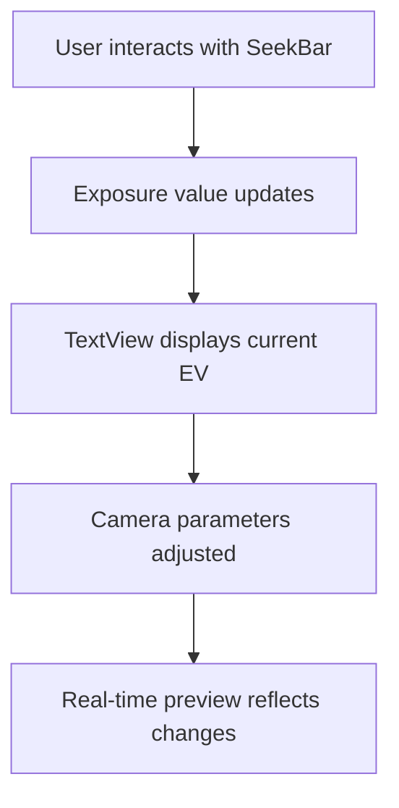
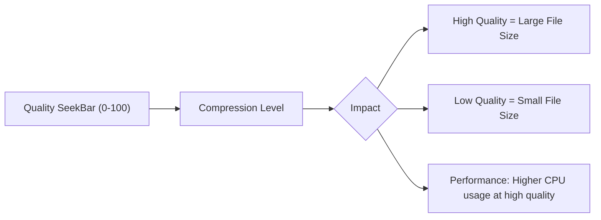
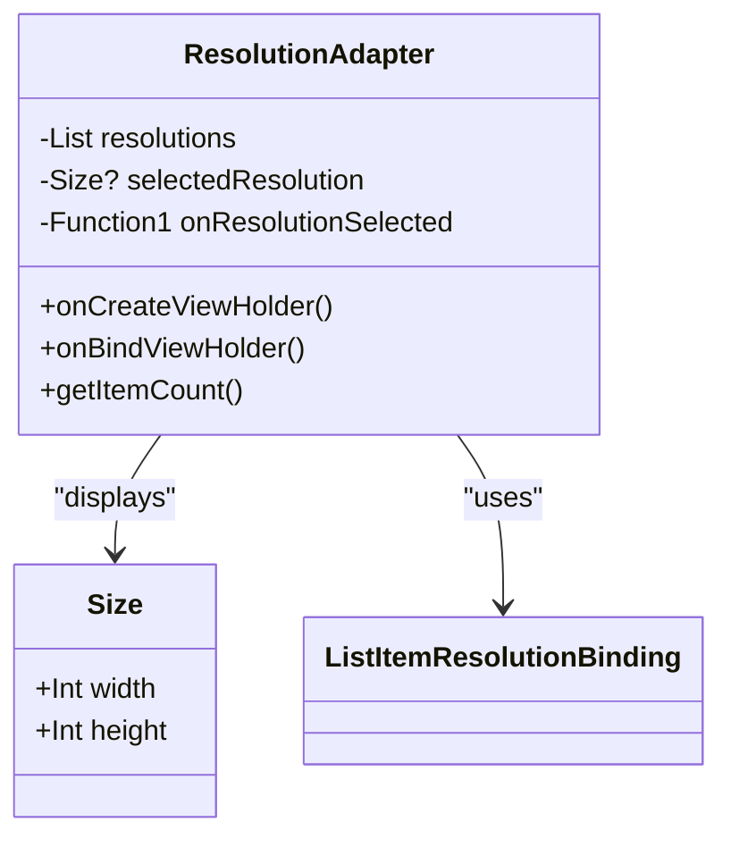
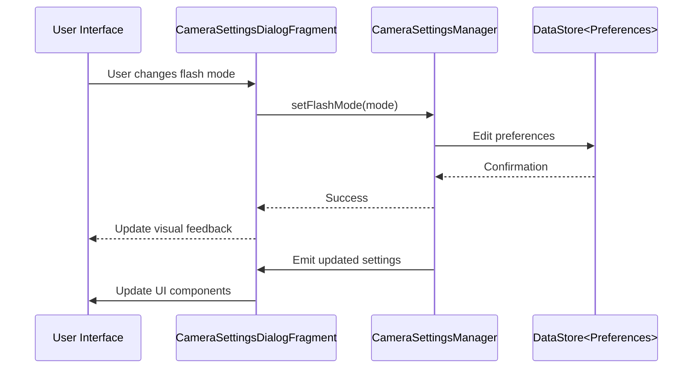
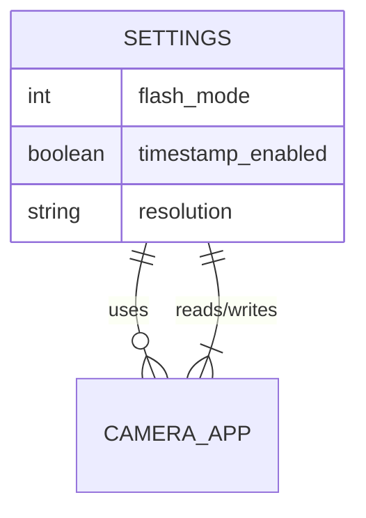
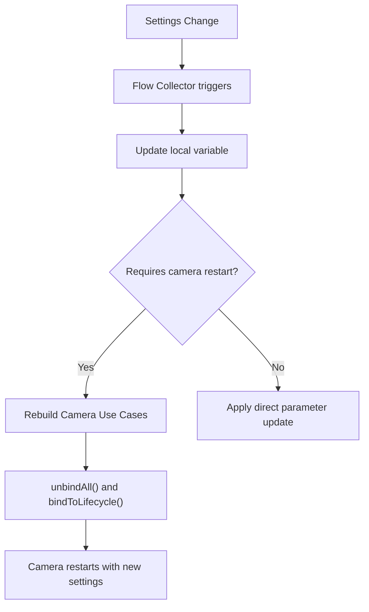

# Camera Settings Dialogs

<cite>
**Referenced Files in This Document**   
- [CameraSettingsDialogFragment.kt](file://app/src/main/java/com/example/b1void/ui/CameraSettingsDialogFragment.kt)
- [CameraSettingsManager.kt](file://app/src/main/java/com/example/b1void/data/CameraSettingsManager.kt)
- [CameraActivity.kt](file://app/src/main/java/com/example/b1void/activities/CameraActivity.kt)
- [dialog_exposure.xml](file://app/src/main/res/layout/dialog_exposure.xml)
- [dialog_image_quality.xml](file://app/src/main/res/layout/dialog_image_quality.xml)
- [dialog_resolution_selector.xml](file://app/src/main/res/layout/dialog_resolution_selector.xml)
- [ResolutionAdapter.kt](file://app/src/main/java/com/example/b1void/adapters/ResolutionAdapter.kt)
- [DynamicSeekbarLayoutBinding.java](file://app/build/generated/data_binding_base_class_source_out/debug/out/com/example/b1void/databinding/DynamicSeekbarLayoutBinding.java)
- [ListItemResolutionBinding.java](file://app/build/generated/data_binding_base_class_source_out/debug/out/com/example/b1void/databinding/ListItemResolutionBinding.java)
</cite>

## Table of Contents
1. [Introduction](#introduction)
2. [Core Dialog Components](#core-dialog-components)
3. [Exposure Control Dialog](#exposure-control-dialog)
4. [Image Quality Configuration](#image-quality-configuration)
5. [Resolution Selection System](#resolution-selection-system)
6. [Camera Settings Controller](#camera-settings-controller)
7. [State Management and Persistence](#state-management-and-persistence)
8. [Integration with Camera Activity](#integration-with-camera-activity)
9. [Common Issues and Performance Considerations](#common-issues-and-performance-considerations)

## Introduction
This document provides comprehensive technical documentation for the camera settings dialog components in the B1Void application. It details the implementation of fine-grained capture parameter controls through specialized dialog interfaces that enable users to configure exposure, image quality, and resolution settings. The system leverages Android's Data Binding framework, CameraX API integration, and reactive state management patterns to provide a responsive user experience with persistent configuration storage. Each dialog component is designed to work within a bottom sheet interface, providing intuitive access to advanced camera controls while maintaining application performance and device compatibility.

## Core Dialog Components

The camera settings system consists of three primary dialog components that provide specialized control over different aspects of image capture: exposure compensation, image quality configuration, and resolution selection. These dialogs are implemented as lightweight, focused interfaces that integrate seamlessly with the main camera activity through data binding and reactive programming patterns. The design follows Material Design guidelines for bottom sheet dialogs, ensuring consistent user experience across the application.

**Section sources**
- [dialog_exposure.xml](file://app/src/main/res/layout/dialog_exposure.xml#L1-L23)
- [dialog_image_quality.xml](file://app/src/main/res/layout/dialog_image_quality.xml#L1-L21)
- [dialog_resolution_selector.xml](file://app/src/main/res/layout/dialog_resolution_selector.xml#L1-L9)

## Exposure Control Dialog

### Manual Exposure Compensation Implementation
The exposure control dialog enables manual adjustment of camera exposure compensation through a seekbar interface defined in `dialog_exposure.xml`. The layout contains a TextView to display the current exposure value and a SeekBar for user interaction. The exposure values are typically represented in EV (Exposure Value) units, allowing precise control over image brightness.



The seekbar interaction is handled through standard Android event listeners that update both the visual feedback and underlying camera parameters. While the specific binding logic isn't directly visible in the provided code, the pattern follows Android's recommended approach for handling seekbar changes in camera applications.

**Diagram sources**
- [dialog_exposure.xml](file://app/src/main/res/layout/dialog_exposure.xml#L1-L23)

**Section sources**
- [dialog_exposure.xml](file://app/src/main/res/layout/dialog_exposure.xml#L1-L23)

## Image Quality Configuration

### JPEG Compression Level Settings
The image quality dialog (`dialog_image_quality.xml`) provides control over JPEG compression levels through a seekbar that ranges from 0 to 100. This setting directly impacts both file size and image quality, with higher values producing better quality but larger files.



The validation rules ensure that only valid integer values within the specified range are accepted. The impact on performance is significant, as higher quality settings require more processing time during image encoding, which can affect capture speed and battery consumption.

When an image is saved, the selected quality level is applied through the Bitmap compression API:

```kotlin
bitmap.compress(Bitmap.CompressFormat.JPEG, qualityLevel, outputStream)
```

Where the quality level is derived from the seekbar position, with the default implementation using 95% quality in the `saveBitmapToFile` method.

**Diagram sources**
- [dialog_image_quality.xml](file://app/src/main/res/layout/dialog_image_quality.xml#L1-L21)
- [CameraActivity.kt](file://app/src/main/java/com/example/b1void/activities/CameraActivity.kt#L739-L746)

**Section sources**
- [dialog_image_quality.xml](file://app/src/main/res/layout/dialog_image_quality.xml#L1-L21)
- [CameraActivity.kt](file://app/src/main/java/com/example/b1void/activities/CameraActivity.kt#L739-L746)

## Resolution Selection System

### Resolution Display and Selection Logic
The resolution selection system uses a RecyclerView-based interface defined in `dialog_resolution_selector.xml` to display available output dimensions from CameraX capabilities. The system retrieves supported resolutions directly from the camera hardware through the Camera2 API and presents them in a scrollable list.



The `ResolutionAdapter` implements the RecyclerView.Adapter pattern to bind camera resolution data to list items. Each resolution is displayed in "width x height" format, with the currently selected resolution indicated by a checkmark and yellow text color.

### Aspect Ratio Preservation and Filtering
The system preserves aspect ratio integrity by presenting only resolutions that are natively supported by the camera hardware. The filtering logic retrieves available JPEG output sizes from the camera's StreamConfigurationMap:

```kotlin
val streamConfigurationMap = characteristics.get(CameraCharacteristics.SCALER_STREAM_CONFIGURATION_MAP)
val resolutions = streamConfigurationMap?.getOutputSizes(ImageFormat.JPEG)?.toList() ?: emptyList()
```

Resolutions are displayed in reverse order (largest first) to prioritize higher quality options. The selection logic ensures that only valid, camera-supported resolutions can be chosen, preventing configuration errors.

**Diagram sources**
- [dialog_resolution_selector.xml](file://app/src/main/res/layout/dialog_resolution_selector.xml#L1-L9)
- [ResolutionAdapter.kt](file://app/src/main/java/com/example/b1void/adapters/ResolutionAdapter.kt#L12-L50)
- [ListItemResolutionBinding.java](file://app/build/generated/data_binding_base_class_source_out/debug/out/com/example/b1void/databinding/ListItemResolutionBinding.java#L18-L80)

**Section sources**
- [dialog_resolution_selector.xml](file://app/src/main/res/layout/dialog_resolution_selector.xml#L1-L9)
- [ResolutionAdapter.kt](file://app/src/main/java/com/example/b1void/adapters/ResolutionAdapter.kt#L12-L50)
- [CameraActivity.kt](file://app/src/main/java/com/example/b1void/activities/CameraActivity.kt#L410-L426)

## Camera Settings Controller

### State Management with CameraSettingsDialogFragment
The `CameraSettingsDialogFragment.kt` serves as the controller for managing camera settings state, user input, and persistence. As a BottomSheetDialogFragment, it provides a modal interface for adjusting camera parameters without leaving the main camera view.

The fragment handles flash mode and timestamp settings through RadioGroup and SwitchMaterial components, respectively. It uses Kotlin coroutines with Flow collectors to observe and update settings in real-time:



The lifecycle hooks ensure proper initialization and cleanup of coroutine scopes, preventing memory leaks and ensuring responsive UI updates.

**Diagram sources**
- [CameraSettingsDialogFragment.kt](file://app/src/main/java/com/example/b1void/ui/CameraSettingsDialogFragment.kt#L1-L66)

**Section sources**
- [CameraSettingsDialogFragment.kt](file://app/src/main/java/com/example/b1void/ui/CameraSettingsDialogFragment.kt#L1-L66)

## State Management and Persistence

### Camera Settings Persistence with DataStore
The `CameraSettingsManager.kt` implements persistent storage of camera settings using Android's DataStore preference system. This modern alternative to SharedPreferences provides type-safe, asynchronous access to app settings with built-in support for Kotlin coroutines.



The manager exposes three primary settings:
- **Flash Mode**: Stored as integer (0=OFF, 1=ON, 2=AUTO)
- **Timestamp Enabled**: Boolean flag with default=true
- **Resolution**: String in "widthxheight" format

Each setting is exposed as a Flow<Int>, Flow<Boolean>, or Flow<String?> to enable reactive UI updates when settings change from any part of the application.

```kotlin
suspend fun setResolution(resolution: String) {
    context.dataStore.edit {
        it[RESOLUTION_KEY] = resolution
    }
}
```

The use of Flow collections allows multiple observers to receive real-time updates, ensuring all UI components reflect the current settings state.

**Diagram sources**
- [CameraSettingsManager.kt](file://app/src/main/java/com/example/b1void/data/CameraSettingsManager.kt#L1-L59)

**Section sources**
- [CameraSettingsManager.kt](file://app/src/main/java/com/example/b1void/data/CameraSettingsManager.kt#L1-L59)

## Integration with Camera Activity

### Real-time Preview Updates and Configuration
The `CameraActivity.kt` integrates all camera settings components through reactive observation of settings changes. When any setting is modified, the camera pipeline is automatically reconfigured to apply the new parameters.



The `observeSettings()` method establishes three coroutine listeners that respond to changes in flash mode, timestamp setting, and resolution:

- **Flash Mode Changes**: Trigger a full camera restart to apply new flash configuration
- **Timestamp Setting**: Updates local flag; affects post-processing of captured images
- **Resolution Changes**: Triggers camera restart with new target resolution

When resolution changes, the system parses the stored string value back into a Size object:

```kotlin
private fun parseResolution(resString: String): Size? {
    return try {
        val parts = resString.split("x")
        Size(parts[0].toInt(), parts[1].toInt())
    } catch (e: Exception) {
        null
    }
}
```

The default resolution is set to 720x960 pixels, providing a balanced aspect ratio suitable for most devices.

**Diagram sources**
- [CameraActivity.kt](file://app/src/main/java/com/example/b1void/activities/CameraActivity.kt#L274-L306)
- [CameraActivity.kt](file://app/src/main/java/com/example/b1void/activities/CameraActivity.kt#L351-L399)
- [CameraActivity.kt](file://app/src/main/java/com/example/b1void/activities/CameraActivity.kt#L410-L426)

**Section sources**
- [CameraActivity.kt](file://app/src/main/java/com/example/b1void/activities/CameraActivity.kt#L274-L306)
- [CameraActivity.kt](file://app/src/main/java/com/example/b1void/activities/CameraActivity.kt#L351-L399)
- [CameraActivity.kt](file://app/src/main/java/com/example/b1void/activities/CameraActivity.kt#L410-L426)
- [CameraActivity.kt](file://app/src/main/java/com/example/b1void/activities/CameraActivity.kt#L827-L834)
- [CameraActivity.kt](file://app/src/main/java/com/example/b1void/activities/CameraActivity.kt#L878-L878)

## Common Issues and Performance Considerations

### Resolution Unavailability on Certain Devices
One common issue is resolution unavailability on certain devices due to hardware limitations. Different camera sensors support different resolution profiles, and some older or lower-end devices may not support high-resolution capture modes. The system handles this gracefully by:

1. Querying available resolutions directly from the camera hardware
2. Falling back to default resolution (720x960) when no valid selection exists
3. Automatically updating the stored resolution setting when invalid values are encountered

```kotlin
if (resString == null) {
    settingsManager.setResolution("${DEFAULT_PHOTO_RESOLUTION.width}x${DEFAULT_PHOTO_RESOLUTION.height}")
}
```

### Performance Implications of High-Resolution Settings
High-resolution settings have significant performance implications:

- **Memory Usage**: Larger images consume more RAM during processing
- **Storage Requirements**: Higher resolution images create larger file sizes
- **Processing Time**: Image encoding and decoding takes longer
- **Battery Consumption**: Increased CPU/GPU usage drains battery faster

The default JPEG quality setting of 95% balances quality and performance, avoiding the diminishing returns of maximum quality settings while still producing high-quality images. For optimal performance, the application should consider implementing adaptive quality settings based on device capabilities and available storage space.

Additional performance considerations include:
- Minimizing camera restarts by batching multiple setting changes
- Using efficient bitmap processing techniques to reduce memory pressure
- Implementing proper lifecycle management to prevent resource leaks
- Optimizing the resolution list display for smooth scrolling performance

**Section sources**
- [CameraActivity.kt](file://app/src/main/java/com/example/b1void/activities/CameraActivity.kt#L274-L306)
- [CameraActivity.kt](file://app/src/main/java/com/example/b1void/activities/CameraActivity.kt#L739-L746)
- [CameraSettingsManager.kt](file://app/src/main/java/com/example/b1void/data/CameraSettingsManager.kt#L47-L51)