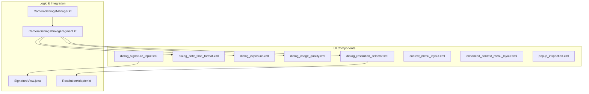
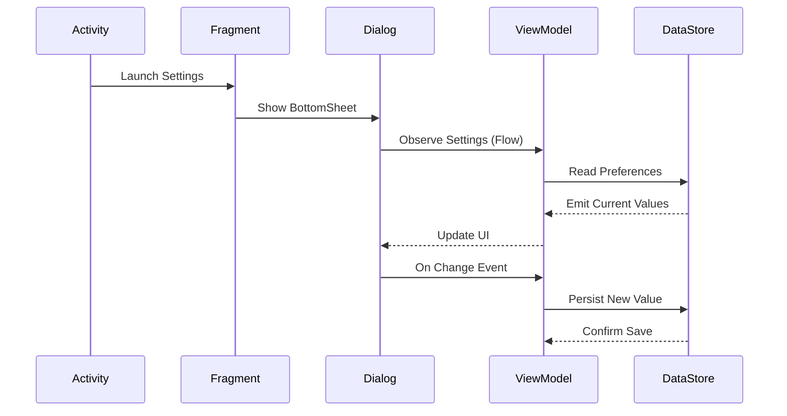
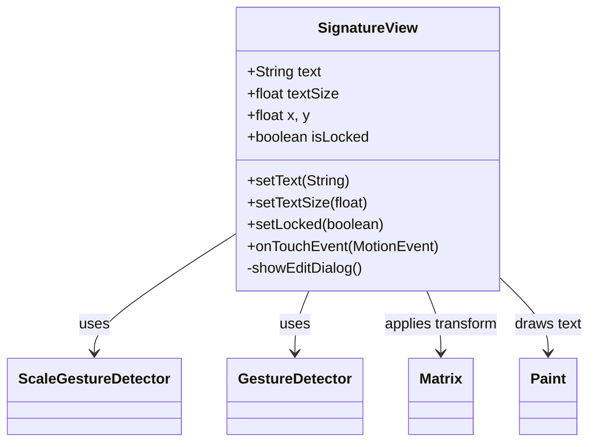
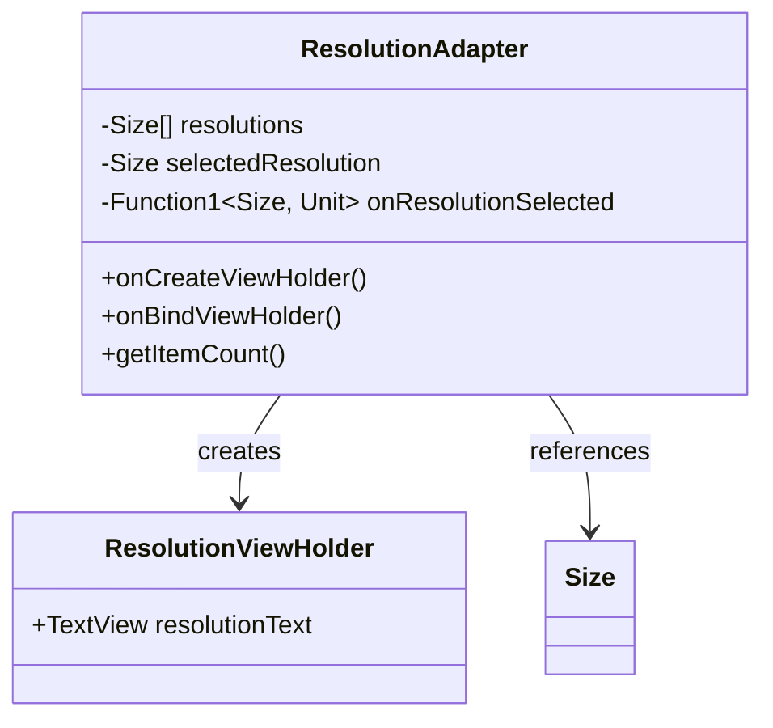
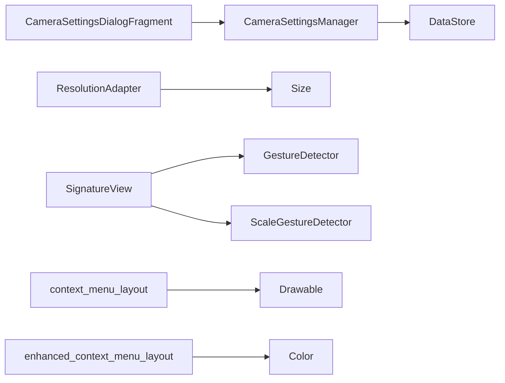

# Dialogs and Popup Components

<cite>
**Referenced Files in This Document**   
- [dialog_signature_input.xml](file://app/src/main/res/layout/dialog_signature_input.xml)
- [dialog_date_time_format.xml](file://app/src/main/res/layout/dialog_date_time_format.xml)
- [dialog_exposure.xml](file://app/src/main/res/layout/dialog_exposure.xml)
- [dialog_image_quality.xml](file://app/src/main/res/layout/dialog_image_quality.xml)
- [dialog_resolution_selector.xml](file://app/src/main/res/layout/dialog_resolution_selector.xml)
- [context_menu_layout.xml](file://app/src/main/res/layout/context_menu_layout.xml)
- [enhanced_context_menu_layout.xml](file://app/src/main/res/layout/enhanced_context_menu_layout.xml)
- [popup_inspection.xml](file://app/src/main/res/layout/popup_inspection.xml)
- [SignatureView.java](file://app/src/main/java/com/example/b1void/activities/SignatureView.java)
- [ResolutionAdapter.kt](file://app/src/main/java/com/example/b1void/adapters/ResolutionAdapter.kt)
- [CameraSettingsDialogFragment.kt](file://app/src/main/java/com/example/b1void/ui/CameraSettingsDialogFragment.kt)
- [CameraSettingsManager.kt](file://app/src/main/java/com/example/b1void/data/CameraSettingsManager.kt)
</cite>

## Table of Contents
1. [Introduction](#introduction)
2. [Project Structure](#project-structure)
3. [Core Components](#core-components)
4. [Architecture Overview](#architecture-overview)
5. [Detailed Component Analysis](#detailed-component-analysis)
6. [Dependency Analysis](#dependency-analysis)
7. [Performance Considerations](#performance-considerations)
8. [Troubleshooting Guide](#troubleshooting-guide)
9. [Conclusion](#conclusion)

## Introduction
This document provides a comprehensive overview of the dialog and popup UI components used within the Inspector application for capturing user input and enabling context-sensitive actions. It details the structure, functionality, integration points, and lifecycle management of various modal dialogs such as signature input, date/time formatting, exposure controls, image quality settings, and resolution selection. Additionally, it covers context menus and inspection-related popups, emphasizing consistent theming, argument handling, and result return mechanisms.

## Project Structure
The dialog and popup components are defined in XML layout files located under `app/src/main/res/layout/`. These layouts are paired with Kotlin and Java classes that manage their behavior, data binding, and interaction with the app's state via ViewModel and DataStore patterns. The architecture follows Android’s recommended separation of concerns, using fragments for modals, adapters for dynamic lists, and custom views for interactive elements.

**Diagram sources**
- [dialog_signature_input.xml](file://app/src/main/res/layout/dialog_signature_input.xml)
- [dialog_resolution_selector.xml](file://app/src/main/res/layout/dialog_resolution_selector.xml)
- [SignatureView.java](file://app/src/main/java/com/example/b1void/activities/SignatureView.java)
- [ResolutionAdapter.kt](file://app/src/main/java/com/example/b1void/adapters/ResolutionAdapter.kt)
- [CameraSettingsDialogFragment.kt](file://app/src/main/java/com/example/b1void/ui/CameraSettingsDialogFragment.kt)
- [CameraSettingsManager.kt](file://app/src/main/java/com/example/b1void/data/CameraSettingsManager.kt)

**Section sources**
- [dialog_signature_input.xml](file://app/src/main/res/layout/dialog_signature_input.xml#L1-L22)
- [dialog_resolution_selector.xml](file://app/src/main/res/layout/dialog_resolution_selector.xml#L1-L9)

## Core Components
The core components include modal dialogs for configuration tasks (e.g., timestamp format, exposure compensation), popups for contextual file operations, and specialized input mechanisms like handwritten signature capture. Each component is designed to be reusable, theme-aware, and integrated with persistent settings storage through DataStore. They utilize modern Android practices including ViewBinding, coroutines, Flow-based reactive programming, and BottomSheetDialogFragment for presentation.

**Section sources**
- [CameraSettingsDialogFragment.kt](file://app/src/main/java/com/example/b1void/ui/CameraSettingsDialogFragment.kt#L15-L65)
- [CameraSettingsManager.kt](file://app/src/main/java/com/example/b1void/data/CameraSettingsManager.kt#L15-L58)

## Architecture Overview
The overall architecture employs a clean separation between UI (XML layouts), business logic (Kotlin classes), and data persistence (DataStore). Dialogs and popups are typically launched from activities or fragments, pass arguments via Bundles, and return results using callbacks or shared ViewModel states. Theming is applied consistently through the app’s theme system, ensuring visual coherence across all components.

**Diagram sources**
- [CameraSettingsDialogFragment.kt](file://app/src/main/java/com/example/b1void/ui/CameraSettingsDialogFragment.kt#L15-L65)
- [CameraSettingsManager.kt](file://app/src/main/java/com/example/b1void/data/CameraSettingsManager.kt#L15-L58)

## Detailed Component Analysis

### Signature Input Dialog
The `dialog_signature_input.xml` layout provides a simple interface for entering text that will appear as a digital signature. It includes an EditText field labeled "Enter Signature Text" and supports direct input from the user. This dialog integrates with the `SignatureView` class, which renders and manipulates the signature on screen with support for movement, scaling, and double-tap editing.

#### SignatureView Integration

**Diagram sources**
- [SignatureView.java](file://app/src/main/java/com/example/b1void/activities/SignatureView.java#L22-L225)

**Section sources**
- [dialog_signature_input.xml](file://app/src/main/res/layout/dialog_signature_input.xml#L1-L22)
- [SignatureView.java](file://app/src/main/java/com/example/b1void/activities/SignatureView.java#L22-L225)

### Date and Time Format Configuration
The `dialog_date_time_format.xml` layout allows users to configure how timestamps are overlaid on media. It contains two labeled EditText fields: one for date format (default: yyyy-MM-dd HH:mm:ss) and another for time format (default: HH:mm:ss). These values are likely persisted and used by camera services when annotating photos or videos.

**Section sources**
- [dialog_date_time_format.xml](file://app/src/main/res/layout/dialog_date_time_format.xml#L1-L33)

### Manual Exposure Control
The `dialog_exposure.xml` layout provides manual control over camera exposure compensation. It features a SeekBar linked to a TextView that displays the current exposure value (e.g., 0.0). As the user adjusts the slider, the displayed value updates in real-time, allowing precise tuning of image brightness.

**Section sources**
- [dialog_exposure.xml](file://app/src/main/res/layout/dialog_exposure.xml#L1-L23)

### Image Quality Adjustment
The `dialog_image_quality.xml` layout enables adjustment of JPEG compression quality. It includes a SeekBar (range: 0–100) and a descriptive label. Higher values correspond to better image quality and larger file sizes. Changes made here are applied during image encoding processes.

**Section sources**
- [dialog_image_quality.xml](file://app/src/main/res/layout/dialog_image_quality.xml#L1-L21)

### Resolution Selection
The `dialog_resolution_selector.xml` layout uses a RecyclerView to display available camera output dimensions. It is populated dynamically using the `ResolutionAdapter`, which binds a list of `Size` objects and highlights the currently selected resolution with a checkmark and yellow text color.

#### ResolutionAdapter Implementation

**Diagram sources**
- [ResolutionAdapter.kt](file://app/src/main/java/com/example/b1void/adapters/ResolutionAdapter.kt#L12-L50)

**Section sources**
- [dialog_resolution_selector.xml](file://app/src/main/res/layout/dialog_resolution_selector.xml#L1-L9)
- [ResolutionAdapter.kt](file://app/src/main/java/com/example/b1void/adapters/ResolutionAdapter.kt#L12-L50)

### Context Menus
Two context menu layouts exist: `context_menu_layout.xml` and `enhanced_context_menu_layout.xml`. Both provide options for file operations such as Move, Share, Rename, and Delete. The enhanced version includes improved styling with dividers, consistent tints (`@color/colorPrimary`), and better accessibility attributes. Menu items use vector drawables and respond to clicks via parent fragment or activity handling.

**Section sources**
- [context_menu_layout.xml](file://app/src/main/res/layout/context_menu_layout.xml#L1-L119)
- [enhanced_context_menu_layout.xml](file://app/src/main/res/layout/enhanced_context_menu_layout.xml#L1-L129)

### Inspection Popups
The `popup_inspection.xml` layout defines a full-screen ConstraintLayout container intended for inspection-related overlays or transient information displays. Though minimal in structure, it serves as a base for dynamic content injection during inspection workflows.

**Section sources**
- [popup_inspection.xml](file://app/src/main/res/layout/popup_inspection.xml#L1-L6)

## Dependency Analysis
Components are loosely coupled through interfaces and dependency injection principles. The `CameraSettingsDialogFragment` depends on `CameraSettingsManager` for persistent setting access, which in turn uses Android’s DataStore for key-value storage. Adapters like `ResolutionAdapter` accept callback functions to decouple UI events from business logic. All dialogs inherit styling from the app theme, ensuring consistency without hardcoding colors or fonts.

**Diagram sources**
- [CameraSettingsDialogFragment.kt](file://app/src/main/java/com/example/b1void/ui/CameraSettingsDialogFragment.kt#L15-L65)
- [CameraSettingsManager.kt](file://app/src/main/java/com/example/b1void/data/CameraSettingsManager.kt#L15-L58)
- [ResolutionAdapter.kt](file://app/src/main/java/com/example/b1void/adapters/ResolutionAdapter.kt#L12-L50)
- [SignatureView.java](file://app/src/main/java/com/example/b1void/activities/SignatureView.java#L22-L225)

**Section sources**
- [CameraSettingsManager.kt](file://app/src/main/java/com/example/b1void/data/CameraSettingsManager.kt#L15-L58)
- [go.mod](file://app/build.gradle.kts#L1-L10)

## Performance Considerations
All dialogs are lightweight and avoid unnecessary nesting. RecyclerView is used efficiently in resolution selection to handle variable item counts. Custom views like `SignatureView` optimize drawing using canvas matrix transformations and invalidate only when necessary. Coroutines and Flow ensure non-blocking reads/writes to DataStore, preventing UI jank during preference changes.

## Troubleshooting Guide
Common issues may include:
- **Signature not appearing**: Ensure `SignatureView` is added to the correct parent layout and `invalidate()` is called after updates.
- **Settings not persisting**: Verify DataStore initialization and coroutine scope usage in `CameraSettingsManager`.
- **Menu text in Russian**: Layouts contain hardcoded Russian strings; consider externalizing to string resources for localization.
- **SeekBar not updating UI**: Confirm listener registration and thread safety when updating TextViews.

**Section sources**
- [SignatureView.java](file://app/src/main/java/com/example/b1void/activities/SignatureView.java#L22-L225)
- [CameraSettingsManager.kt](file://app/src/main/java/com/example/b1void/data/CameraSettingsManager.kt#L15-L58)

## Conclusion
The dialog and popup system in the Inspector app is well-structured, leveraging modern Android development practices for maintainability and performance. Key strengths include reusable components, reactive data handling, and intuitive user interactions. Future improvements could involve full localization, additional accessibility features, and unified theming via Material Design components.