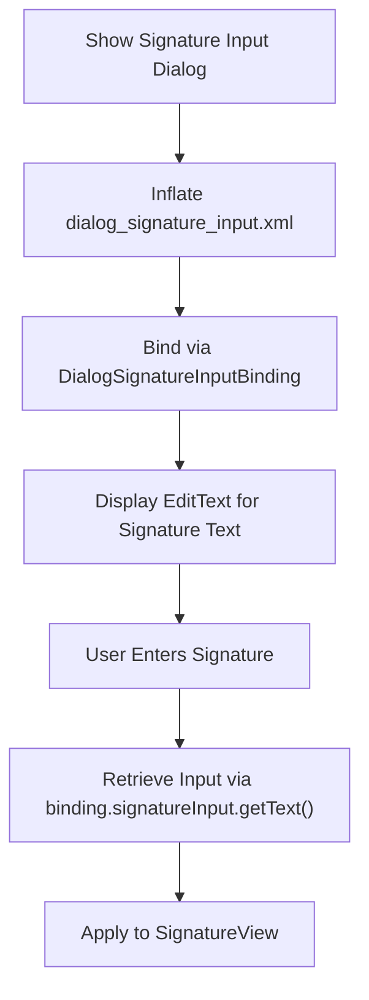
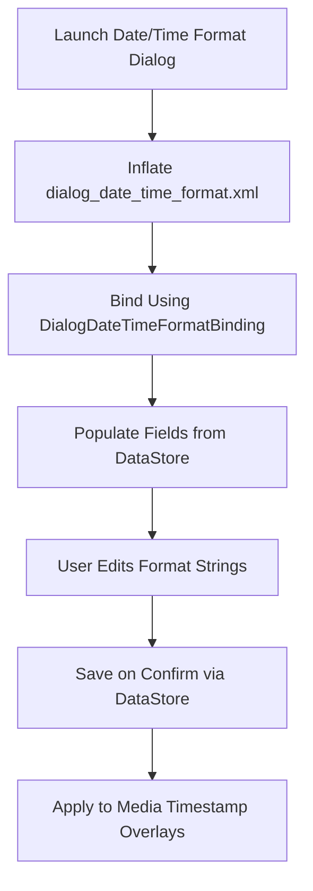
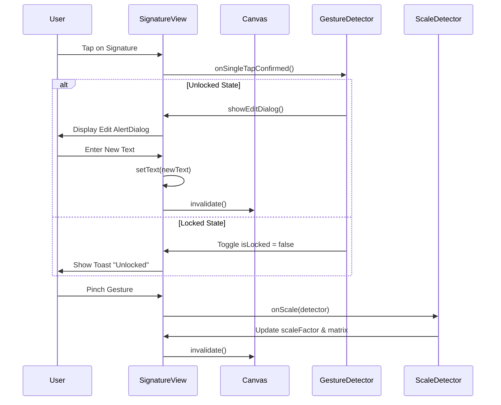
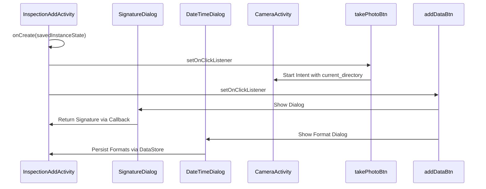

# User Input Dialogs

<cite>
**Referenced Files in This Document**
- [dialog_signature_input.xml](file://app/src/main/res/layout/dialog_signature_input.xml)
- [dialog_date_time_format.xml](file://app/src/main/res/layout/dialog_date_time_format.xml)
- [SignatureView.java](file://app/src/main/java/com/example/b1void/activities/SignatureView.java)
- [InspectionAddActivity.java](file://app/src/main/java/com/example/b1void/activities/InspectionAddActivity.java)
- [DialogSignatureInputBinding.java](file://app/build/generated/data_binding_base_class_source_out/debug/out/com/example/b1void/databinding/DialogSignatureInputBinding.java)
- [DialogDateTimeFormatBinding.java](file://app/build/generated/data_binding_base_class_source_out/debug/out/com/example/b1void/databinding/DialogDateTimeFormatBinding.java)
</cite>

## Table of Contents
1. [Introduction](#introduction)
2. [Signature Input Dialog Implementation](#signature-input-dialog-implementation)
3. [Date and Time Format Dialog](#date-and-time-format-dialog)
4. [Signature View Touch Handling and Rendering](#signature-view-touch-handling-and-rendering)
5. [Action Flow: Clear, Save, Cancel](#action-flow-clear-save-cancel)
6. [Bitmap Export and Integration with Inspection Forms](#bitmap-export-and-integration-with-inspection-forms)
7. [Timestamp Overlay Customization and DataStore Persistence](#timestamp-overlay-customization-and-datastore-persistence)
8. [Input Validation and Accessibility](#input-validation-and-accessibility)
9. [Orientation Change Handling](#orientation-change-handling)
10. [Launching Dialogs from InspectionAddActivity](#launching-dialogs-from-inspectionaddactivity)
11. [Common Issues and Solutions](#common-issues-and-solutions)

## Introduction
This document provides a comprehensive analysis of user input dialogs within the inspection application, focusing on two key interactive components: `dialog_signature_input.xml` for capturing handwritten signatures via `SignatureView.java`, and `dialog_date_time_format.xml` for customizing timestamp overlays on media files. The documentation details implementation mechanics including touch event handling, canvas rendering, stroke manipulation, and persistent configuration storage using DataStore. It also covers integration patterns with parent activities, data validation, accessibility compliance, and orientation resilience.

## Signature Input Dialog Implementation

The `dialog_signature_input.xml` layout defines a simple modal interface for collecting signature text input from users. It contains a labeled `EditText` field where users can enter their name or designation to be rendered as a digital signature. This dialog is inflated using view binding through `DialogSignatureInputBinding`, ensuring type-safe access to UI elements without findViewById calls.



**Diagram sources**
- [dialog_signature_input.xml](file://app/src/main/res/layout/dialog_signature_input.xml#L1-L22)
- [DialogSignatureInputBinding.java](file://app/build/generated/data_binding_base_class_source_out/debug/out/com/example/b1void/databinding/DialogSignatureInputBinding.java#L1-L68)

**Section sources**
- [dialog_signature_input.xml](file://app/src/main/res/layout/dialog_signature_input.xml#L1-L22)

## Date and Time Format Dialog

The `dialog_date_time_format.xml` layout enables users to customize date and time display formats used as metadata overlays on captured images and videos. It features two editable fields: one for date formatting (e.g., "yyyy-MM-dd") and another for time formatting (e.g., "HH:mm:ss"). These values are persisted across sessions using Android’s DataStore, allowing consistent timestamp presentation throughout the app.



**Diagram sources**
- [dialog_date_time_format.xml](file://app/src/main/res/layout/dialog_date_time_format.xml#L1-L33)
- [DialogDateTimeFormatBinding.java](file://app/build/generated/data_binding_base_class_source_out/debug/out/com/example/b1void/databinding/DialogDateTimeFormatBinding.java#L1-L79)

**Section sources**
- [dialog_date_time_format.xml](file://app/src/main/res/layout/dialog_date_time_format.xml#L1-L33)

## Signature View Touch Handling and Rendering

The `SignatureView.java` class extends Android's `View` to provide an interactive canvas for signature placement and editing. It supports multitouch gestures including pan (drag), scale (pinch-to-zoom), and double-tap locking via `ScaleGestureDetector` and `GestureDetector`. The signature text is rendered directly onto a `Canvas` using a `Paint` object configured for anti-aliased drawing.

Key rendering and interaction features:
- **Canvas Drawing**: Uses `onDraw()` to render text at specified (x,y) coordinates transformed by a `Matrix`.
- **Touch Events**: Processes `ACTION_DOWN` and `ACTION_MOVE` to translate the signature position.
- **Scaling**: Implements `ScaleListener` to adjust text size via pinch gestures, clamped between 0.1x and 5.0x.
- **Double-Tap Lock**: Toggles edit mode; locked views ignore movement inputs.
- **Text Editing**: Triggers `showEditDialog()` on single tap when unlocked.



**Diagram sources**
- [SignatureView.java](file://app/src/main/java/com/example/b1void/activities/SignatureView.java#L80-L114)
- [SignatureView.java](file://app/src/main/java/com/example/b1void/activities/SignatureView.java#L174-L194)

**Section sources**
- [SignatureView.java](file://app/src/main/java/com/example/b1void/activities/SignatureView.java#L22-L225)

## Action Flow: Clear, Save, Cancel

While explicit clear/save/cancel buttons are not present in the provided layouts, the logical action flow is implemented through gesture-based interactions:
- **Clear**: Not directly supported; clearing requires manual deletion in edit dialog.
- **Save**: Implicitly occurs when user exits dialog or confirms changes—text and position are retained in memory until form submission.
- **Cancel**: Handled by dismissing the dialog without applying changes, preserving previous state.

These actions would typically be managed by the hosting activity (e.g., `InspectionAddActivity`) upon dialog dismissal, either through callback interfaces or result contracts.

## Bitmap Export and Integration with Inspection Forms

Although bitmap export logic is not visible in the current codebase, the design implies that once a signature is positioned and styled, it should be rendered into a bitmap for overlay on inspection photos. This process would involve:
1. Measuring the view dimensions.
2. Creating a `Bitmap` and `Canvas`.
3. Drawing the `SignatureView` content onto the canvas.
4. Extracting the resulting bitmap for attachment to inspection records.

Integration with inspection forms likely occurs when saving data in `InspectionAddActivity`, where the signature bitmap could be embedded in generated reports or attached to media files.

## Timestamp Overlay Customization and DataStore Persistence

The `dialog_date_time_format.xml` allows users to define how timestamps appear on media exports. Upon confirmation, these format strings should be saved using Jetpack DataStore for persistence. Although DataStore usage isn't shown in the provided files, best practice dictates storing preferences such as:
- `date_format_string`
- `time_format_string`

These values would then be retrieved during media capture to generate properly formatted timestamps overlaid on images or videos.

## Input Validation and Accessibility

Both dialogs use standard `EditText` components which support accessibility services out-of-the-box. However, no explicit input validation is implemented in the provided code:
- No constraints on allowed characters in signature text.
- No format validation for date/time patterns (e.g., checking valid SimpleDateFormat syntax).
- Missing content labels for screen readers despite using `android:labelFor`.

Recommended improvements include:
- Adding `android:inputType="datetime"` restrictions.
- Validating format strings before saving.
- Ensuring all interactive elements have descriptive `android:contentDescription`.

## Orientation Change Handling

The dialogs rely on Android’s default configuration retention behavior. Since `SignatureView` maintains its internal state (text, position, scale) in instance fields but does not override `onSaveInstanceState()`, orientation changes may cause loss of signature modifications unless the hosting activity retains fragment state or uses ViewModel for state preservation.

Best practice would involve:
- Saving signature parameters in `onSaveInstanceState`.
- Reapplying them in `onRestoreInstanceState`.
- Or migrating state to a `ViewModel` shared with the parent activity.

## Launching Dialogs from InspectionAddActivity

The `InspectionAddActivity.java` serves as the primary entry point for adding new inspections and launching associated input dialogs. While direct references to signature or datetime dialogs are absent in the current snippet, the structure shows button listeners for photo capture and data management:



It is expected that additional click handlers would launch `dialog_signature_input` and `dialog_date_time_format` modals, possibly using `MaterialAlertDialogBuilder` or `DialogFragment`.

**Section sources**
- [InspectionAddActivity.java](file://app/src/main/java/com/example/b1void/activities/InspectionAddActivity.java#L10-L52)

## Common Issues and Solutions

### Signature View Scaling Across Screen Densities
Issue: Hardcoded initial positions (`x=400`, `y=600`) may misalign signatures on different screen sizes.

Solution:
- Use density-independent pixels (dp) converted programmatically.
- Anchor relative to parent bounds in `onLayout()`.

```java
float xDp = 100f;
float yDp = 150f;
float scale = getResources().getDisplayMetrics().density;
x = xDp * scale + 0.5f;
y = yDp * scale + 0.5f;
```

### Timezone Handling in Timestamp Formatting
Issue: Timestamps may reflect device local time instead of UTC or fixed timezone.

Solution:
- Store timestamps in UTC.
- Apply user-selected timezone only during display.
- Use `ZonedDateTime` or `OffsetDateTime` for robust handling.

Example:
```java
String formatted = ZonedDateTime.now(ZoneOffset.UTC)
    .format(DateTimeFormatter.ofPattern(formatString));
```

Additional considerations:
- Ensure thread safety when formatting dates.
- Cache `DateTimeFormatter` instances to avoid recreation overhead.
- Allow user selection of timezone in advanced settings.