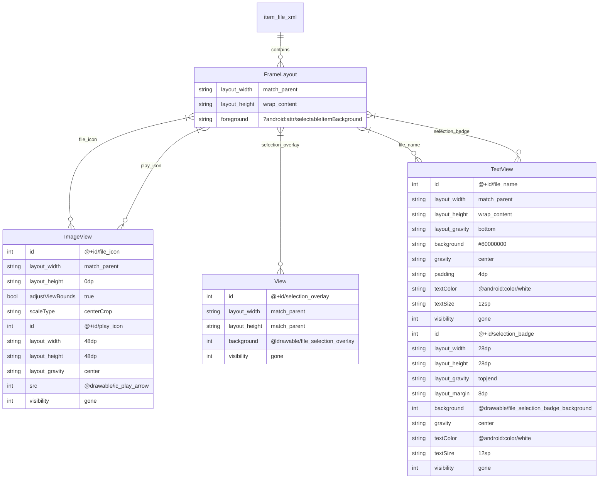
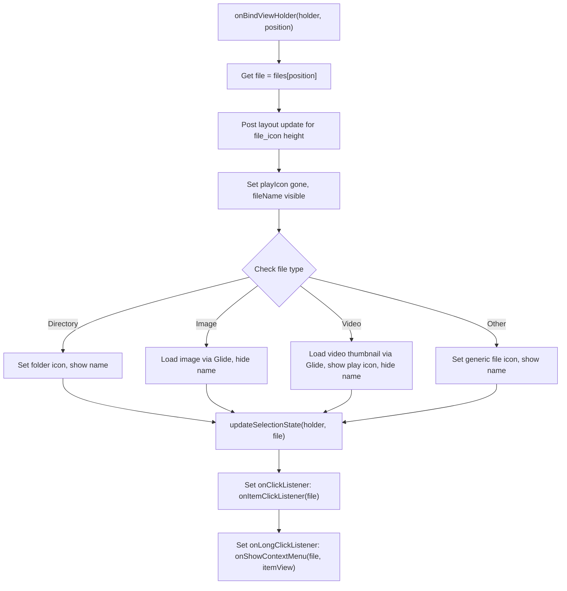
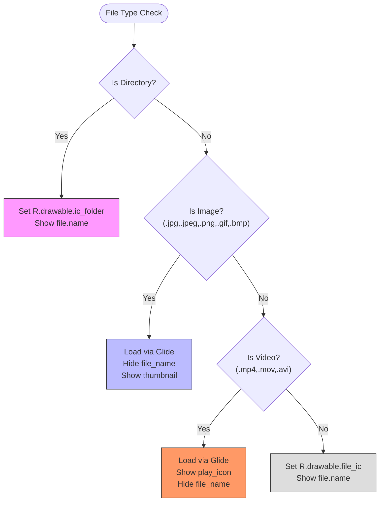
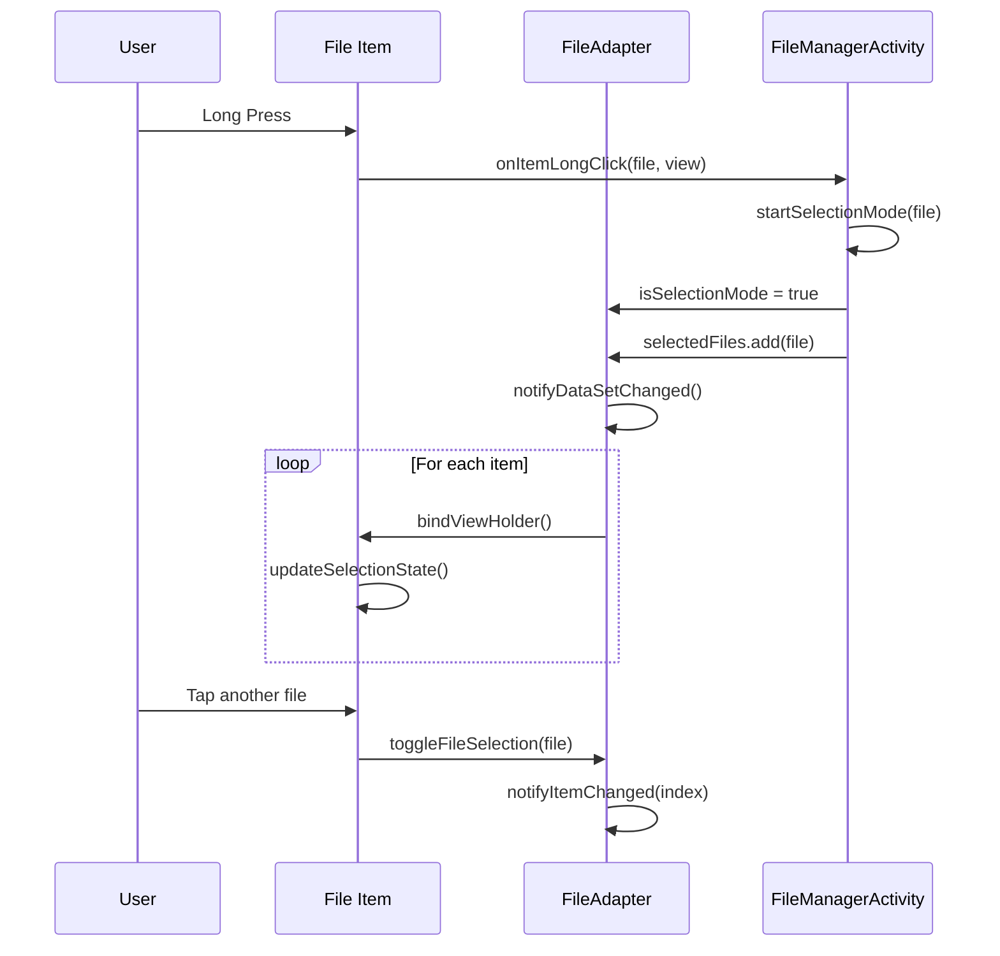
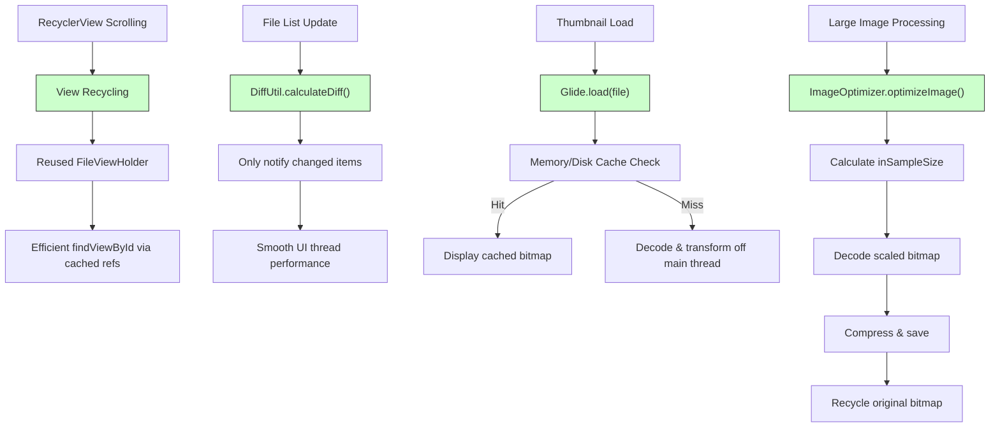

# File List Items

<cite>
**Referenced Files in This Document**
- [item_file.xml](file://app/src/main/res/layout/item_file.xml)
- [file_selection_overlay.xml](file://app/src/main/res/drawable/file_selection_overlay.xml)
- [FileAdapter.kt](file://app/src/main/java/com/example/b1void/adapters/FileAdapter.kt)
- [ImageOptimizer.kt](file://app/src/main/java/com/example/b1void/utils/ImageOptimizer.kt)
- [FileManagerActivity.kt](file://app/src/main/java/com/example/b1void/activities/FileManagerActivity.kt)
</cite>

## Table of Contents
1. [Introduction](#introduction)
2. [Layout Structure and Components](#layout-structure-and-components)
3. [ViewHolder Binding Logic in FileAdapter](#viewholder-binding-logic-in-fileadapter)
4. [Dynamic Icon Rendering Based on File Type](#dynamic-icon-rendering-based-on-file-type)
5. [Thumbnail Loading with Glide and Caching](#thumbnail-loading-with-glide-and-caching)
6. [Selection Overlay Mechanics](#selection-overlay-mechanics)
7. [Click and Long-Click Listeners for Context Actions](#click-and-long-click-listeners-for-context-actions)
8. [State Management During Multi-Selection Mode](#state-management-during-multi-selection-mode)
9. [Performance Optimization Techniques](#performance-optimization-techniques)
10. [Customization via Themes and Extension for Metadata Display](#customization-via-themes-and-extension-for-metadata-display)

## Introduction
This document provides comprehensive technical documentation for the `item_file.xml` layout, which defines the appearance and behavior of individual items within a RecyclerView used to display files and folders in the `FileManagerActivity`. The ViewHolder pattern is implemented through the `FileAdapter`, enabling efficient rendering and interaction handling. Key features include dynamic icon selection based on file type (folder, image, video), thumbnail loading using Glide with memory and disk caching, and visual feedback during multi-selection mode via a semi-transparent overlay (`file_selection_overlay.xml`) and selection badge. The system supports touch interactions such as click to open or preview, long-press to initiate context actions, and swipe-based selection. Performance optimizations include view recycling, lazy loading of thumbnails, and memory-efficient bitmap processing via the `ImageOptimizer` utility.

**Section sources**
- [item_file.xml](file://app/src/main/res/layout/item_file.xml#L1-L53)
- [FileAdapter.kt](file://app/src/main/java/com/example/b1void/adapters/FileAdapter.kt#L1-L168)

## Layout Structure and Components
The `item_file.xml` layout uses a `FrameLayout` container to layer multiple UI components that represent a single file or folder entry. It includes an `ImageView` for the main content (`file_icon`), another `ImageView` for a play icon overlay on videos (`play_icon`), a `View` for the selection state (`selection_overlay`), a `TextView` displaying the filename (`file_name`), and a `TextView` badge showing the selection order (`selection_badge`). All elements are sized relative to the parent, ensuring consistent grid alignment when displayed in a `GridLayoutManager`. The root element applies a ripple effect via `?android:attr/selectableItemBackground` to provide tactile feedback on tap. Each child view has a unique ID allowing programmatic access from the adapter's ViewHolder class.



**Diagram sources**
- [item_file.xml](file://app/src/main/res/layout/item_file.xml#L1-L53)

**Section sources**
- [item_file.xml](file://app/src/main/res/layout/item_file.xml#L1-L53)

## ViewHolder Binding Logic in FileAdapter
The `FileAdapter` implements the RecyclerView.Adapter pattern, defining a nested `FileViewHolder` class that holds references to all views defined in `item_file.xml`. During `onCreateViewHolder`, the layout is inflated and wrapped in a `FileViewHolder` instance. In `onBindViewHolder`, the current `File` object is bound to the view by setting its icon, name, and interactive states. The binding process dynamically determines the file type using helper methods `isImage()` and `isVideo()`, then configures the appropriate drawable or loads a thumbnail via Glide. The method also adjusts the aspect ratio of the `file_icon` to maintain a square shape based on its measured width. Click and long-click listeners are attached to the entire item view to trigger navigation or context menus.



**Diagram sources**
- [FileAdapter.kt](file://app/src/main/java/com/example/b1void/adapters/FileAdapter.kt#L1-L168)

**Section sources**
- [FileAdapter.kt](file://app/src/main/java/com/example/b1void/adapters/FileAdapter.kt#L1-L168)

## Dynamic Icon Rendering Based on File Type
Icons are rendered dynamically based on the file extension. Directories display the `ic_folder` drawable. Image files (extensions .jpg, .jpeg, .png, .gif, .bmp) have their thumbnails loaded asynchronously using Glide; if loading fails, a fallback `image_ic` placeholder is shown. Video files (.mp4, .mov, .avi) also use Glide to load a frame as a thumbnail, with the `ic_videocam` used as both placeholder and error fallback, while additionally showing a centered `play_icon`. All other file types receive a generic `file_ic` icon and display their filename below. This logic ensures users can visually distinguish between different content types at a glance without requiring additional metadata queries.



**Diagram sources**
- [FileAdapter.kt](file://app/src/main/java/com/example/b1void/adapters/FileAdapter.kt#L50-L90)

**Section sources**
- [FileAdapter.kt](file://app/src/main/java/com/example/b1void/adapters/FileAdapter.kt#L50-L90)

## Thumbnail Loading with Glide and Caching
Thumbnails for images and videos are loaded using the Glide library, which handles background threading, memory caching, and lifecycle awareness automatically. The `Glide.with(context).load(file)` call detects whether the file is an image or video and extracts a representative frame accordingly. Both `.centerCrop()` transformation and resource placeholders (`R.drawable.image_ic`, `R.drawable.ic_videocam`) ensure consistent visual presentation even during slow loads. Glide’s default memory and disk cache strategies minimize redundant I/O operations when scrolling through large directories. No custom cache keys or sizes are specified, relying on Glide’s intelligent defaults optimized for mobile devices.

**Section sources**
- [FileAdapter.kt](file://app/src/main/java/com/example/b1void/adapters/FileAdapter.kt#L65-L78)

## Selection Overlay Mechanics
During multi-selection mode, selected items are highlighted using two visual indicators: a semi-transparent overlay and a numbered badge. The `selection_overlay` is a `View` with background set to `@drawable/file_selection_overlay`, which defines a solid color (`@color/file_selection_overlay`) via a `<shape>` drawable. Its visibility is toggled between `GONE` and `VISIBLE` depending on selection state. The `selection_badge` displays the order in which files were selected (1, 2, 3, etc.) and appears in the top-right corner. When not in selection mode, both overlays are hidden, and item alpha is restored to 1.0 for full brightness.

```mermaid
classDiagram
class FileAdapter {
+Boolean isSelectionMode
+MutableSet<File> selectedFiles
+updateSelectionState(holder, file)
}
class FileViewHolder {
+View selectionOverlay
+TextView selectionBadge
}
FileAdapter --> FileViewHolder : binds
FileAdapter --> File : checks membership
note right of FileAdapter
Manages global selection state.
Updates UI via notifyItemChanged().
end
note right of FileViewHolder
Holds direct references to overlay views.
State updated in onBindViewHolder().
end
```

**Diagram sources**
- [item_file.xml](file://app/src/main/res/layout/item_file.xml#L14-L20)
- [file_selection_overlay.xml](file://app/src/main/res/drawable/file_selection_overlay.xml#L1-L6)
- [FileAdapter.kt](file://app/src/main/java/com/example/b1void/adapters/FileAdapter.kt#L92-L110)

**Section sources**
- [file_selection_overlay.xml](file://app/src/main/res/drawable/file_selection_overlay.xml#L1-L6)
- [FileAdapter.kt](file://app/src/main/java/com/example/b1void/adapters/FileAdapter.kt#L92-L110)

## Click and Long-Click Listeners for Context Actions
Each item view has registered click listeners that respond to user input. A single tap triggers the `onItemClickListener`, which navigates into subdirectories, opens image previews, or launches external apps for supported media types. A long press invokes `onShowContextMenu`, which displays a popup menu offering actions like move, delete, share, or entering multi-select mode. These callbacks are passed into the `FileAdapter` constructor from `FileManagerActivity`, enabling separation of UI logic from business logic. The long-click listener specifically prevents action initiation during active selection mode to avoid conflicts.

**Section sources**
- [FileAdapter.kt](file://app/src/main/java/com/example/b1void/adapters/FileAdapter.kt#L108-L115)
- [FileManagerActivity.kt](file://app/src/main/java/com/example/b1void/activities/FileManagerActivity.kt#L250-L255)

## State Management During Multi-Selection Mode
Multi-selection state is managed centrally by the `FileAdapter` using two properties: `isSelectionMode` (Boolean) and `selectedFiles` (MutableSet<File>). When selection begins—either via long-press or context menu—the adapter updates these flags and calls `notifyDataSetChanged()` or `notifyItemChanged()` to refresh affected views. The `updateSelectionState()` method computes per-item visibility and styling: selected items appear opaque with visible overlays, while unselected ones are dimmed (alpha = 0.75f). The `notifySelectionChanged()` method efficiently recalculates only those items whose selection status changed, minimizing redraw overhead.



**Diagram sources**
- [FileAdapter.kt](file://app/src/main/java/com/example/b1void/adapters/FileAdapter.kt#L92-L110)
- [FileManagerActivity.kt](file://app/src/main/java/com/example/b1void/activities/FileManagerActivity.kt#L400-L430)

**Section sources**
- [FileAdapter.kt](file://app/src/main/java/com/example/b1void/adapters/FileAdapter.kt#L92-L110)
- [FileManagerActivity.kt](file://app/src/main/java/com/example/b1void/activities/FileManagerActivity.kt#L400-L430)

## Performance Optimization Techniques
Several performance optimizations ensure smooth scrolling and low memory usage. First, `DiffUtil` is used in `updateFiles()` to calculate precise changes between old and new file lists, dispatching granular updates instead of full refreshes. Second, thumbnails are loaded asynchronously via Glide with built-in caching. Third, the `ImageOptimizer` utility processes large bitmaps efficiently by downsampling (`inSampleSize`) and using memory-conscious configurations (`RGB_565`). It also monitors available heap space before decoding to prevent OOM errors. Finally, `RecyclerView`'s view recycling reuses `FileViewHolder` instances, avoiding repeated inflation and findViewById calls.



**Diagram sources**
- [FileAdapter.kt](file://app/src/main/java/com/example/b1void/adapters/FileAdapter.kt#L122-L138)
- [ImageOptimizer.kt](file://app/src/main/java/com/example/b1void/utils/ImageOptimizer.kt#L23-L75)

**Section sources**
- [FileAdapter.kt](file://app/src/main/java/com/example/b1void/adapters/FileAdapter.kt#L122-L138)
- [ImageOptimizer.kt](file://app/src/main/java/com/example/b1void/utils/ImageOptimizer.kt#L23-L75)

## Customization via Themes and Extension for Metadata Display
The appearance of file items can be customized through Android themes by overriding attributes such as `?android:attr/selectableItemBackground`, text colors, and dimension resources. The `file_selection_overlay` color is defined in `colors.xml` as `file_selection_overlay`, allowing easy theme adaptation. To extend functionality for additional metadata (e.g., file size, date), developers can modify `item_file.xml` to include extra `TextView` elements and update `onBindViewHolder` to extract and format this information from the `File` object. Similarly, custom icons for specific file extensions (PDF, DOCX) can be added by extending the conditional logic in the binding method.

**Section sources**
- [item_file.xml](file://app/src/main/res/layout/item_file.xml#L1-L53)
- [file_selection_overlay.xml](file://app/src/main/res/drawable/file_selection_overlay.xml#L1-L6)