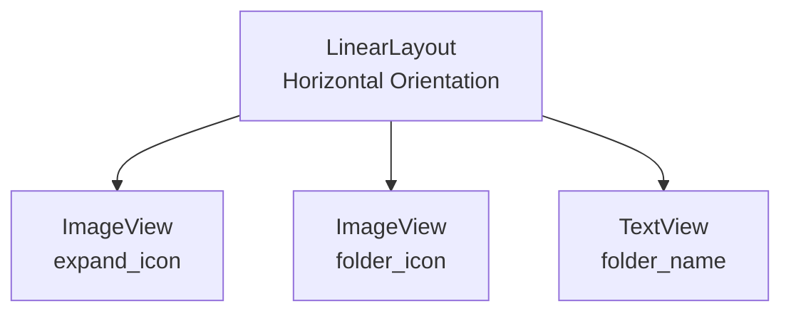
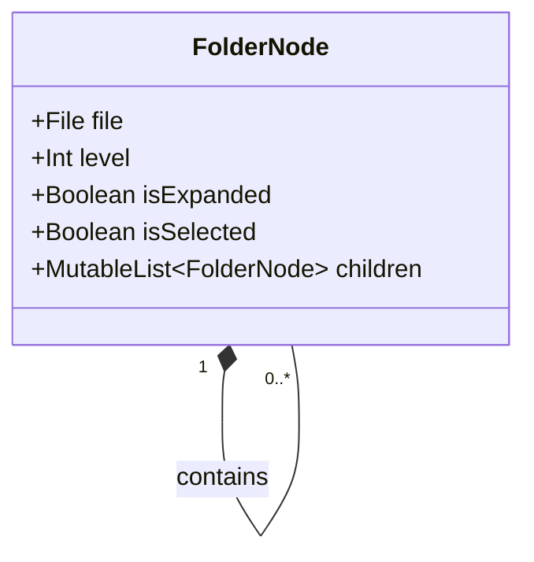
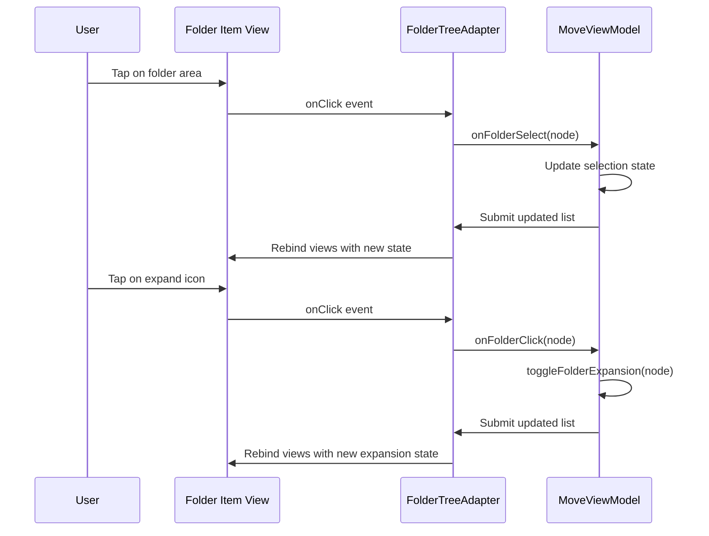
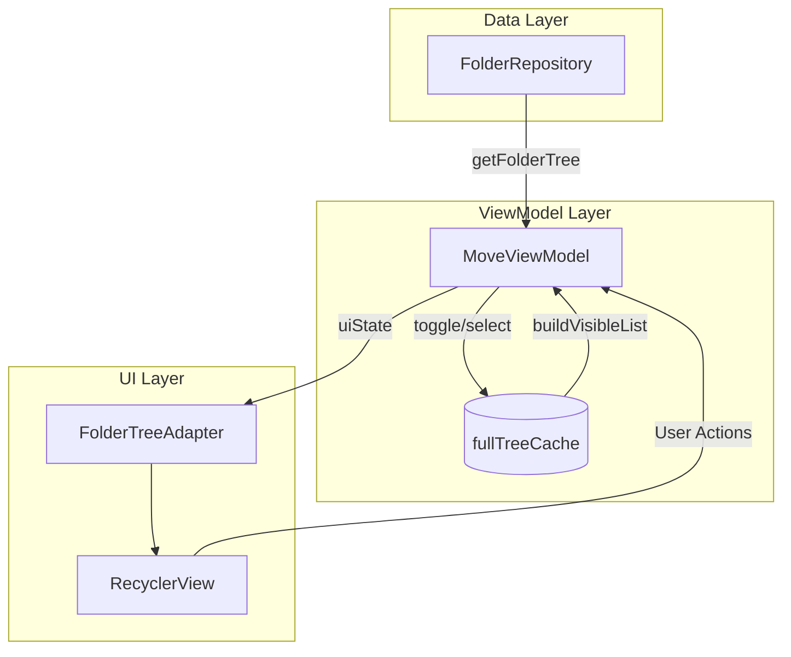

# Folder Tree Items

<cite>
**Referenced Files in This Document**
- [item_folder_tree.xml](file://app/src/main/res/layout/item_folder_tree.xml)
- [FolderTreeAdapter.kt](file://app/src/main/java/com/example/b1void/adapters/FolderTreeAdapter.kt)
- [MoveFilesBottomSheet.kt](file://app/src/main/java/com/example/b1void/ui/MoveFilesBottomSheet.kt)
- [FolderRepository.kt](file://app/src/main/java/com/example/b1void/data/FolderRepository.kt)
- [FolderNode.kt](file://app/src/main/java/com/example/b1void/models/MoveState.kt#L12-L18)
- [MoveViewModel.kt](file://app/src/main/java/com/example/b1void/viewmodels/MoveViewModel.kt)
- [ic_arrow_right_24.xml](file://app/src/main/res/drawable/ic_arrow_right_24.xml)
- [ic_folder_24.xml](file://app/src/main/res/drawable/ic_folder_24.xml)
</cite>

## Table of Contents
1. [Introduction](#introduction)
2. [Visual Structure and Layout](#visual-structure-and-layout)
3. [Recursive Binding Mechanism](#recursive-binding-mechanism)
4. [Interaction Patterns](#interaction-patterns)
5. [Data Binding and State Management](#data-binding-and-state-management)
6. [Performance Considerations](#performance-considerations)
7. [Customization Options](#customization-options)
8. [Conclusion](#conclusion)

## Introduction

The `item_folder_tree.xml` layout file defines the visual representation of individual folder items within a hierarchical tree structure used in the `MoveFilesBottomSheet` component. This documentation provides comprehensive details about the folder tree implementation, including its visual design, recursive data binding mechanism, user interaction patterns, state management, and performance characteristics. The system enables users to navigate nested directory structures when selecting destination folders for file operations.

**Section sources**
- [item_folder_tree.xml](file://app/src/main/res/layout/item_folder_tree.xml#L1-L36)
- [MoveFilesBottomSheet.kt](file://app/src/main/java/com/example/b1void/ui/MoveFilesBottomSheet.kt#L20-L133)

## Visual Structure and Layout

The folder tree item layout consists of three primary visual elements arranged horizontally: an expansion indicator icon, a folder icon, and a text label displaying the folder name. The layout uses a `LinearLayout` with vertical centering gravity to align these components properly.

**Diagram sources**
- [item_folder_tree.xml](file://app/src/main/res/layout/item_folder_tree.xml#L1-L36)

The expansion indicator (`expand_icon`) uses the `ic_arrow_right_24.xml` drawable resource, which rotates 90 degrees clockwise when a folder is expanded. The folder icon (`folder_icon`) displays the `ic_folder_24.xml` resource. Text styling follows the `textAppearanceBodyLarge` theme attribute, ensuring consistency with the application's typography system.

Indentation is dynamically calculated based on the folder's nesting level, with each level adding 24dp of padding to create a clear visual hierarchy. The root folder displays as "Основная директория" (Main Directory) instead of its actual name for better user understanding.

**Section sources**
- [item_folder_tree.xml](file://app/src/main/res/layout/item_folder_tree.xml#L1-L36)
- [FolderTreeAdapter.kt](file://app/src/main/java/com/example/b1void/adapters/FolderTreeAdapter.kt#L14-L88)
- [ic_arrow_right_24.xml](file://app/src/main/res/drawable/ic_arrow_right_24.xml#L1-L11)
- [ic_folder_24.xml](file://app/src/main/res/drawable/ic_folder_24.xml#L1-L11)

## Recursive Binding Mechanism

The `FolderTreeAdapter` implements a recursive binding mechanism that handles nested directory structures through the `FolderNode` data class hierarchy. Each `FolderNode` contains a mutable list of child nodes, enabling the representation of arbitrarily deep folder trees.

**Diagram sources**
- [FolderNode.kt](file://app/src/main/java/com/example/b1void/models/MoveState.kt#L12-L18)
- [FolderTreeAdapter.kt](file://app/src/main/java/com/example/b1void/adapters/FolderTreeAdapter.kt#L14-L88)

The adapter calculates indentation by multiplying the node's `level` property by 24dp, creating a consistent visual hierarchy. When a folder is expanded or collapsed, the adapter updates the `isExpanded` state and rebuilds the visible list by recursively traversing the tree structure. The `buildVisibleList` method in `MoveViewModel` performs this traversal, adding nodes to the display list only if their parent folders are expanded.

**Section sources**
- [FolderTreeAdapter.kt](file://app/src/main/java/com/example/b1void/adapters/FolderTreeAdapter.kt#L14-L88)
- [MoveViewModel.kt](file://app/src/main/java/com/example/b1void/viewmodels/MoveViewModel.kt#L14-L123)

## Interaction Patterns

The folder tree supports two primary interaction patterns: tap to select destination folders and expand/collapse operations for navigating the hierarchy. These interactions are managed through click listeners on specific UI elements.

**Diagram sources**
- [FolderTreeAdapter.kt](file://app/src/main/java/com/example/b1void/adapters/FolderTreeAdapter.kt#L14-L88)
- [MoveViewModel.kt](file://app/src/main/java/com/example/b1void/viewmodels/MoveViewModel.kt#L14-L123)

Selection is disabled for the source folder to prevent self-referential moves. Selected folders display in red text color with a distinct background to provide clear visual feedback. During file operations, the entire RecyclerView becomes semi-transparent (alpha 0.5f) to indicate non-interactivity while processing.

**Section sources**
- [FolderTreeAdapter.kt](file://app/src/main/java/com/example/b1void/adapters/FolderTreeAdapter.kt#L14-L88)
- [MoveFilesBottomSheet.kt](file://app/src/main/java/com/example/b1void/ui/MoveFilesBottomSheet.kt#L20-L133)

## Data Binding and State Management

The folder tree implements a robust state management system using Jetpack Compose's StateFlow pattern. The `MoveViewModel` maintains the complete folder tree in memory through the `fullTreeCache`, preserving expansion states across configuration changes and filtering operations.

**Diagram sources**
- [FolderRepository.kt](file://app/src/main/java/com/example/b1void/data/FolderRepository.kt#L7-L54)
- [MoveViewModel.kt](file://app/src/main/java/com/example/b1void/viewmodels/MoveViewModel.kt#L14-L123)
- [FolderTreeAdapter.kt](file://app/src/main/java/com/example/b1void/adapters/FolderTreeAdapter.kt#L14-L88)

The `FolderRepository` recursively scans the filesystem starting from the root directory, building the complete folder hierarchy in a single operation. This approach minimizes disk I/O operations and ensures consistent data presentation. The repository runs on the IO dispatcher to avoid blocking the main thread during potentially lengthy filesystem operations.

**Section sources**
- [FolderRepository.kt](file://app/src/main/java/com/example/b1void/data/FolderRepository.kt#L7-L54)
- [MoveViewModel.kt](file://app/src/main/java/com/example/b1void/viewmodels/MoveViewModel.kt#L14-L123)

## Performance Considerations

The folder tree implementation includes several performance optimizations for handling deep directory structures. The recursive scanning occurs off the main thread using `withContext(Dispatchers.IO)`, preventing UI jank during initial tree construction. The adapter uses `ListAdapter` with a custom `DiffCallback` to minimize unnecessary view rebinds when the tree structure changes.

For large directory trees, the current implementation may experience performance degradation due to loading the entire folder hierarchy into memory at once. While this approach enables fast filtering and preserves state, it could lead to memory pressure on devices with extensive file systems.

The filtering mechanism creates filtered copies of nodes rather than modifying the original cache, ensuring data integrity but potentially increasing memory usage during search operations. The visible list is rebuilt entirely whenever expansion states change, which provides accurate rendering but could be optimized for very large trees by implementing more granular updates.

**Section sources**
- [FolderRepository.kt](file://app/src/main/java/com/example/b1void/data/FolderRepository.kt#L7-L54)
- [MoveViewModel.kt](file://app/src/main/java/com/example/b1void/viewmodels/MoveViewModel.kt#L14-L123)
- [FolderTreeAdapter.kt](file://app/src/main/java/com/example/b1void/adapters/FolderTreeAdapter.kt#L14-L88)

## Customization Options

The folder tree implementation offers several customization points for adapting to different use cases. The maximum tree depth is implicitly limited by the filesystem scan recursion, which could be modified to include a configurable depth limit parameter in the `getFolderTree` method.

Visual styling can be customized through the following resources:
- Color scheme defined in color resources (`move_folder_item_text`, `move_folder_item_background`, etc.)
- Drawable resources for icons (`ic_arrow_right_24.xml`, `ic_folder_24.xml`)
- Text appearance attributes (`textAppearanceBodyLarge`)
- Padding and spacing values (24dp indentation per level)

The adapter accepts callback functions for both folder clicks (expansion) and selections, allowing integration with different workflows. The root folder label ("Основная директория") is hardcoded but could be externalized to string resources for localization support.

**Section sources**
- [item_folder_tree.xml](file://app/src/main/res/layout/item_folder_tree.xml#L1-L36)
- [FolderTreeAdapter.kt](file://app/src/main/java/com/example/b1void/adapters/FolderTreeAdapter.kt#L14-L88)
- [MoveViewModel.kt](file://app/src/main/java/com/example/b1void/viewmodels/MoveViewModel.kt#L14-L123)

## Conclusion

The folder tree component provides a comprehensive solution for navigating and selecting destination folders within a hierarchical directory structure. Its implementation combines efficient data loading, responsive UI updates, and intuitive user interactions. The separation of concerns between data retrieval (repository), state management (view model), and presentation (adapter) follows modern Android architecture principles. While the current implementation performs well for typical use cases, consideration should be given to lazy loading strategies for extremely large directory trees to optimize memory usage and initialization time.