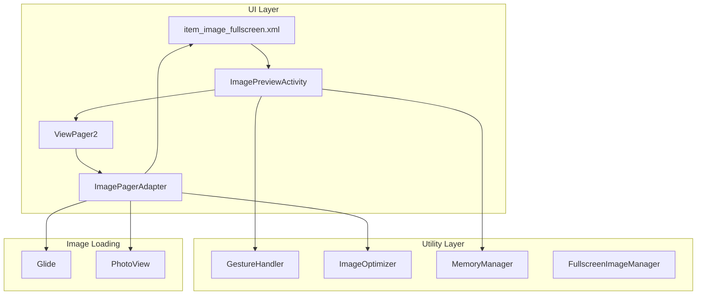
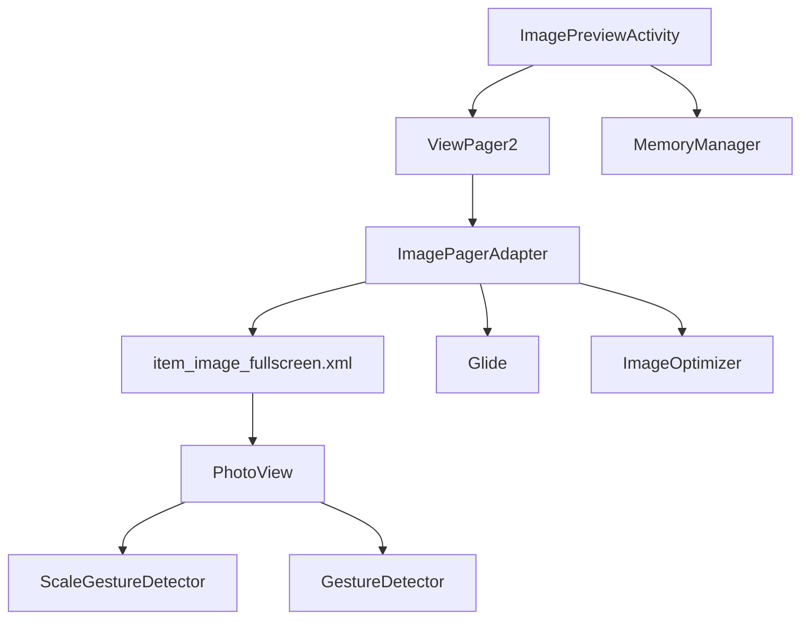
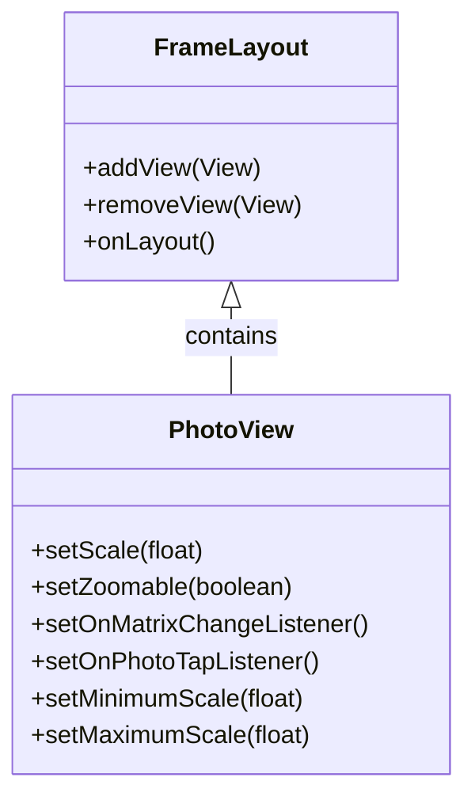
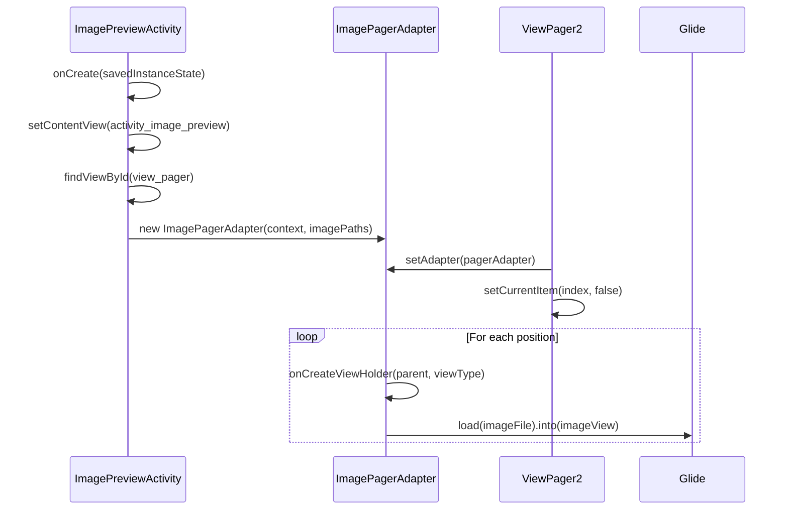
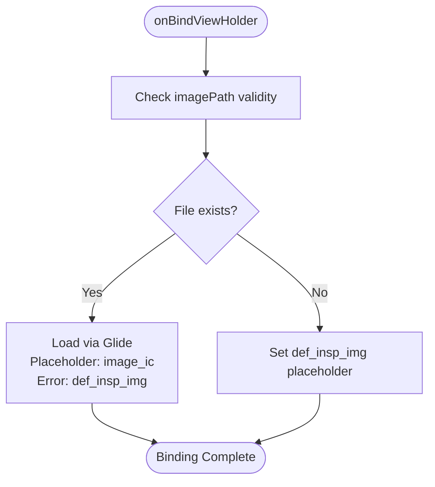
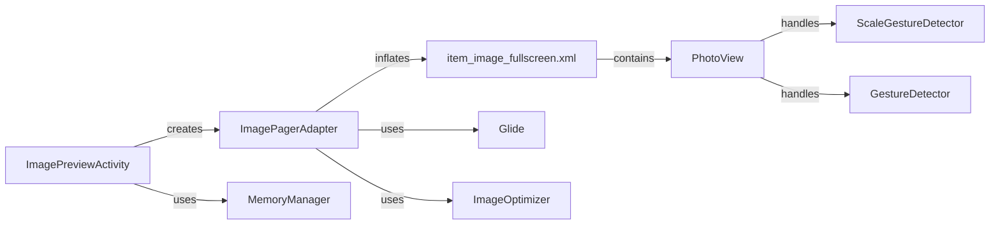

# Image Fullscreen Items

<cite>
**Referenced Files in This Document**   
- [item_image_fullscreen.xml](file://app/src/main/res/layout/item_image_fullscreen.xml)
- [ImagePreviewActivity.kt](file://app/src/main/java/com/example/b1void/activities/ImagePreviewActivity.kt)
- [ImagePagerAdapter.kt](file://app/src/main/java/com/example/b1void/adapters/ImagePagerAdapter.kt)
- [GestureHandler.kt](file://app/src/main/java/com/example/b1void/utils/GestureHandler.kt)
- [MemoryManager.kt](file://app/src/main/java/com/example/b1void/utils/MemoryManager.kt)
- [ImageOptimizer.kt](file://app/src/main/java/com/example/b1void/utils/ImageOptimizer.kt)
</cite>

## Table of Contents
1. [Introduction](#introduction)
2. [Project Structure](#project-structure)
3. [Core Components](#core-components)
4. [Architecture Overview](#architecture-overview)
5. [Detailed Component Analysis](#detailed-component-analysis)
6. [Dependency Analysis](#dependency-analysis)
7. [Performance Considerations](#performance-considerations)
8. [Troubleshooting Guide](#troubleshooting-guide)
9. [Conclusion](#conclusion)

## Introduction
This document provides comprehensive technical documentation for the `item_image_fullscreen.xml` layout and its associated components used in the `ImagePreviewActivity`. The system enables high-resolution image viewing with advanced gesture support, memory-efficient loading, and smooth transitions from thumbnails to full resolution. It leverages Glide for progressive image loading, implements pinch-to-zoom and panning via PhotoView, and manages bitmap lifecycle through optimized adapters and memory handling.

## Project Structure
The fullscreen image preview functionality is implemented using a modular architecture centered around ViewPager2 and RecyclerView patterns. The layout file defines the visual structure while Kotlin classes manage behavior, gestures, and performance optimization.

**Diagram sources**
- [item_image_fullscreen.xml](file://app/src/main/res/layout/item_image_fullscreen.xml)
- [ImagePreviewActivity.kt](file://app/src/main/java/com/example/b1void/activities/ImagePreviewActivity.kt)
- [ImagePagerAdapter.kt](file://app/src/main/java/com/example/b1void/adapters/ImagePagerAdapter.kt)

**Section sources**
- [item_image_fullscreen.xml](file://app/src/main/res/layout/item_image_fullscreen.xml)
- [ImagePreviewActivity.kt](file://app/src/main/java/com/example/b1void/activities/ImagePreviewActivity.kt)

## Core Components
The core components include the `item_image_fullscreen.xml` layout that hosts the `PhotoView` widget, the `ImagePagerAdapter` responsible for view creation and binding, and the `ImagePreviewActivity` that orchestrates navigation and user interaction. These components work together to deliver a responsive fullscreen image browsing experience with efficient resource management.

**Section sources**
- [item_image_fullscreen.xml](file://app/src/main/res/layout/item_image_fullscreen.xml)
- [ImagePreviewActivity.kt](file://app/src/main/java/com/example/b1void/activities/ImagePreviewActivity.kt)
- [ImagePagerAdapter.kt](file://app/src/main/java/com/example/b1void/adapters/ImagePagerAdapter.kt)

## Architecture Overview
The architecture follows a clean separation between presentation and data layers. The `ImagePreviewActivity` acts as the container activity hosting a `ViewPager2` instance which displays individual pages created by `ImagePagerAdapter`. Each page inflates the `item_image_fullscreen.xml` layout containing a `PhotoView` capable of handling complex touch gestures including pinch-to-zoom and pan.

**Diagram sources**
- [ImagePreviewActivity.kt](file://app/src/main/java/com/example/b1void/activities/ImagePreviewActivity.kt)
- [ImagePagerAdapter.kt](file://app/src/main/java/com/example/b1void/adapters/ImagePagerAdapter.kt)
- [item_image_fullscreen.xml](file://app/src/main/res/layout/item_image_fullscreen.xml)

## Detailed Component Analysis

### Item Image Fullscreen Layout Analysis
The `item_image_fullscreen.xml` layout serves as the template for each page within the fullscreen pager. It uses a `FrameLayout` root container to host a single `PhotoView` instance that supports zooming and panning operations. The layout ensures proper scaling with `match_parent` dimensions and applies `fitCenter` scale type to maintain aspect ratio during initial display.

#### For Object-Oriented Components:

**Diagram sources**
- [item_image_fullscreen.xml](file://app/src/main/res/layout/item_image_fullscreen.xml)

**Section sources**
- [item_image_fullscreen.xml](file://app/src/main/res/layout/item_image_fullscreen.xml)

### Image Preview Activity Analysis
The `ImagePreviewActivity` manages the overall fullscreen browsing experience, initializing the ViewPager2 with appropriate adapter and restoring state from intent extras. It handles navigation between images, deletion operations, and sharing functionality while responding to orientation changes seamlessly.

#### For API/Service Components:

**Diagram sources**
- [ImagePreviewActivity.kt](file://app/src/main/java/com/example/b1void/activities/ImagePreviewActivity.kt)
- [ImagePagerAdapter.kt](file://app/src/main/java/com/example/b1void/adapters/ImagePagerAdapter.kt)

**Section sources**
- [ImagePreviewActivity.kt](file://app/src/main/java/com/example/b1void/activities/ImagePreviewActivity.kt)

### ImagePagerAdapter Analysis
The `ImagePagerAdapter` binds image paths to views by loading them through Glide into the `PhotoView` widget. It handles error states with fallback drawables and checks file existence before attempting to load. The adapter integrates directly with Android's RecyclerView system to efficiently recycle views as users swipe between images.

#### For Complex Logic Components:

**Diagram sources**
- [ImagePagerAdapter.kt](file://app/src/main/java/com/example/b1void/adapters/ImagePagerAdapter.kt)

**Section sources**
- [ImagePagerAdapter.kt](file://app/src/main/java/com/example/b1void/adapters/ImagePagerAdapter.kt)

## Dependency Analysis
The fullscreen image viewer depends on several key components: the `PhotoView` library for gesture handling, Glide for image loading, and various utility classes for memory management. The component tree shows clear unidirectional data flow from activity to adapter to view, with utilities providing cross-cutting concerns like caching and optimization.

**Diagram sources**
- [ImagePreviewActivity.kt](file://app/src/main/java/com/example/b1void/activities/ImagePreviewActivity.kt)
- [ImagePagerAdapter.kt](file://app/src/main/java/com/example/b1void/adapters/ImagePagerAdapter.kt)
- [MemoryManager.kt](file://app/src/main/java/com/example/b1void/utils/MemoryManager.kt)
- [ImageOptimizer.kt](file://app/src/main/java/com/example/b1void/utils/ImageOptimizer.kt)

**Section sources**
- [ImagePreviewActivity.kt](file://app/src/main/java/com/example/b1void/activities/ImagePreviewActivity.kt)
- [ImagePagerAdapter.kt](file://app/src/main/java/com/example/b1void/adapters/ImagePagerAdapter.kt)

## Performance Considerations
The implementation includes multiple performance optimizations. `MemoryManager` monitors available RAM and triggers cache cleanup when thresholds are crossed. `ImageOptimizer` provides methods for reducing memory footprint through downsampling and compression. Glide handles efficient bitmap recycling and caching automatically, while the RecyclerView-based ViewPager2 minimizes memory usage by only keeping adjacent pages in memory.

The system also adapts behavior based on device capabilities—lower quality settings and smaller cache sizes are applied on low-end devices as determined by memory availability checks. Cache eviction occurs both programmatically after image deletion and automatically through Android's memory trimming callbacks.

**Section sources**
- [MemoryManager.kt](file://app/src/main/java/com/example/b1void/utils/MemoryManager.kt)
- [ImageOptimizer.kt](file://app/src/main/java/com/example/b1void/utils/ImageOptimizer.kt)

## Troubleshooting Guide
Common issues may include missing images due to incorrect file paths, zoom/pan not working (usually caused by missing PhotoView integration), or out-of-memory errors on older devices. Ensure that all image URIs passed via intent extras are valid and accessible. Verify that the `PhotoView` class is correctly imported from the Stream library. Monitor logcat for warnings from `MemoryManager` indicating low memory conditions requiring cache clearance.

When debugging gesture issues, confirm that touch events are properly propagated and not intercepted by parent containers. For orientation change problems, ensure that the activity restores its state correctly from saved instance state rather than recreating everything from scratch.

**Section sources**
- [ImagePreviewActivity.kt](file://app/src/main/java/com/example/b1void/activities/ImagePreviewActivity.kt)
- [ImagePagerAdapter.kt](file://app/src/main/java/com/example/b1void/adapters/ImagePagerAdapter.kt)
- [MemoryManager.kt](file://app/src/main/java/com/example/b1void/utils/MemoryManager.kt)

## Conclusion
The `item_image_fullscreen.xml` layout and its surrounding architecture provide a robust solution for displaying high-resolution images in a paginated fullscreen viewer. By combining ViewPager2's efficient scrolling with PhotoView's rich gesture support and Glide's powerful image loading capabilities, the implementation delivers a smooth and responsive user experience. Careful attention to memory management ensures reliability across diverse device configurations, making it suitable for both high-end and budget Android devices.