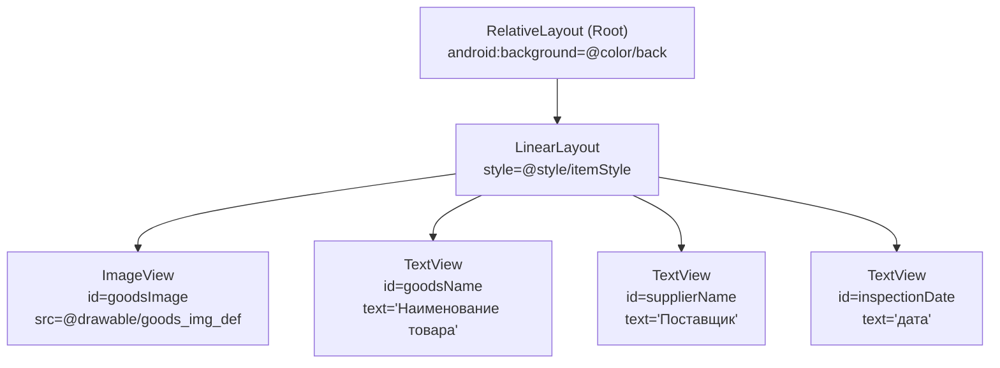
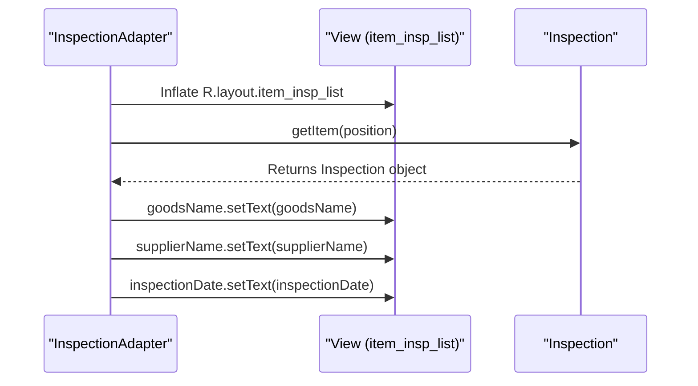
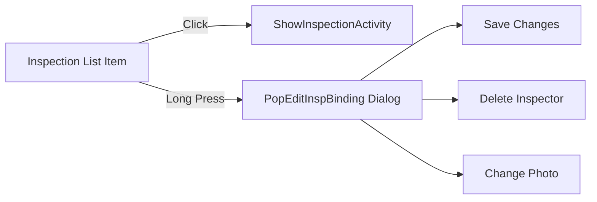
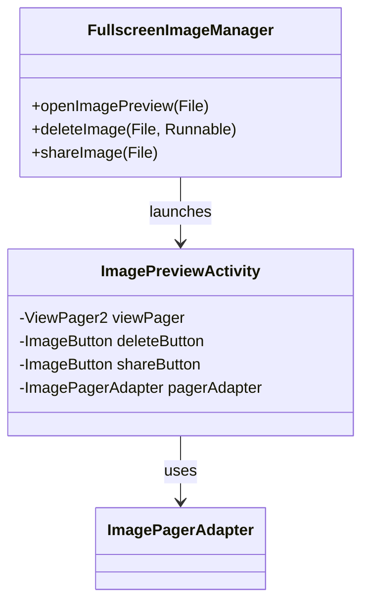

# Inspection List Items

<cite>
**Referenced Files in This Document**   
- [item_insp_list.xml](file://app/src/main/res/layout/item_insp_list.xml)
- [def_insp_img.xml](file://app/src/main/res/drawable/def_insp_img.xml)
- [InspectionAdapter.java](file://app/src/main/java/com/example/b1void/adapters/InspectionAdapter.java)
- [Inspection.java](file://app/src/main/java/com/example/b1void/models/Inspection.java)
- [PopEditInspBinding.java](file://app/build/generated/data_binding_base_class_source_out/debug/out/com/example/b1void/databinding/PopEditInspBinding.java)
- [pop_edit_insp.xml](file://app/src/main/res/layout/pop_edit_insp.xml)
- [FullscreenImageManager.kt](file://app/src/main/java/com/example/b1void/utils/FullscreenImageManager.kt)
- [ImagePreviewActivity.kt](file://app/src/main/java/com/example/b1void/activities/ImagePreviewActivity.kt)
</cite>

## Table of Contents
1. [Introduction](#introduction)
2. [Layout Structure and UI Components](#layout-structure-and-ui-components)
3. [Data Binding Process](#data-binding-process)
4. [Click Handling and Navigation](#click-handling-and-navigation)
5. [Thumbnail Generation and Image Management](#thumbnail-generation-and-image-management)
6. [Customization Options](#customization-options)

## Introduction
The `item_insp_list.xml` layout defines the visual representation of individual inspection entries within a list-based interface. It is used by the `InspectionAdapter` to display data from the `Inspection` model, showing key information such as item name, supplier, and inspection date. The layout supports interaction through click and long-press events for navigation and editing, integrates fallback thumbnails via `def_insp_img.xml`, and enables high-resolution image previews using `FullscreenImageManager`. This document details its structure, binding logic, event handling, and extensibility.

**Section sources**
- [item_insp_list.xml](file://app/src/main/res/layout/item_insp_list.xml)
- [InspectionAdapter.java](file://app/src/main/java/com/example/b1void/adapters/InspectionAdapter.java)

## Layout Structure and UI Components
The `item_insp_list.xml` layout uses a `RelativeLayout` as the root container with a nested `LinearLayout` to organize child views horizontally. Key UI components include:

- **Title (`goodsName`)**: A `TextView` displaying the product name, styled with `@style/textBoxStyle`.
- **Supplier Name (`supplierName`)**: A `TextView` showing the supplier's name.
- **Date Stamp (`inspectionDate`)**: A `TextView` presenting the formatted inspection date.
- **Thumbnail Preview (`goodsImage`)**: An `ImageView` that displays a product image or a default placeholder defined in `def_insp_img.xml`.

The background color is set to `@color/back`, and all elements follow a consistent styling scheme via predefined styles.

**Diagram sources**
- [item_insp_list.xml](file://app/src/main/res/layout/item_insp_list.xml)

**Section sources**
- [item_insp_list.xml](file://app/src/main/res/layout/item_insp_list.xml)

## Data Binding Process
The `InspectionAdapter` binds data from the `Inspection` model to the `item_insp_list.xml` layout. During `getView()`, it inflates the layout and populates each view with corresponding values:

- `goodsNameTextView.setText(inspection.getGoodsName())`
- `supplierNameTextView.setText(inspection.getSupplierName())`
- `inspectionDateTextView.setText(inspection.getInspectionDate())`

This binding occurs for each list item, ensuring dynamic updates based on the underlying data collection. The adapter receives a `List<Inspection>` in its constructor and leverages Android’s `ArrayAdapter` framework for efficient view recycling.

**Diagram sources**
- [InspectionAdapter.java](file://app/src/main/java/com/example/b1void/adapters/InspectionAdapter.java)
- [Inspection.java](file://app/src/main/java/com/example/b1void/models/Inspection.java)

**Section sources**
- [InspectionAdapter.java](file://app/src/main/java/com/example/b1void/adapters/InspectionAdapter.java)
- [Inspection.java](file://app/src/main/java/com/example/b1void/models/Inspection.java)

## Click Handling and Navigation
While not directly implemented in the layout file, the parent activity or fragment typically sets up click listeners on the list items. Standard behavior includes:

- **Click**: Navigates to `ShowInspectionActivity` to display detailed inspection information.
- **Long-Press**: Triggers a context menu or directly opens `PopEditInspBinding`, a popup dialog allowing modification of inspection details such as inspector name, code, and photo.

The `PopEditInspBinding` layout contains editable fields and action buttons bound to data operations, enabling inline editing without leaving the list context.

**Diagram sources**
- [PopEditInspBinding.java](file://app/build/generated/data_binding_base_class_source_out/debug/out/com/example/b1void/databinding/PopEditInspBinding.java)
- [pop_edit_insp.xml](file://app/src/main/res/layout/pop_edit_insp.xml)

**Section sources**
- [PopEditInspBinding.java](file://app/build/generated/data_binding_base_class_source_out/debug/out/com/example/b1void/databinding/PopEditInspBinding.java)
- [pop_edit_insp.xml](file://app/src/main/res/layout/pop_edit_insp.xml)

## Thumbnail Generation and Image Management
The `goodsImage` field in `item_insp_list.xml` defaults to `@drawable/goods_img_def`, though the system may use `def_insp_img.xml` as a fallback when no valid image is available. This vector drawable features a stylized icon tinted with `#768ED1`, designed for clarity at small sizes.

For full-screen viewing, the app utilizes `FullscreenImageManager`, which launches `ImagePreviewActivity` to display images in high resolution. This manager supports sharing and deletion operations, enhancing user interaction beyond basic preview functionality.

**Diagram sources**
- [FullscreenImageManager.kt](file://app/src/main/java/com/example/b1void/utils/FullscreenImageManager.kt)
- [ImagePreviewActivity.kt](file://app/src/main/java/com/example/b1void/activities/ImagePreviewActivity.kt)

**Section sources**
- [FullscreenImageManager.kt](file://app/src/main/java/com/example/b1void/utils/FullscreenImageManager.kt)
- [ImagePreviewActivity.kt](file://app/src/main/java/com/example/b1void/activities/ImagePreviewActivity.kt)

## Customization Options
Developers can customize both appearance and behavior of inspection list items:

- **Appearance**: Modify `@style/itemStyle` and `@style/textBoxStyle` in styles resources to alter spacing, fonts, and colors. Replace `def_insp_img.xml` with an alternative vector asset for different placeholder imagery.
- **Behavior**: Extend `InspectionAdapter` to add conditional formatting (e.g., color-coding based on inspection status). Implement custom click handlers in the hosting activity to support swipe actions or drag-to-reorder.
- **Localization**: Text labels in `item_insp_list.xml` are hardcoded in Russian; these should be moved to string resources for proper i18n support.

These adjustments allow flexible adaptation to various design systems and functional requirements while maintaining compatibility with existing data models.

**Section sources**
- [item_insp_list.xml](file://app/src/main/res/layout/item_insp_list.xml)
- [InspectionAdapter.java](file://app/src/main/java/com/example/b1void/adapters/InspectionAdapter.java)