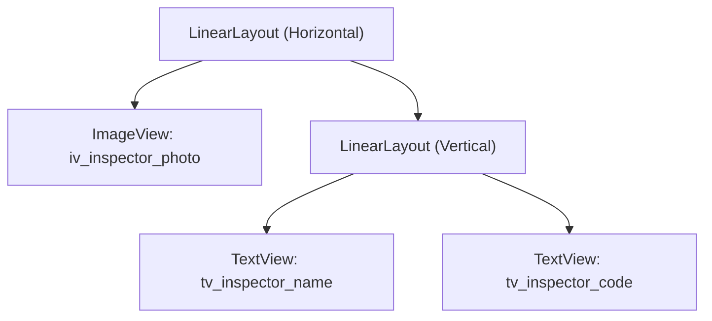
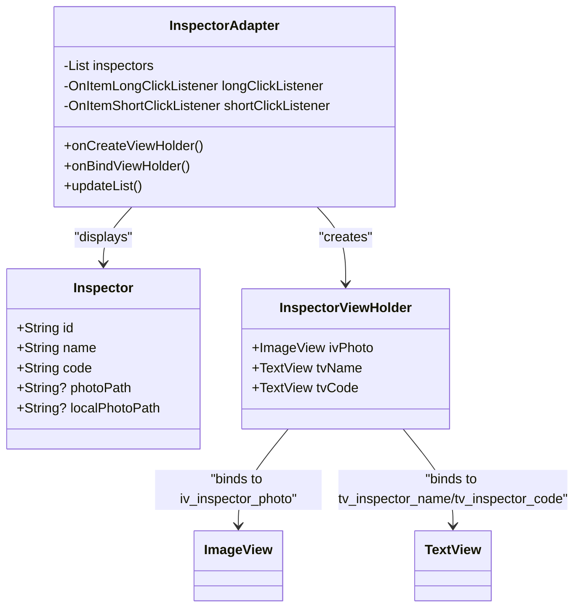
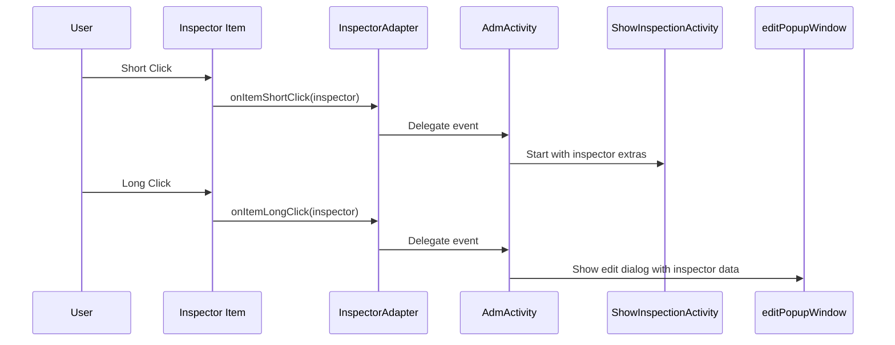

# Inspector Profile Items

<cite>
**Referenced Files in This Document**   
- [item_inspector.xml](file://app/src/main/res/layout/item_inspector.xml)
- [circle_background.xml](file://app/src/main/res/drawable/circle_background.xml)
- [rounded_background.xml](file://app/src/main/res/drawable/rounded_background.xml)
- [InspectorAdapter.kt](file://app/src/main/java/com/example/b1void/adapters/InspectorAdapter.kt)
- [Inspector.kt](file://app/src/main/java/com/example/b1void/models/Inspector.kt)
</cite>

## Table of Contents
1. [Introduction](#introduction)
2. [Layout Structure and Visual Elements](#layout-structure-and-visual-elements)
3. [Data Binding and Model Mapping](#data-binding-and-model-mapping)
4. [Interaction Patterns](#interaction-patterns)
5. [Styling and Drawable Resources](#styling-and-drawable-resources)
6. [Extensibility and Integration Guidance](#extensibility-and-integration-guidance)

## Introduction
The `item_inspector.xml` layout defines the UI component used to display inspector profiles within administrative interfaces of the application. This documentation provides a comprehensive overview of its structure, data binding mechanism, interaction behaviors, styling, and extensibility options. The component is primarily used in list views managed by `InspectorAdapter`, where each item represents an `Inspector` model instance with name, code, and photo information.

## Layout Structure and Visual Elements

The `item_inspector.xml` layout uses a horizontal `LinearLayout` to organize visual elements into two main sections: the profile avatar and textual details.



**Diagram sources**
- [item_inspector.xml](file://app/src/main/res/layout/item_inspector.xml#L1-L35)

**Section sources**
- [item_inspector.xml](file://app/src/main/res/layout/item_inspector.xml#L1-L35)

### Profile Avatar Placeholder
The `ImageView` with ID `iv_inspector_photo` serves as the profile picture container:
- Fixed size: 50dp × 50dp
- Uses `centerCrop` scale type for consistent image framing
- Default image resource: `@drawable/def_insp_img`
- Positioned on the left with 8dp right margin

This placeholder can be dynamically replaced with actual inspector photos loaded from local storage via bitmap decoding and Glide integration.

### Textual Information Fields
Two `TextView` components display key inspector metadata:
- **Name Field (`tv_inspector_name`)**: Bold text at 16sp font size
- **Code Field (`tv_inspector_code`)**: Standard body text for inspector identifier

These fields are vertically stacked within a nested `LinearLayout` aligned to the center vertically.

## Data Binding and Model Mapping

The `InspectorAdapter` class binds data from the `Inspector` model to the UI components defined in `item_inspector.xml`.



**Diagram sources**
- [InspectorAdapter.kt](file://app/src/main/java/com/example/b1void/adapters/InspectorAdapter.kt#L17-L88)
- [Inspector.kt](file://app/src/main/java/com/example/b1void/models/Inspector.kt#L2-L8)

**Section sources**
- [InspectorAdapter.kt](file://app/src/main/java/com/example/b1void/adapters/InspectorAdapter.kt#L40-L68)
- [Inspector.kt](file://app/src/main/java/com/example/b1void/models/Inspector.kt#L2-L8)

### Binding Process
During `onBindViewHolder`, the adapter performs the following mappings:
- `currentInspector.name` → `holder.tvName.text`
- `currentInspector.code` → `holder.tvCode.text`
- `currentInspector.localPhotoPath` → loaded via `loadBitmapFromPath()` and displayed using Glide

If no photo path is available or loading fails, the default placeholder (`def_insp_img`) is shown.

### Photo Loading Mechanism
Photos are asynchronously loaded from internal storage using:
1. Direct file access via `FileInputStream`
2. Bitmap decoding with `BitmapFactory.decodeStream()`
3. Image loading through Glide library with placeholder and error fallbacks

This ensures smooth rendering even when dealing with large image files.

## Interaction Patterns

The inspector item supports both short and long click interactions, enabling different workflow actions.



**Diagram sources**
- [InspectorAdapter.kt](file://app/src/main/java/com/example/b1void/adapters/InspectorAdapter.kt#L60-L67)
- [AdmActivity.kt](file://app/src/main/java/com/example/b1void/activities/AdmActivity.kt#L341-L344)
- [AdmActivity.kt](file://app/src/main/java/com/example/b1void/activities/AdmActivity.kt#L334-L338)

**Section sources**
- [InspectorAdapter.kt](file://app/src/main/java/com/example/b1void/adapters/InspectorAdapter.kt#L60-L67)
- [AdmActivity.kt](file://app/src/main/java/com/example/b1void/activities/AdmActivity.kt#L341-L344)
- [AdmActivity.kt](file://app/src/main/java/com/example/b1void/activities/AdmActivity.kt#L334-L338)

### Selection Workflow
A short click triggers navigation to `ShowInspectionActivity`, passing inspector details (ID, name, code, photo path) via intent extras for inspection viewing.

### Edit Mode Activation
A long click sets the current inspector as `currentEditInspector` and opens a popup window (`editPopupWindow`) pre-filled with editable fields, allowing modification of name, code, and photo.

## Styling and Drawable Resources

Visual styling is achieved through dedicated drawable resources that define shape and color properties.

### Circle Background Resource
Although not directly used in `item_inspector.xml`, `circle_background.xml` defines an oval shape with solid green fill (#4CAF50), potentially intended for badge overlays or alternative avatar styles.

```xml
<shape android:shape="oval">
    <solid android:color="#4CAF50" />
    <size android:width="48dp" android:height="48dp" />
</shape>
```

**Section sources**
- [circle_background.xml](file://app/src/main/res/drawable/circle_background.xml#L1-L8)

### Rounded Background Resource
The `rounded_background.xml` drawable applies rounded corners (10dp radius) and references a theme-defined background color (`@color/button_background_color`), suitable for buttons or selected states.

```xml
<shape android:shape="rectangle">
    <solid android:color="@color/button_background_color" />
    <corners android:radius="10dp" />
</shape>
```

While not directly applied in this layout, it may be used programmatically for selection highlighting or state feedback.

**Section sources**
- [rounded_background.xml](file://app/src/main/res/drawable/rounded_background.xml#L1-L8)

## Extensibility and Integration Guidance

### Adding Metadata Display
To extend the component with additional inspector metadata (e.g., department, contact info):
1. Add new `TextView` elements to `item_inspector.xml`
2. Update `InspectorViewHolder` to include view bindings
3. Modify `onBindViewHolder` to populate new fields from extended `Inspector` model

Example extension point:
```kotlin
// In Inspector.kt
val department: String = ""
val email: String? = null
```

### Authentication System Integration
Integrate with authentication systems by:
- Passing inspector identity tokens during navigation
- Using `inspector.id` as principal identifier in API calls
- Securing photo access based on user roles
- Logging inspector access events in audit trails

The existing `localPhotoPath` field supports offline availability of authenticated user assets.

### Performance Optimization
Consider implementing:
- RecyclerView view holder pooling
- Memory-efficient image caching with Glide
- Lazy loading for large inspector lists
- DiffUtil for efficient list updates

These enhancements ensure responsive behavior in enterprise-scale deployments.