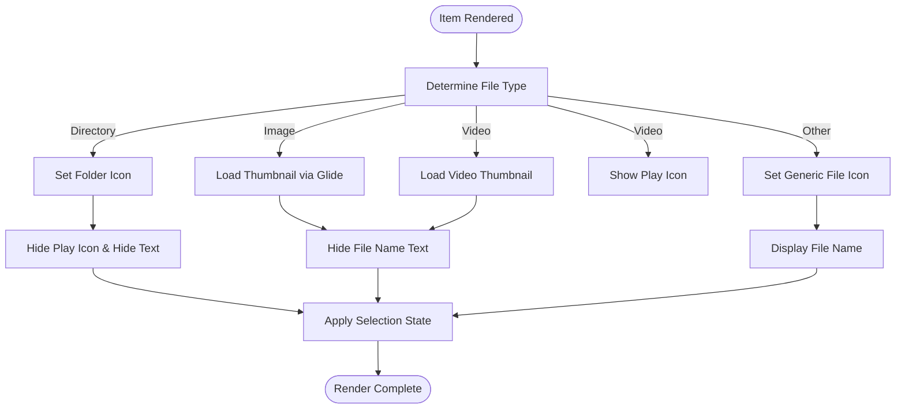
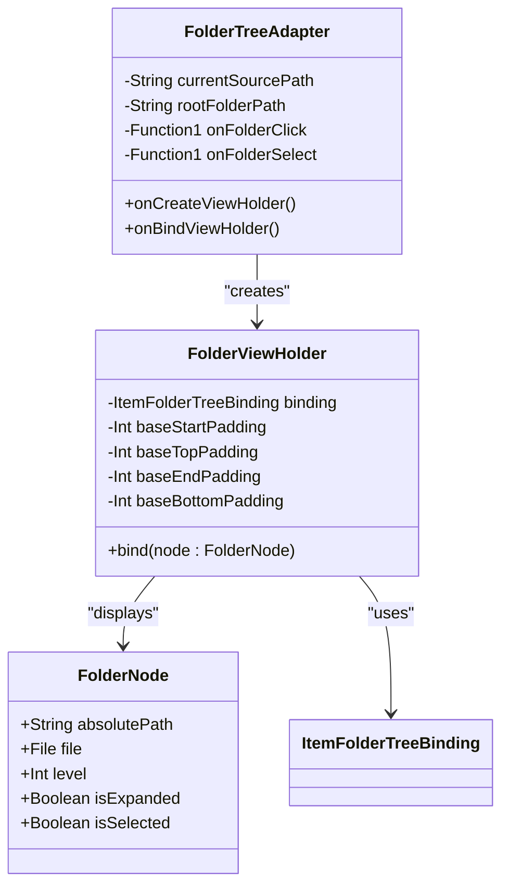
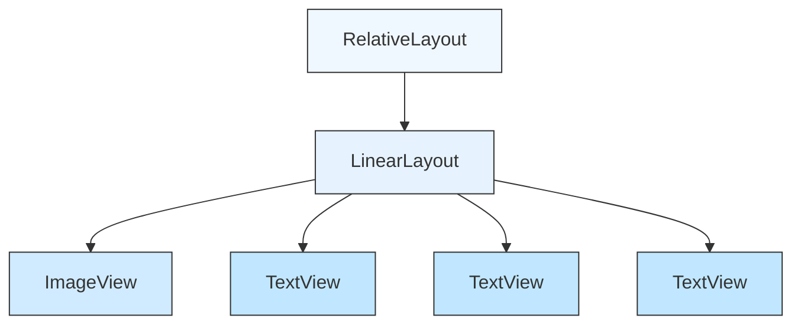
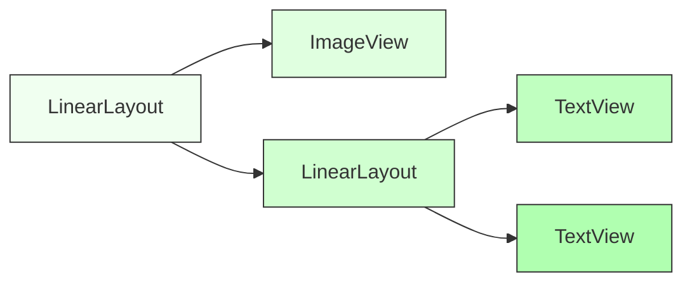
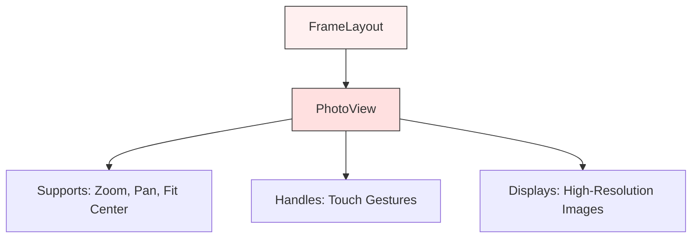
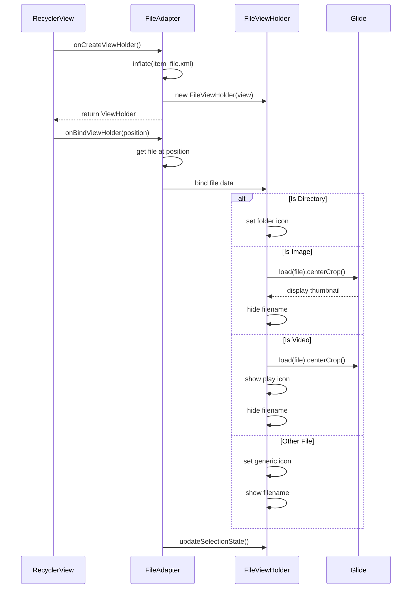
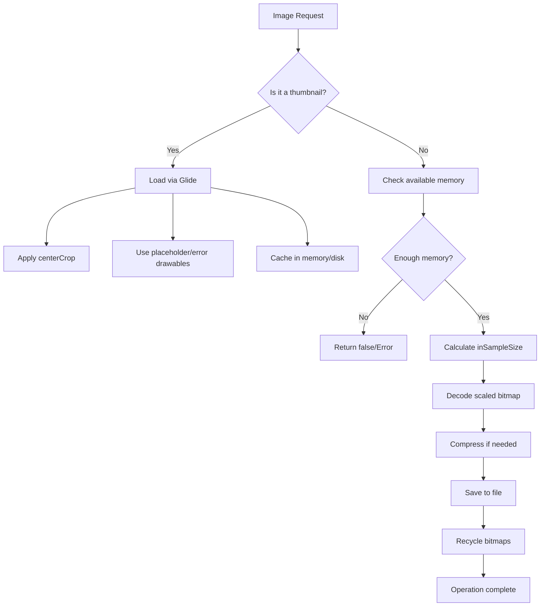
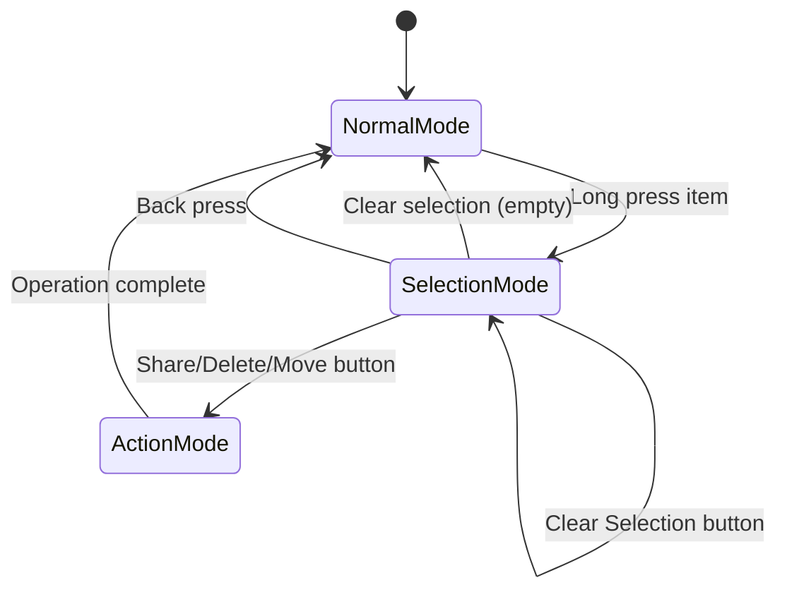

# List Item Components

<cite>
**Referenced Files in This Document**
- [item_file.xml](file://app/src/main/res/layout/item_file.xml)
- [item_folder_tree.xml](file://app/src/main/res/layout/item_folder_tree.xml)
- [item_insp_list.xml](file://app/src/main/res/layout/item_insp_list.xml)
- [item_inspector.xml](file://app/src/main/res/layout/item_inspector.xml)
- [item_image_fullscreen.xml](file://app/src/main/res/layout/item_image_fullscreen.xml)
- [FileAdapter.kt](file://app/src/main/java/com/example/b1void/adapters/FileAdapter.kt)
- [FolderTreeAdapter.kt](file://app/src/main/java/com/example/b1void/adapters/FolderTreeAdapter.kt)
- [ImagePagerAdapter.kt](file://app/src/main/java/com/example/b1void/adapters/ImagePagerAdapter.kt)
- [ImageOptimizer.kt](file://app/src/main/java/com/example/b1void/utils/ImageOptimizer.kt)
- [SelectionManager.kt](file://app/src/main/java/com/example/b1void/utils/SelectionManager.kt)
- [FullscreenImageManager.kt](file://app/src/main/java/com/example/b1void/utils/FullscreenImageManager.kt)
</cite>

## Table of Contents
1. [Introduction](#introduction)
2. [File Item Layout (item_file.xml)](#file-item-layout-item_filexml)
3. [Folder Tree Item Layout (item_folder_tree.xml)](#folder-tree-item-layout-item_foldertreexml)
4. [Inspection List Item Layout (item_insp_list.xml)](#inspection-list-item-layout-item_insp_listxml)
5. [Inspector Profile Item Layout (item_inspector.xml)](#inspector-profile-item-layout-item_inspectorxml)
6. [Fullscreen Image Item Layout (item_image_fullscreen.xml)](#fullscreen-image-item-layout-item_image_fullscreenxml)
7. [ViewHolder and Adapter Patterns](#viewholder-and-adapter-patterns)
8. [Image Handling and Optimization](#image-handling-and-optimization)
9. [Selection and Interaction Management](#selection-and-interaction-management)
10. [State Preservation and Configuration Changes](#state-preservation-and-configuration-changes)
11. [Theming and Customization](#theming-and-customization)

## Introduction
This document provides comprehensive documentation for the RecyclerView item layouts used throughout the Inspector application. It details the structure, functionality, and integration of various list item components that represent files, folders, inspection entries, inspector profiles, and fullscreen images. The documentation covers layout design, ViewHolder patterns, image handling via Glide and custom optimization, selection mechanics, user interactions, and performance considerations.

## File Item Layout (item_file.xml)

The `item_file.xml` layout represents individual files and folders within the file manager interface. It uses a FrameLayout to layer multiple UI elements including dynamic icons, thumbnails, play indicators for videos, selection overlays, and badges.

The layout supports different visual states based on file type:
- Folders display a dedicated folder icon
- Images show thumbnail previews loaded via Glide
- Videos include a play icon overlay
- Other files use a generic file icon

Selection state is visually indicated through an overlay and numbered badge, with text displayed only for non-media files to avoid content obstruction.

**Diagram sources**
- [item_file.xml](file://app/src/main/res/layout/item_file.xml#L1-L54)
- [FileAdapter.kt](file://app/src/main/java/com/example/b1void/adapters/FileAdapter.kt#L15-L167)

**Section sources**
- [item_file.xml](file://app/src/main/res/layout/item_file.xml#L1-L54)
- [FileAdapter.kt](file://app/src/main/java/com/example/b1void/adapters/FileAdapter.kt#L15-L167)

## Folder Tree Item Layout (item_folder_tree.xml)

The `item_folder_tree.xml` layout displays hierarchical folder structures in the move files bottom sheet. It uses a horizontal LinearLayout containing an expansion indicator, folder icon, and folder name with dynamic indentation based on nesting level.

Key features include:
- Expand/collapse controls via arrow icon
- Visual hierarchy through left padding proportional to nesting depth
- Different text colors for source folder (disabled), selected folder (red), and normal items
- Background color changes for selected state
- Click handlers for both folder selection and expansion control

**Diagram sources**
- [item_folder_tree.xml](file://app/src/main/res/layout/item_folder_tree.xml#L1-L36)
- [FolderTreeAdapter.kt](file://app/src/main/java/com/example/b1void/adapters/FolderTreeAdapter.kt#L14-L88)

**Section sources**
- [item_folder_tree.xml](file://app/src/main/res/layout/item_folder_tree.xml#L1-L36)
- [FolderTreeAdapter.kt](file://app/src/main/java/com/example/b1void/adapters/FolderTreeAdapter.kt#L14-L88)

## Inspection List Item Layout (item_insp_list.xml)

The `item_insp_list.xml` layout renders individual inspection entries in a vertical LinearLayout within a RelativeLayout container. Each item displays product information including:

- Product image with default placeholder
- Product name
- Supplier name
- Inspection date

The layout applies consistent styling through predefined styles (`itemStyle`, `textBoxStyle`) and maintains a clean background color defined by the theme. The structure prioritizes readability with proper spacing and alignment of information fields.

**Diagram sources**
- [item_insp_list.xml](file://app/src/main/res/layout/item_insp_list.xml#L1-L49)

**Section sources**
- [item_insp_list.xml](file://app/src/main/res/layout/item_insp_list.xml#L1-L49)

## Inspector Profile Item Layout (item_inspector.xml)

The `item_inspector.xml` layout displays inspector profile information in a horizontal arrangement. It consists of:

- Circular inspector photo (50x50dp) with crop scaling
- Vertical layout containing:
  - Inspector name (bold, 16sp)
  - Inspector code/identifier

The layout uses a simple LinearLayout structure with appropriate margins and gravity settings to ensure proper alignment. Default image resources are provided for cases where photos are unavailable.

**Diagram sources**
- [item_inspector.xml](file://app/src/main/res/layout/item_inspector.xml#L1-L36)

**Section sources**
- [item_inspector.xml](file://app/src/main/res/layout/item_inspector.xml#L1-L36)

## Fullscreen Image Item Layout (item_image_fullscreen.xml)

The `item_image_fullscreen.xml` layout provides high-resolution image display within the preview pager. It uses a FrameLayout container with a single PhotoView component that supports:

- Pinch-to-zoom gestures
- Pan scrolling
- Multiple scale types (configured as fitCenter)
- High-performance rendering of large images

The simplified structure eliminates distractions, focusing entirely on image presentation with gesture support handled by the third-party PhotoView library.

**Diagram sources**
- [item_image_fullscreen.xml](file://app/src/main/res/layout/item_image_fullscreen.xml#L1-L12)
- [ImagePagerAdapter.kt](file://app/src/main/java/com/example/b1void/adapters/ImagePagerAdapter.kt#L12-L44)

**Section sources**
- [item_image_fullscreen.xml](file://app/src/main/res/layout/item_image_fullscreen.xml#L1-L12)
- [ImagePagerAdapter.kt](file://app/src/main/java/com/example/b1void/adapters/ImagePagerAdapter.kt#L12-L44)

## ViewHolder and Adapter Patterns

The application implements efficient RecyclerView patterns through specialized adapters and ViewHolders that handle view recycling and data binding.

### FileAdapter Implementation
The `FileAdapter` manages file and folder items with support for selection mode. Key features include:
- Dynamic view holder creation from `item_file.xml`
- Type-based icon/thumbnail determination
- Selection state management with visual feedback
- DiffUtil integration for efficient updates
- Click and long-click listeners for interaction

### FolderTreeAdapter Implementation
The `FolderTreeAdapter` extends ListAdapter for automatic diffing and handles hierarchical data:
- Uses ViewBinding (ItemFolderTreeBinding) for type safety
- Applies dynamic indentation based on node level
- Manages expandable tree state
- Handles both selection and expansion clicks separately

### ImagePagerAdapter Implementation
The `ImagePagerAdapter` handles fullscreen image viewing:
- Binds image paths to PhotoView components
- Uses Glide for efficient image loading with placeholders
- Handles missing files gracefully

**Diagram sources**
- [FileAdapter.kt](file://app/src/main/java/com/example/b1void/adapters/FileAdapter.kt#L15-L167)
- [FolderTreeAdapter.kt](file://app/src/main/java/com/example/b1void/adapters/FolderTreeAdapter.kt#L14-L88)
- [ImagePagerAdapter.kt](file://app/src/main/java/com/example/b1void/adapters/ImagePagerAdapter.kt#L12-L44)

**Section sources**
- [FileAdapter.kt](file://app/src/main/java/com/example/b1void/adapters/FileAdapter.kt#L15-L167)
- [FolderTreeAdapter.kt](file://app/src/main/java/com/example/b1void/adapters/FolderTreeAdapter.kt#L14-L88)
- [ImagePagerAdapter.kt](file://app/src/main/java/com/example/b1void/adapters/ImagePagerAdapter.kt#L12-L44)

## Image Handling and Optimization

The application employs multiple strategies for efficient image handling across different contexts.

### Glide Integration
Glide is used extensively for asynchronous image loading with:
- Memory and disk caching
- Placeholder and error drawables
- Transformation options (centerCrop)
- Lifecycle-aware requests

### ImageOptimizer Class
The `ImageOptimizer` utility handles bitmap processing with memory-conscious operations:
- Calculates optimal sample size to prevent OOM errors
- Uses RGB_565 configuration to reduce memory footprint
- Implements worker thread execution via coroutines
- Includes memory availability checks before processing
- Provides compression and resizing utilities

### Performance Considerations
- Thumbnails are loaded at appropriate resolutions
- Bitmaps are recycled after use
- Cache directories are managed and can be cleared
- Image operations occur on IO dispatcher threads

**Diagram sources**
- [ImageOptimizer.kt](file://app/src/main/java/com/example/b1void/utils/ImageOptimizer.kt#L1-L171)
- [FileAdapter.kt](file://app/src/main/java/com/example/b1void/adapters/FileAdapter.kt#L15-L167)
- [ImagePagerAdapter.kt](file://app/src/main/java/com/example/b1void/adapters/ImagePagerAdapter.kt#L12-L44)

**Section sources**
- [ImageOptimizer.kt](file://app/src/main/java/com/example/b1void/utils/ImageOptimizer.kt#L1-L171)

## Selection and Interaction Management

The application implements a comprehensive selection system for batch operations on files.

### SelectionManager Class
Centralizes selection state and UI:
- Tracks selected files in a MutableSet
- Manages selection mode lifecycle
- Coordinates adapter state changes
- Updates action button states
- Handles select all/clear operations
- Provides animation for UI transitions

### Interaction Patterns
- **Click**: Opens file or navigates into folder
- **Long press**: Initiates selection mode and selects the item
- **Item click in selection mode**: Toggles selection state
- **Selection toolbar buttons**: Enable batch operations (share, delete, move)

### Visual Feedback
- Semi-transparent overlay on selected items
- Numbered badges showing selection order
- Reduced alpha (0.75) for unselected items
- Slide animations for toolbar appearance/disappearance

**Diagram sources**
- [SelectionManager.kt](file://app/src/main/java/com/example/b1void/utils/SelectionManager.kt#L1-L122)
- [FileAdapter.kt](file://app/src/main/java/com/example/b1void/adapters/FileAdapter.kt#L15-L167)

**Section sources**
- [SelectionManager.kt](file://app/src/main/java/com/example/b1void/utils/SelectionManager.kt#L1-L122)

## State Preservation and Configuration Changes

The application maintains selection state and scroll positions across configuration changes through several mechanisms:

- RecyclerView automatically preserves scroll position
- Selection state is maintained in the SelectionManager instance
- FileAdapter holds references to selected files collection
- ViewModel components (where used) survive configuration changes
- Fragment retainInstance or ViewModel patterns preserve business logic

The architecture ensures that when orientation changes or other configuration changes occur:
- Current selection is preserved
- Scroll position is restored
- Selection mode UI state is maintained
- No reloading of file lists is required

This is achieved through proper separation of concerns between UI components and data holders, with stateful objects surviving lifecycle events appropriately.

**Section sources**
- [FileAdapter.kt](file://app/src/main/java/com/example/b1void/adapters/FileAdapter.kt#L15-L167)
- [SelectionManager.kt](file://app/src/main/java/com/example/b1void/utils/SelectionManager.kt#L1-L122)

## Theming and Customization

List item appearances can be customized through several mechanisms:

### Theme Attributes
- Color values referenced from theme (e.g., `@color/move_folder_item_background`)
- Text appearance attributes (`?attr/textAppearanceBodyLarge`)
- Selectable item background (`?android:attr/selectableItemBackground`)

### Drawable Resources
- Custom selectors and state lists
- Vector drawables for icons
- Shape drawables for backgrounds
- Density-independent dimensions (dp, sp)

### Style Inheritance
- Predefined styles (`itemStyle`, `textBoxStyle`)
- Consistent typography and spacing
- Theme-aware color selection

Developers can modify the appearance by:
- Updating color values in color resources
- Replacing drawable assets
- Modifying dimension values
- Adjusting style definitions
- Overriding theme attributes in different configurations

This approach allows for consistent theming across the application while maintaining flexibility for customization.

**Section sources**
- [item_file.xml](file://app/src/main/res/layout/item_file.xml#L1-L54)
- [item_folder_tree.xml](file://app/src/main/res/layout/item_folder_tree.xml#L1-L36)
- [item_insp_list.xml](file://app/src/main/res/layout/item_insp_list.xml#L1-L49)
- [item_inspector.xml](file://app/src/main/res/layout/item_inspector.xml#L1-L36)