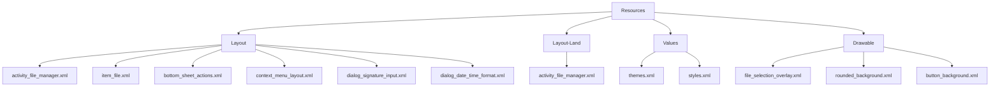
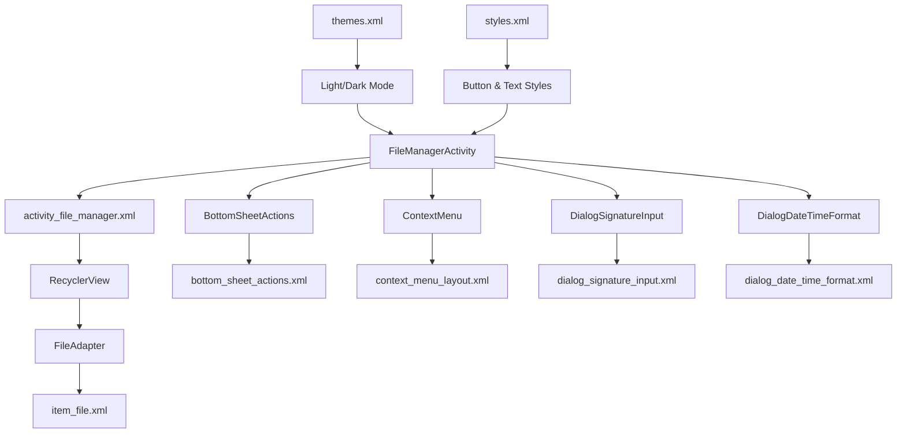
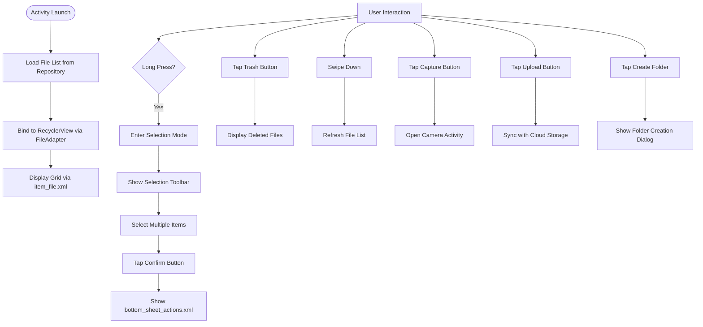
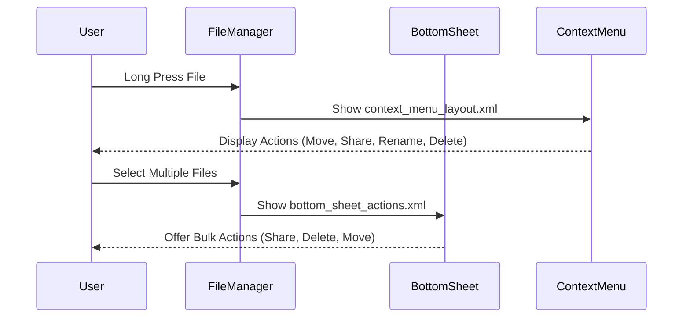
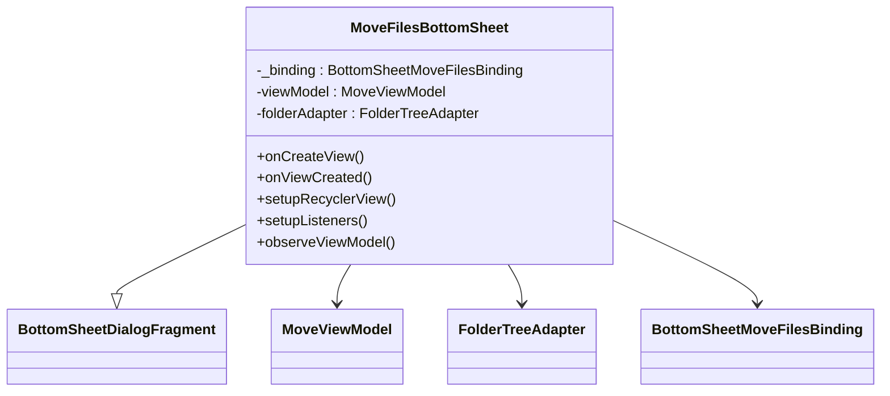
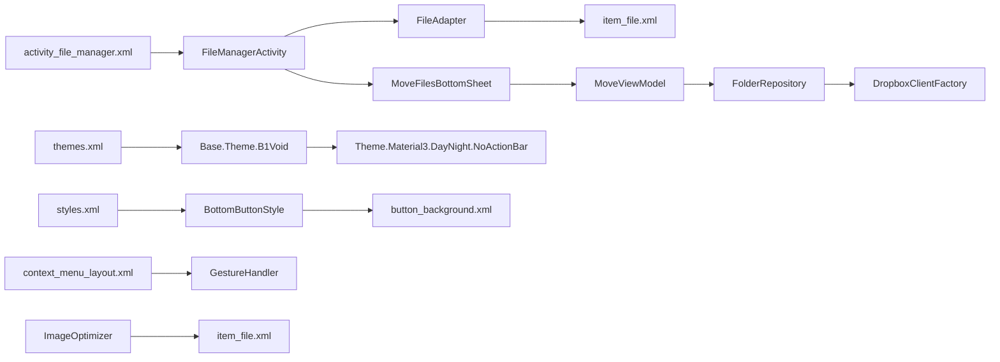

# User Interface Components

<cite>
**Referenced Files in This Document**
- [activity_file_manager.xml](file://app/src/main/res/layout/activity_file_manager.xml)
- [item_file.xml](file://app/src/main/res/layout/item_file.xml)
- [bottom_sheet_actions.xml](file://app/src/main/res/layout/bottom_sheet_actions.xml)
- [context_menu_layout.xml](file://app/src/main/res/layout/context_menu_layout.xml)
- [dialog_signature_input.xml](file://app/src/main/res/layout/dialog_signature_input.xml)
- [dialog_date_time_format.xml](file://app/src/main/res/layout/dialog_date_time_format.xml)
- [themes.xml](file://app/src/main/res/values/themes.xml)
- [styles.xml](file://app/src/main/res/values/styles.xml)
- [MoveFilesBottomSheet.kt](file://app/src/main/java/com/example/b1void/ui/MoveFilesBottomSheet.kt)
- [layout-land/activity_file_manager.xml](file://app/src/main/res/layout-land/activity_file_manager.xml)
</cite>

## Table of Contents
1. [Introduction](#introduction)
2. [Project Structure](#project-structure)
3. [Core Components](#core-components)
4. [Architecture Overview](#architecture-overview)
5. [Detailed Component Analysis](#detailed-component-analysis)
6. [Dependency Analysis](#dependency-analysis)
7. [Performance Considerations](#performance-considerations)
8. [Troubleshooting Guide](#troubleshooting-guide)
9. [Conclusion](#conclusion)

## Introduction
This document provides comprehensive documentation for the core UI components of the Inspector_appVX application. It details the visual design, interaction patterns, and technical implementation of key layouts and dialogs used throughout the app. The focus is on Material Design compliance, responsive behavior across screen orientations, accessibility features, and performance optimization strategies.

## Project Structure

The UI components are organized within the standard Android resource directory structure under `app/src/main/res`. Key directories include:
- `layout/`: Contains primary XML layout files for activities, fragments, dialogs, and list items.
- `layout-land/`: Houses landscape-specific layout variations for improved usability on wider screens.
- `values/`: Stores styles, themes, colors, and strings that define visual appearance and support light/dark mode.
- `drawable/`: Includes vector drawables and shape resources used in UI elements such as buttons, backgrounds, and icons.



**Diagram sources**
- [activity_file_manager.xml](file://app/src/main/res/layout/activity_file_manager.xml)
- [item_file.xml](file://app/src/main/res/layout/item_file.xml)
- [bottom_sheet_actions.xml](file://app/src/main/res/layout/bottom_sheet_actions.xml)
- [context_menu_layout.xml](file://app/src/main/res/layout/context_menu_layout.xml)
- [dialog_signature_input.xml](file://app/src/main/res/layout/dialog_signature_input.xml)
- [dialog_date_time_format.xml](file://app/src/main/res/layout/dialog_date_time_format.xml)
- [themes.xml](file://app/src/main/res/values/themes.xml)
- [styles.xml](file://app/src/main/res/values/styles.xml)

**Section sources**
- [activity_file_manager.xml](file://app/src/main/res/layout/activity_file_manager.xml)
- [item_file.xml](file://app/src/main/res/layout/item_file.xml)
- [bottom_sheet_actions.xml](file://app/src/main/res/layout/bottom_sheet_actions.xml)
- [context_menu_layout.xml](file://app/src/main/res/layout/context_menu_layout.xml)
- [dialog_signature_input.xml](file://app/src/main/res/layout/dialog_signature_input.xml)
- [dialog_date_time_format.xml](file://app/src/main/res/layout/dialog_date_time_format.xml)
- [themes.xml](file://app/src/main/res/values/themes.xml)
- [styles.xml](file://app/src/main/res/values/styles.xml)

## Core Components

The application's user interface is built around several core components that provide consistent navigation, selection, and action capabilities. These include the main file manager dashboard (`activity_file_manager.xml`), individual file representation (`item_file.xml`), contextual action menus (`bottom_sheet_actions.xml`, `context_menu_layout.xml`), and specialized input dialogs (`dialog_signature_input.xml`, `dialog_date_time_format.xml`). All components adhere to Material Design principles with attention to accessibility, responsiveness, and theming.

**Section sources**
- [activity_file_manager.xml](file://app/src/main/res/layout/activity_file_manager.xml)
- [item_file.xml](file://app/src/main/res/layout/item_file.xml)
- [bottom_sheet_actions.xml](file://app/src/main/res/layout/bottom_sheet_actions.xml)
- [context_menu_layout.xml](file://app/src/main/res/layout/context_menu_layout.xml)
- [dialog_signature_input.xml](file://app/src/main/res/layout/dialog_signature_input.xml)
- [dialog_date_time_format.xml](file://app/src/main/res/layout/dialog_date_time_format.xml)

## Architecture Overview

The UI architecture follows a component-based approach using Android’s data binding and view binding frameworks. Activities host RecyclerViews populated by adapters (e.g., `FileAdapter.kt`) that bind data to reusable item layouts. Contextual actions are managed through BottomSheetDialogFragments like `MoveFilesBottomSheet.kt`, which encapsulate complex interactions while maintaining separation of concerns. Theming is centralized in `themes.xml` and `styles.xml`, enabling dynamic light/dark mode switching.



**Diagram sources**
- [activity_file_manager.xml](file://app/src/main/res/layout/activity_file_manager.xml)
- [item_file.xml](file://app/src/main/res/layout/item_file.xml)
- [bottom_sheet_actions.xml](file://app/src/main/res/layout/bottom_sheet_actions.xml)
- [context_menu_layout.xml](file://app/src/main/res/layout/context_menu_layout.xml)
- [dialog_signature_input.xml](file://app/src/main/res/layout/dialog_signature_input.xml)
- [dialog_date_time_format.xml](file://app/src/main/res/layout/dialog_date_time_format.xml)
- [themes.xml](file://app/src/main/res/values/themes.xml)
- [styles.xml](file://app/src/main/res/values/styles.xml)

## Detailed Component Analysis

### Main Dashboard: activity_file_manager.xml

The main dashboard serves as the central hub for file management operations. It features a top AppBar with a title, trash access button, sort control, and clear-trash option (when applicable). Below this is a SwipeRefreshLayout-wrapped RecyclerView displaying files in a grid via `item_file.xml`. At the bottom, three primary action buttons allow capture, upload, and folder creation.

In landscape mode, an additional vertical seekbar appears on the right side, allowing quick navigation through long lists. The toolbar also adapts, showing inline action buttons and a selection mode toolbar when multiple items are selected.

#### Interaction Patterns
- **Swipe-to-refresh**: Pull down to reload file list
- **Long press**: Initiates multi-selection mode
- **Selection overlay**: Visual feedback during selection
- **Floating Action Buttons**: Primary actions always accessible



**Diagram sources**
- [activity_file_manager.xml](file://app/src/main/res/layout/activity_file_manager.xml)
- [layout-land/activity_file_manager.xml](file://app/src/main/res/layout-land/activity_file_manager.xml)
- [item_file.xml](file://app/src/main/res/layout/item_file.xml)
- [bottom_sheet_actions.xml](file://app/src/main/res/layout/bottom_sheet_actions.xml)

**Section sources**
- [activity_file_manager.xml](file://app/src/main/res/layout/activity_file_manager.xml)
- [layout-land/activity_file_manager.xml](file://app/src/main/res/layout-land/activity_file_manager.xml)

### File Item Representation: item_file.xml

Each file or folder is represented by `item_file.xml`, a FrameLayout containing:
- **Thumbnail Image**: Full-width ImageView with centerCrop scaling
- **Play Icon**: Overlay indicator for video files
- **Selection Overlay**: Semi-transparent layer shown during selection
- **File Name Label**: Bottom-aligned text with dark background
- **Selection Badge**: Circular counter in top-right corner showing selection order

Accessibility features include proper content descriptions and sufficient touch target sizing (minimum 48dp). The layout uses foreground selectors for ripple effects on tap.

```mermaid
classDiagram
class ItemFile {
+ImageView file_icon
+ImageView play_icon
+View selection_overlay
+TextView file_name
+TextView selection_badge
}
ItemFile : android : layout_width="match_parent"
ItemFile : android : layout_height="wrap_content"
ItemFile : android : foreground="?android : attr/selectableItemBackground"
ImageView : android : id="@+id/file_icon"
ImageView : android : scaleType="centerCrop"
View : android : id="@+id/selection_overlay"
View : android : background="@drawable/file_selection_overlay"
TextView : android : id="@+id/selection_badge"
TextView : android : background="@drawable/file_selection_badge_background"
```

**Diagram sources**
- [item_file.xml](file://app/src/main/res/layout/item_file.xml)
- [drawable/file_selection_overlay.xml](file://app/src/main/res/drawable/file_selection_overlay.xml)
- [drawable/file_selection_badge_background.xml](file://app/src/main/res/drawable/file_selection_badge_background.xml)

**Section sources**
- [item_file.xml](file://app/src/main/res/layout/item_file.xml)

### Contextual Actions: bottom_sheet_actions.xml and context_menu_layout.xml

Contextual actions are presented via two complementary mechanisms:

1. **Bottom Sheet Actions** (`bottom_sheet_actions.xml`): Appears after confirming selection, offering Share, Delete, and Move options with color-coded danger actions.
2. **Context Menu** (`context_menu_layout.xml`): Triggered by long-press, provides Move, Share, Rename, and Delete with iconography and selectableItemBackground styling.

Both use `?attr/selectableItemBackground` for consistent Material ripple feedback. Colors follow theme attributes for dark/light mode compatibility.



**Diagram sources**
- [bottom_sheet_actions.xml](file://app/src/main/res/layout/bottom_sheet_actions.xml)
- [context_menu_layout.xml](file://app/src/main/res/layout/context_menu_layout.xml)

**Section sources**
- [bottom_sheet_actions.xml](file://app/src/main/res/layout/bottom_sheet_actions.xml)
- [context_menu_layout.xml](file://app/src/main/res/layout/context_menu_layout.xml)

### Custom Dialogs: DialogSignatureInput and DialogDateTimeFormat

Specialized input dialogs provide focused user interaction:

- **DialogSignatureInput** (`dialog_signature_input.xml`): Simple form for entering signature text with labeled EditText field.
- **DialogDateTimeFormat** (`dialog_date_time_format.xml`): Configuration panel for customizing date/time display formats with separate fields and hints.

These dialogs use standard LinearLayout structures with appropriate padding and labeling for accessibility (`android:labelFor`).

```mermaid
flowchart LR
Subgraph DialogSignatureInput
direction TB
Title1["TextView: Enter Signature Text"]
Input1["EditText: signature_input"]
End
Subgraph DialogDateTimeFormat
direction TB
Title2["TextView: Date Format"]
Input2["EditText: date_format_edit_text"]
Title3["TextView: Time Format"]
Input3["EditText: time_format_edit_text"]
End
```

**Diagram sources**
- [dialog_signature_input.xml](file://app/src/main/res/layout/dialog_signature_input.xml)
- [dialog_date_time_format.xml](file://app/src/main/res/layout/dialog_date_time_format.xml)

**Section sources**
- [dialog_signature_input.xml](file://app/src/main/res/layout/dialog_signature_input.xml)
- [dialog_date_time_format.xml](file://app/src/main/res/layout/dialog_date_time_format.xml)

### Material Design Components

Several advanced Material components enhance UX:

- **MoveFilesBottomSheet** (`MoveFilesBottomSheet.kt`): Implements `BottomSheetDialogFragment` with state-driven UI updates via `MoveViewModel`. Features search filtering, folder tree expansion, and progress indication during move operations.
- **VerticalSeekBarWrapper**: Used in landscape mode for fast scrolling through large file sets.
- **EnhancedContextMenuLayout**: Extends standard menus with richer visuals and animations.

These components leverage Android’s lifecycle-aware architecture components and Kotlin coroutines for responsive, non-blocking interactions.



**Diagram sources**
- [MoveFilesBottomSheet.kt](file://app/src/main/java/com/example/b1void/ui/MoveFilesBottomSheet.kt)

**Section sources**
- [MoveFilesBottomSheet.kt](file://app/src/main/java/com/example/b1void/ui/MoveFilesBottomSheet.kt)

## Dependency Analysis

UI components depend on a layered architecture where presentation logic is separated from business logic and data access:



**Diagram sources**
- [activity_file_manager.xml](file://app/src/main/res/layout/activity_file_manager.xml)
- [item_file.xml](file://app/src/main/res/layout/item_file.xml)
- [MoveFilesBottomSheet.kt](file://app/src/main/java/com/example/b1void/ui/MoveFilesBottomSheet.kt)
- [themes.xml](file://app/src/main/res/values/themes.xml)
- [styles.xml](file://app/src/main/res/values/styles.xml)

**Section sources**
- [themes.xml](file://app/src/main/res/values/themes.xml)
- [styles.xml](file://app/src/main/res/values/styles.xml)

## Performance Considerations

Key performance optimizations include:

- **ViewHolder Pattern**: Implemented in `FileAdapter.kt` to recycle views efficiently
- **Efficient Bitmap Handling**: `ImageOptimizer.kt` manages memory usage and scaling
- **Lazy Loading**: Folder contents loaded on demand via `ListFolderTask.kt`
- **Debounced Search**: In `MoveFilesBottomSheet`, search queries are observed with flow operators to prevent excessive filtering
- **View Binding**: Reduces findViewById calls and improves inflation speed
- **RecyclerView Pooling**: Reuses item layouts to minimize garbage collection

Additionally, landscape layout optimizations reduce overdraw and improve scroll performance with constrained paddings and margins.

## Troubleshooting Guide

Common UI issues and solutions:

| Issue | Possible Cause | Solution |
|------|----------------|----------|
| Slow scrolling in file list | Large bitmap loading | Ensure `ImageOptimizer` is applied; verify thumbnail sizes |
| Selection state lost on rotation | State not persisted | Check if `SelectionManager` saves state; validate ViewModel retention |
| Bottom sheet not dismissing | Lifecycle conflict | Verify `dismiss()` call in success/failure paths; check coroutine scope |
| Theme not applying correctly | Missing parent inheritance | Confirm `Theme.B1Void` extends `Base.Theme.B1Void`; check manifest theme assignment |
| Touch targets too small | Layout constraints | Validate minimum 48dp size; inspect padding/margin settings |

Accessibility checks should confirm all interactive elements have contentDescription and sufficient contrast ratios in both light and dark modes.

## Conclusion

The Inspector_appVX UI system demonstrates a robust implementation of modern Android development practices. By combining Material Design components with responsive layouts, efficient adapters, and well-structured theming, the application delivers a polished and performant user experience. Key strengths include seamless orientation handling, intuitive gesture-based interactions, and scalable architecture through separation of concerns. Future enhancements could include motion transitions between states and deeper accessibility testing across device types.